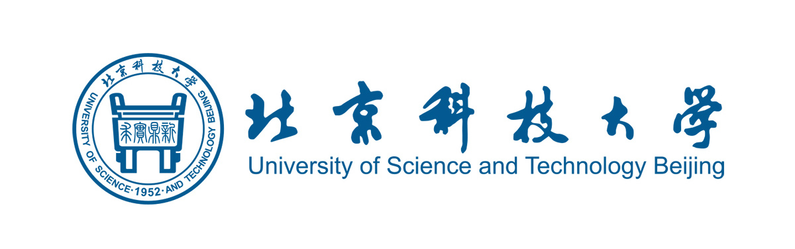

# SubsToKernel

`Substium` 是两位参赛队员在参与 [2025春秋季开源操作系统训练营](https://opencamp.cn/os2edu/camp/2025spring) 专业阶段OS设计实现后基于 rCore-Tutorial-v3 的 ch8 分支实现的操作系统内核。
 
## 参赛文档

系统介绍文档在 [docs](./docs/) 文件夹。初赛参赛文档为[此文档](./docs/初赛文档.md)

[GitLab 仓库](https://gitlab.eduxiji.net/T202510008995695/oskernel2025-osrepo) 与 [GitHub 仓库](https://github.com/wdlin233/osrepo) 保持同步。

## 参赛信息

- 参赛队名：SubsToKernel
- 参赛学校：北京科技大学
- 队伍成员：
    - 吴函霖：[858459615@qq.com](mailto:858459615@qq.com)
    - 刘畅：[wdlin233@163.com](mailto:wdlin233@163.com)