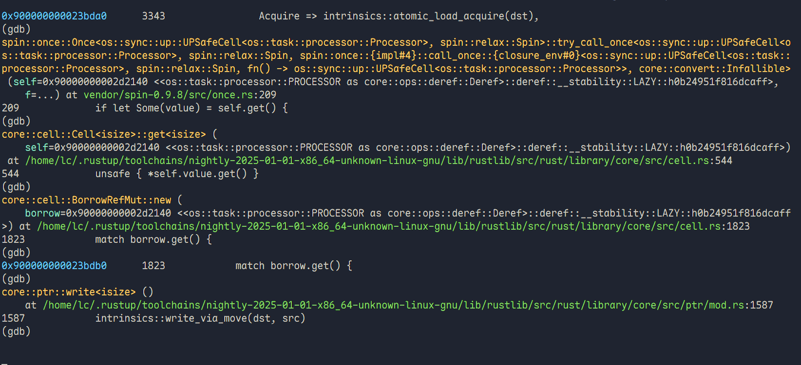
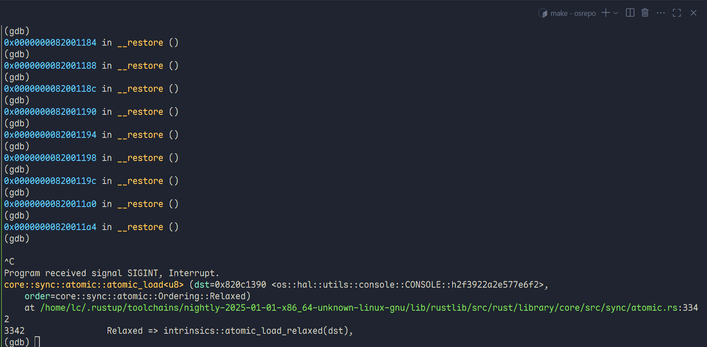
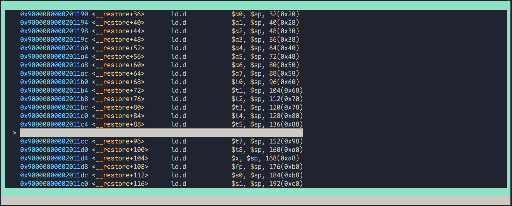
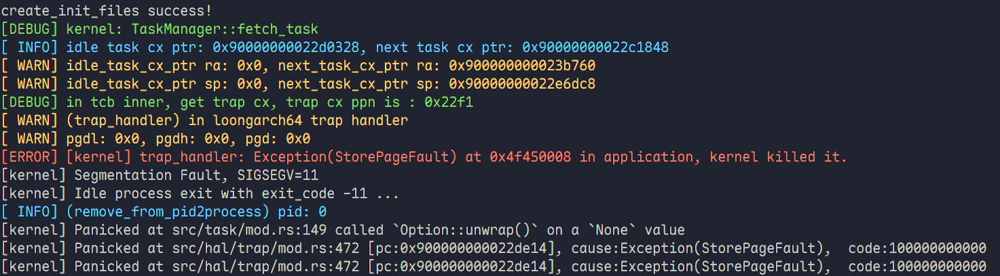

# 决赛开发日志 by wdlin

我们认为在学习别人内核时有一个这样类似的文档，来记录各种遇到的 bug 和设计时的考虑是很好的。虽然我们经验还不充足，但是还是把自己的一些学习和思考都记录下来，一方面是自己记录先前所做的事情，还有一方面是如果之后有人无意间翻到了这个内核，希望能提供一些力所能及的帮助。

## 七月

### 2025.7.2

> 参考 Linux 的设计，因为**信号**的设计用统一的 `TaskControlBlock` 来实现会更好，而且我们先前因为赶工没有太在意代码的可维护性和可读性，我们决定**重构**. 将现有的 `ProcessControlBlock` 和 `TaskControlBlock` 合为同一个结构体.

摆烂一天后开始进行重构，和队友分工，我负责修改线程块的部分，队友负责改地址空间.

`TaskStatus` 这种结构肯定是可以直接放在 `ProcessControlBlock` 的，不过 `exit_code` 就有点难说，因为这和进程组还有一点关系，最后还和信号相关.

```rust
#[derive(Copy, Clone, PartialEq, Debug)]
/// The execution status of the current process
pub enum TaskStatus {
    /// ready to run
    Ready,
    /// running
    Running,
    /// blocked
    Blocked,
}
```

我们打算参考 rCore 的 ch6 进行修改. 比较幽默的是，`heap_bottom` 和 `program_brk` 在 ch6 中就是作为 `ProcessControlBlock` 的成员，现在我们想改回 `TaskControlBlock` 中.

不管可维护性而到处写条件编译真的很折磨人. 决定先做 `tid` 的部分.

`TidHandler` 直接就迁移过来了. 然后把 `TaskContext` 的通用寄存器统一了，RISCV 下有 12 个通用寄存器，而 LoongArch 只有 10 个，如果分开写很不优雅. 或者之后单独切一个 `TaskContext` 放在 `hal` module 里.

### 2025.7.3

`KernelAddr` 结构体直接包裹 `usize`，主要还是为了在统一地址空间后进行内核地址与用户地址的区分. 

分配用户资源的 `alloc_user_res` 方法，首先在 `USER_TRAP_CONTEXT_TOP` 分配一个页的空间用作 Trap，然后在 `USER_STACK_TOP` 向低地址分配一个 `USER_STACK_SIZE` 的空间作为用户栈，`USER_TRAP_CONTEXT_TOP` 地址比 `USER_STACK_TOP` 高线程最大数量的页大小，也就是 Trap 的存放地址比用户栈高. 然后会在用户栈上预先映射一些段.

研究了一下 `sfence.vma`，发现这个 TLB 刷新的问题好像在 LA 下并不是那么简单，而且 LA 下本身就需要考虑 TLB 重填的问题，后面应该要重新设计. 

退出码 `exit_code` 的问题实际上和信号的机制是紧密连在一起的.

下面梳理信号机制：

`SignalFlags` 是由 `bitflags` 定义的信号集合，各种信号. `SigOp` 是 `SignalFlags::default_op()` 根据不同信号作出的处理操作的一个枚举类型. 这个是定义部分. `SigAction` 是信号处理的结构体，`sa_handler` 即用户自定义处理函数, `sa_flags` 即相应的标志位, `sa_restorer` 为当用户自定义处理函数运行完毕后跳转的地址, `sa_mask` 为运行该信号处理函数时需要阻塞的信号.

```rust
#[repr(C)]
#[derive(Clone, Copy, Debug)]
pub struct SigAction {
    pub sa_handler: usize,
    pub sa_flags: SigActionFlags,
    pub sa_restore: usize,
    pub sa_mask: SignalFlags,
}
```

`KSigAction` 添加一个自定义标志判断是否使用默认处理函数.

```rust
#[derive(Clone, Copy)]
pub struct KSigAction {
    pub act: SigAction,
    pub customed: bool,
}

impl KSigAction {
    pub fn ignore() -> Self {
        Self {
            act: SigAction {
                sa_handler: 1,
                sa_flags: SigActionFlags::empty(),
                sa_restore: 0,
                sa_mask: SignalFlags::empty(),
            },
            customed: false,
        }
    }
}
```

`SigTable`  维护一个信号表，封装 `SigTableInner`，`group_exit_code` 是一个进程内多个线程的退出码. `actions` 即是信号表本身根据信号编号调用对应处理函数.

```rust
pub struct SigTableInner {
    actions: [KSigAction; SIG_MAX_NUM + 1],
    group_exit_code: Option<i32>,
}

impl SigTable {
	...
    pub fn action(&self, signo: usize) -> KSigAction {
        self.get_ref().actions[signo]
    }
    pub fn set_action(&self, signo: usize, act: KSigAction) {
        self.get_mut().actions[signo] = act
    }
    pub fn exit_code(&self) -> i32 {
        self.get_ref().group_exit_code.unwrap()
    }
    ...
}
```

<span id="signal"></span>

内核对信号的处理如下，引自[[Linux中的信号处理机制 二] - 知乎](https://zhuanlan.zhihu.com/p/79062142)：


`handle_signal()` 就是内核中的信号处理函数.

```rust
pub fn handle_signal(signo: usize) {
    let task = current_task().unwrap();
    let process = task.process.upgrade().unwrap();
    let inner = process.inner_exclusive_access();
    let signal = SignalFlags::from_sig(signo);
    let sig_action = inner.sig_table.action(signo);
    drop(inner);
    let mut task_inner = task.inner_exclusive_access();
    task_inner.sig_pending.remove(signal);
    drop(task_inner);
    drop(task);
    if sig_action.customed {
        setup_frame(signo, sig_action);
    } else {
        if sig_action.act.sa_handler != 1 {
            if sig_action.act.sa_handler == exit_current_and_run_next as usize {
                exit_current_and_run_next((signo + 128) as i32);
            }
        }
    }
}
```

在修改过程中，我就疑惑为什么一个更符合直觉的 ch8 中将 `ProcessControlBlock` 和 `TaskControlBlock` 分离的方法不是一个更为普遍采用的方法，后来我查询了[Linux 源码](https://elixir.bootlin.com/linux/v5.10.65/source/include/linux/sched.h#L648)，才发现 `TaskControlBlock` 才是更通用的. 既然使用了同一个结构体，那么是怎么区分进程和线程的呢？

此时才发现当需要自己设计内核的时候，自然地需要考虑 **WHY 的问题**而不是 WHAT 和 HOW. 而一般的教程要么告诉 WAHT 要么告诉 HOW，而很少有告诉 WHY 的问题.

### 2025.7.4

我的理解是进程和线程共同一个 `ProcessControlBlock`，也即 Linux  下的 `task_struct`. 每一个进程都有自己的 `pid`, `tid` 和 `ppid`. 在 Linux 下有 `tgid` 和 `pid` 的区分，每个线程有自己的 `pid` 而其 `tgid` 与主线程的 `pid` 相等，可以参考 [进程和线程的区别 ( LINUX系统 )](https://blog.csdn.net/whahu1989/article/details/83153191) 中的例子. 甚至可以说这两者的区别并不那么重要，当我使用 `PID2PCB` 的时候就取了一个带有进程号 `pid` 的线程.

```rust
lazy_static! {
    /// PID2PCB instance (map of pid to pcb)
    pub static ref PID2PCB: UPSafeCell<BTreeMap<usize, Arc<ProcessControlBlock>>> =
        unsafe { UPSafeCell::new(BTreeMap::new()) };
}
```

`exit_code` 现在被存放在 `SigTable` 下.

### 2025.7.5

尝试使用 polyhal 库进行修改. 参考 [yfblock/rcore-tutorial-v3-with-hal-component](https://github.com/yfblock/rcore-tutorial-v3-with-hal-component).

目前我们的 `ProcessControlBlock::new()` 里面有一个 `user` 逻辑，感觉放在和 `pid` 同级不是很好，之后或许考虑放在 `inner` 里面.

Trap 上下文 `trap_cx` 的的保存就用 `TrapFrame::new()` 分配一个页帧. `task_cx` 就用 `KContext` 将内核栈的栈顶存在 `KContext` 里.

### 2025.7.6

处理学校的事务.

### 2025.7.7

为什么往年的内核就可以直接使用 `data_flow!` 呢？或者不如说 `translate_refmut` 是在做什么事情？做的是将其他地址空间的 `ptr` 转换为内核地址空间的一个可变 `u8 slice`. 这里我认为是因为其跳板页或者说双页表机制让内核地址空间和用户地址空间完全隔离开来. 这个地方之后再改动.

将几个关键的方法例如 `new`, `exec` 和 `fork` 实现了. 

### 2025.7.8

清除了 `ProcessControlBlock` 的一些无用成员.

polyhal 自己有一个 `PageTable`，同时也定义了各种地址段. 感觉如果使用他们的页表那改动就太大了. 不过 LA 和 RV 可以更好做一个兼容.

`TaskControlBlock` 就是一个线程，不过我这里都叫它 `ProcessControlBlock`，实际上有点不对.

Trap 部分和地址空间的高地址还没做好，但是想让他先过编译. 实际上这些部分改动太大，除了 `KContext` 还有 `TrapFrame`.

队友说因为参考实现的懒分配机制和一部分我们自己实现的实分配机制，我们的进程在 `clone` 时会遇到没有处理 COW 位的问题，子进程复制父进程的地址空间会因为这个位的判断从而触发 PageFault 错误.

### 2025.7.9

改 `KContext` 和 `TrapFrame`. 首先先明晰 `task_cx` 任务上下文是进程/线程切换时的上下文，而 `trap_cx` 是处理器发生中断、异常和系统调用等时的上下文.

现在有三种不同的上下文处理实现，整理一下 `task_cx` 所做的事情：

在新建一个 `TaskContext` 或者说 `KContext` 实际上做的是类似的事情，都是定义 `ra`, `sp` 和通用寄存器

```rust
pub fn goto_trap_loop(kstack_ptr: usize) -> Self {
    Self {
        ra: trap_loop as usize,
        sp: kstack_ptr,
        s: [0; 12],
    }
}

fn blank_kcontext(ksp: usize) -> KContext {
    let mut kcx = KContext::blank(); // s在此被建立了
    kcx[KContextArgs::KPC] = task_entry as usize;
    kcx[KContextArgs::KSP] = ksp;
    kcx[KContextArgs::KTP] = read_current_tp();
    kcx
}
```

`trap_loop as usize` 的操作是返回一个函数指针，实际上就是在后续让其进行跳转. 之后就是进入对应的处理函数了：

```rust
#[no_mangle]
pub fn trap_loop() {
    loop {
        trap_return();
        trap_handler();
    }
}

fn task_entry() {
    trace!("os::task::task_entry");
    let task = current_task()
        .unwrap()
        .inner
        .exclusive_access()
        .get_trap_cx() as *mut TrapFrame;
    // run_user_task_forever(unsafe { task.as_mut().unwrap() })
    let ctx_mut = unsafe { task.as_mut().unwrap() };
    loop {
        run_user_task(ctx_mut); // polyhal的内置函数
    }
}
```

`trustos` 的 Trap 处理涉及更多：

```rust
#[no_mangle]
pub fn trap_return() {
    //检查信号
    if let Some(signo) = check_if_any_sig_for_current_task() {
        debug!("found signo in trap_return");
        handle_signal(signo);
    }

    if scause::read().cause() == Trap::Interrupt(scause::Interrupt::SupervisorTimer) {
        set_next_trigger();
    }

    // log::info!("return to user");

    set_user_trap_entry();
    extern "C" {
        #[allow(improper_ctypes)]
        fn __return_to_user(cx: *mut TrapContext);
    }
    unsafe {
        // 方便调试进入__return_to_user
        let trap_cx = current_trap_cx();
        // debug!("return to user,trap_ctx={:?}", trap_cx);
        __return_to_user(trap_cx);
    }
}

#[no_mangle]
/// handle an interrupt, exception, or system call from user space
pub fn trap_handler() {
    //记录用户空间花费CPU时间，同时准备内核空间花费CPU时间
    current_task()
        .unwrap()
        .inner_lock()
        .time_data
        .update_utime();
    set_kernel_trap_entry();
    let scause = scause::read();
    let stval = stval::read();
    match scause.cause() {
        ...
    }
    //检查定时器
    current_task().unwrap().check_timer();

    //记录内核空间花费CPU时间，同时准备用户空间花费CPU时间
    current_task()
        .unwrap()
        .inner_lock()
        .time_data
        .update_stime();
}
```

rCore 原来应该是调用 `trap_handler` 然后在末尾调用 `trap_return` 的. `set_user_trap_entry` 是处理地址空间不一致的问题的办法，详见[基于地址空间的分时多任务](https://learningos.cn/rCore-Camp-Guide-2025S/chapter4/6multitasking-based-on-as.html?highlight=set_user_trap_entry#trap). `stvec` 是 Supervisor Trap Vector Base Address Register.

在用户进程运行时，`stvec` 应该指向 `__trap_from_user` 作为 用户陷阱入口。当用户态发生陷阱（中断、异常、系统调用）时，CPU会跳转到 `__trap_from_user`.

```assembly
# user -> kernel
__trap_from_user:
    csrrw sp, sscratch, sp
    # now sp->*TrapContext in kernel space, sscratch->user stack
    # save other general purpose registers
    sd x1, 1*8(sp)
    # skip sp(x2), we will save it later
    # save x3~x31 (x4 is tp)
```

`__trap_from_user` 就是将所有的**用户寄存器**存到**内核栈**，和`polyhal` 的 `user_restore` 是类似的. `__return_to_user` 自然就是在内核栈上恢复用户寄存器了.

对于信号机制，我的理解是进入 `trap_loop` 已经是进入了内核态，然后在 `trap_return` 里进行信号处理调用 `handle_signal`，在这个函数内会先 `setup_frame` 保存内核的上下文在**用户栈**上. 因为根据[先前](#signal)所说的信号处理的机制实际上是在用户态进行的，那么我们就要跳转到用户态，然后从用户态恢复当前的上下文，这就决定了是从被跳转的态的栈上也就是用户栈上恢复了我们原来的态的上下文也就是内核态.

那为什么先处理信号后设置用户返回入口然后就返回了，存疑？那什么时候进入内核的 `trap_handler` 处理？看起来是为了解决调用文件系统的问题所以先返回了一次用户态. 感觉怪怪的，不知道为什么这么写.

`polyhal` 的内置函数定义很清晰，分为存用户上下文和从内核回调两个部分：

```rust
pub fn run_user_task(context: &mut TrapFrame) -> EscapeReason {
    user_restore(context); //包裹保存寄存器的asm
    kernel_callback(context).into() // 中断异常，类似于trap_handler
}
```

但无论是哪种实现，在 Trap 返回时都是需要获取当前的 `TrapContext` 或者说 `TrapFrame` 的，通过调用 `get_trap_cx` 或者 `current_trap_cx` 这种类似的函数来实现. 其实很符合逻辑，因为 Trap 到另一个态就是需要当前的上下文信息的.

那么自然的问题是，`TrapContext` 和 `TaskContext` 有什么区别呢？首先是存放位置的区别，`TrapContext` 一般在内核栈栈顶，`TaskContext` 一般在任务控制块里. 相比于 `TrapContext`，`TaskContext` 只保存一些比较重要的寄存器而不是全部的状态信息. 而且他们的目标也是不一样的，`TrapContext` 是用户态和内核态的切换问题，实现依赖 CPU 的陷阱机制，而 `TaskContext` 是内核态任务的主动切换，依靠的是 `__switch` 这一纯软件的实现方式.

| **特性**       | `trap_context`                        | `task_context`                   |
| :------------- | :------------------------------------ | :------------------------------- |
| **触发时机**   | 用户态→内核态的陷阱（中断/异常）      | 内核态任务主动切换               |
| **保存位置**   | 当前任务的内核栈顶                    | 任务控制块（TCB）                |
| **数据完整性** | 完整用户状态 + 陷阱元数据             | 仅切换所需的关键寄存器           |
| **恢复目标**   | 返回原用户任务                        | 切换到另一个内核任务             |
| **硬件依赖**   | 依赖 CPU 的陷阱机制（如 RISC-V Trap） | 纯软件实现（如 `__switch` 函数） |

一个 `__switch` 一般是这样的：

```rust
global_asm!(include_str!("switch.S"));

extern "C" {
    pub fn __switch(current_task_cx_ptr: *mut TaskContext, next_task_cx_ptr: *const TaskContext);
}
```

为了给 `polyhal` 加入信号处理的机制，需要让 `TrapFrame` 能与我们自己定义的 `MachineContext` 和 `UserContext` 能够实现转换. 试了许多方法，最后感觉还是实现一个 `trait` 再 `impl` 其上比较简单.

`trap_cx` 应该有一个 `origin_a0` 的机制，在处理信号为 `SA_RESTART` 时进行处理，这需要改 `polyhal` 底层，目前先让其过编译，之后用到了再修改.

> 2025.8.15：保证程序正确性应该是第一位的，在内核上做如此大的改动并不合适，不能说只是先过了编译就放着不管了.

### 2025.7.10

如果直接使用 `polyhal-boot` 会有 `PageTable` 的问题，就得用他们的数据结构了. 所以启动的部分还是得自己改.

但是想要启动起来就必须删去跳板页：

```assembly
rust-lld: error: undefined symbol: trampoline
          >>> referenced by os.e36b250b2cfb0a60-cgu.13
          >>>               /home/lc/osrepo/os/target/riscv64gc-unknown-none-elf/release/deps/os-d7d907be1afa0e3a.os.e36b250b2cfb0a60-cgu.13.rcgu.o:(.text.entry+0x2E)
          >>> did you mean: strampoline
          >>> defined in: src/linker_rv.ld:14
```

然后就删去了跳板页，勉强过了编译，但是内核无法启动，卡在 OpenSBI 处.

### 2025.7.11

设置 `BASE_ADDRESS = 0xffffffc080200000`，但是内核无法启动. 难以理解，相当于没有进入内核，但是链接脚本和 `boot` 都看起来没什么问题.

在链接脚本里设置 `BASE_ADDRESS` 为低地址就可以启动了，但是打印出来的地址映射都是高地址，这是否有点离谱了. 难道这个不就是内核的入口起始地址吗？

根据 [TrustOS 的设计文档](https://gitee.com/B4holder/trust-os/blob/final/chapter2_内存管理.md) 和 [chaos 开发日志](https://sazikk.top/posts/开发日志-chaos开发日志/#修改内核地址空间)，设置 `BASE_ADDRESS` 不应该有什么问题，我只能理解为是 `RustSBI` 和 `OpenSBI` 的差异. 根据 TrustOS 文档的说法，改变内核入口并不会影响到物理内存中由 `0x8020_0000` 开始的一段，所以即使内核入口已经设置为了高位的虚拟地址，所以内核还是可以正常执行的，只需要考虑启动虚拟映射之后将代码映射到高位. 但如果 `OpenSBI` 并不是相同的逻辑，而是就根据链接脚本定义的虚拟地址来寻找 `_start` 各段，那么设置了高地址的 `BASE_ADDRESS` 就会让所有符号诸如 `_start = 0xffffffc080200000` 为高位的虚拟地址，同时 `boot` 中所做的映射高位的大页机制中诸如 `sp` 和 `t0` 也就自动被认为是高位地址了，因为 `la` 指令加载的是由链接脚本决定的符号的虚拟地址.

```assembly
la sp, boot_stack_top   # sp = 高虚拟地址 (0xffffffc0802xxxxx)
la t0, boot_pagetable   # t0 = 高虚拟地址 (0xffffffc0802xxxxx)
```

因为在内核刚加载的一段时间分页机制还没有开启，所以一直都是在访问物理地址，访问高虚拟地址自然就会引发错误，无法处理导致卡死.

如果在 `FRAME_ALLOCATOR` 中设置

```rust
FRAME_ALLOCATOR.exclusive_access().init(
    // Frame allocator initialized: 0xffffc082272 - 0xffffc088000
    PhysAddr::from(ekernel as usize).ceil(),
    PhysAddr::from(MEMORY_END).floor(),
);
```

而不是

```rust
FRAME_ALLOCATOR.exclusive_access().init(
    // Frame allocator initialized: 0x82272 - 0x88000
    PhysAddr::from(KernelAddr::from(ekernel as usize)).ceil(),
    PhysAddr::from(KernelAddr::from(MEMORY_END)).floor(),
);
```

就会导致内核卡死，`KernelAddr` 是对 `usize` 的直接包裹，只用来注明这是内核的高地址空间，转换为 `PhysAddr` 时直接减去 `KERNEL_ADDR_OFFSET`. 对于物理页帧分配器，需要的确实应当是低位的物理地址而不是虚拟地址.

但是在 `activate` 里写入 `satp` 就会卡死：

```rust
pub fn activate(&self) {
    let satp = self.page_table.token();
    unsafe {
        satp::write(satp);
        asm!("sfence.vma"); 
    }
}
```

我理解的是 `ppn` 段的内容 `0x82282` 没有被正确映射，导致的问题：

```assembly
kernel satp: 0x8000000000082282
.text [0xffffffc080200000, 0xffffffc080248000)
.rodata [0xffffffc080248000, 0xffffffc080257000)
.data [0xffffffc080257000, 0xffffffc080260000)
.bss [0xffffffc080260000, 0xffffffc082282000)
sigreturn_trampoline : [0xffffffc080202000, 0xffffffc080203000)
physical memory: [0xffffffc082282000,0xffffffc088000000)
...
[ INFO] mapping physical memory
[DEBUG] MapArea::new(as vpn) start floor = 0x4082282, end ceil = 0x4088000
...
create new kernel successfully!
[DEBUG] activate memory set, satp = 0x8000000000082282
[DEBUG] satp = 0x8000000000082282
```

### 2025.7.12

没什么头绪解决，`satp` 之后再看.

然后是 `trap` 的问题. 我们现在的 `trap` 和 `polyhal` 的混在一起，感觉可能整个结构还是得用 `polyhal` 来改写.

打算正式迁移 `polyhal` 了，因为后面无论是上板还是其余的一些功能的实现都会用到. 首先要做的就是修改链接脚本. `polyhal` 确实写的还不错，启动的部分很好懂. 

用 `polyhal` 启动了内核.

### 2025.7.13

`polyhal` 来实现地址空间，`PageTable` 的部分是他们已经实现了的，所有 `MapArea` 相关的部分还保存着.

但是所有涉及 `PageNum` 的部分都需要修改. 先前的 rCore 是用 `floor` 和 `ceil` 方法来实现由地址向页号的转换，这里 `polyhal` 虽然也使用了同名的方法，但是返回值仍然是地址而不是页号. 变量名虽然还是 `vpn`，但是是经过**页对齐**过后的 `VirtAddr`. 页表的 `translate` 方法变为：

```rust
polyhal::pagetable::PageTable
pub fn translate(&self, vaddr: VirtAddr) -> Option<(PhysAddr, MappingFlags)>
```

而且 `MapType` 的差别也被删掉了.

很奇怪，`polyhal` 的实现似乎并不需要 `token`.

我理解的是，用户态和内核态有两个页表，这就是[SaZiKK 一直说的双页表机制](https://sazikk.top/posts/开发日志-chaos开发日志/#2024619-开始重构). 内核的页表就是 `KERNEL_SPACE` 下的页表，如果他们共用一个页表，就完全颠覆了 [跨空间跳板内核](https://rustmagazine.github.io/rust_magazine_2021/chapter_7/trampoline-kernel.html) 的结构. 所以极其精简的 `translated_byte_buffer` 是有原因的：

```rust
pub fn translated_byte_buffer(_token: PageTable, ptr: *mut u8, len: usize) -> &'static mut [u8] {
    trace!("os::mm::page_table::translated_byte_buffer");
    unsafe { core::slice::from_raw_parts_mut(ptr, len) }
}
```

`GROUP_SHARE` 原本都是 `ppn` 到 `FrameTracker` 的映射，记得改过来，现在是对齐过后的 `VirtAddr`. 

修改 `MemorySet` 时都保留了 `vpn` 的说法，但是这是对齐过后的虚拟地址. 

一般的 `VirtAddr` 向 `VirtPageNum` 的转换是 `floor`.

### 2025.7.14

每个进程都有其对应的地址空间，自然也有其对应的页表，当时 `polyhal` 直接删除了这一部分. 犹豫如何修改：

```rust
// MemorySetInner::lazy_clone_area
let mut origin_page_table = PageTable::from_token(self.page_table.token());
let another_page_table = PageTable::from_token(another.page_table.token());
for vpn in another_area.vaddr_range {
    let src_pte = another_page_table.translate(vpn);
    if src_pte.is_none() || !src_pte.unwrap().is_valid() {
        continue;
    }
    let src_ppn = src_pte.unwrap().ppn();

    let dst_pte = origin_page_table.translate(vpn);
    if dst_pte.is_none() || !dst_pte.unwrap().is_valid() {
        this_area.map_one(&mut origin_page_table, vpn);
    }
    let dst_ppn = origin_page_table.translate(vpn).unwrap().ppn();
    dst_ppn
    .bytes_array_mut()
    .copy_from_slice(src_ppn.bytes_array());
}
```

页表的切换，或者说进程页表 `satp` 的切换是在 `TaskControlBlock::exec` 里调用 `memory_set.activate()` 实现的.

`PhysAddr` 和 `VirtAddr` 不需要在 `translated_byte_buffer` 实现转换，应当是因为 `VirtAddr` 和 `PhysAddr` 都是对 `usize` 的简单包裹？但这不对吧，`translated_byte_buffer` 实际上是用户态和内核态转换使用到的，所以实际上这是因为内核态和用户态的双页表机制被取消了. 因为不用跳板页了.

然后说回这个 `lazy_clone_area` 的问题，因为是在 `clone_user_res` 里调用，实际上是不同进程间地址空间的复制，所以必然是要做页表切换的.

`safe_translated_byte_buffer` 实际上就是 `translated_byte_buffer` 在查找 `PageTableEntry`过程中的惰性处理. 因为已经取消了内核页表与应用页表的区别，所以查找页表项也不必要了，删.

### 2025.7.15

TrustOS 的内核栈上存放着 `task_cx`. 原本的设计在 `KERNEL_SAPCE` 和用户的 `memory_set` 分别映射同一段逻辑段应当是为了在上下文切换时保持合理的地址访问.

需要重写整个信号处理机制，但是目前来说还做不到，而且不知道会出现什么问题. 先放着.

一切都改好了，发现 OpenSBI 的启动地址不一样，后续的地址空间也无法被构建起来

```bash
lc@806-os:~/osrepo$ riscv64-unknown-elf-readelf -h kernel-rv
ELF Header:
  Magic:   7f 45 4c 46 02 01 01 03 00 00 00 00 00 00 00 00 
  Class:                             ELF64
  Data:                              2's complement, little endian
  Version:                           1 (current)
  OS/ABI:                            UNIX - GNU
  ABI Version:                       0
  Type:                              EXEC (Executable file)
  Machine:                           RISC-V
  Version:                           0x1
  Entry point address:               0xffffffc080200000
  Start of program headers:          64 (bytes into file)
  Start of section headers:          17567816 (bytes into file)
  Flags:                             0x5, RVC, double-float ABI
  Size of this header:               64 (bytes)
  Size of program headers:           56 (bytes)
  Number of program headers:         7
  Size of section headers:           64 (bytes)
  Number of section headers:         25
  Section header string table index: 23
```

### 2025.7.16

修高位地址的启动问题.

首先先修复了 vendor 里会重复引入 polyhal 宏的问题，一个小 bug.

但是不知道为什么无法将链接脚本里的地址转换为物理地址.

答：换成 `os.bin` 就可以了. 因为 OpenSBI 会根据文件格式进行解析，如果是 ELF 格式就会按照其 Entry 的虚拟地址进行加载，而 bin 文件会无条件加载到 `0x80200000`.

至此可以说**基本**完成了初赛结束以来的重构.

### 2025.7.17

`KernelAddr::from()` 之后再 `kernel_va as *mut u8` 和 `get_mut_ptr::<u8>()` 是一样的. 修复了原本 `bytes_array_mut` 一类的问题.

```rust
// dst_ppn
//   .bytes_array_mut()
//   .copy_from_slice(src_ppn.bytes_array());
let src_paddr: *const u8 = src_paddr.get_ptr::<u8>();
let dst_paddr: *mut u8 = dst_paddr.get_mut_ptr::<u8>();
let dst_array = unsafe {
    core::slice::from_raw_parts_mut(dst_paddr, PAGE_SIZE)
};
dst_array.copy_from_slice(
    unsafe {
        core::slice::from_raw_parts(src_paddr, PAGE_SIZE)
    }
);
```

切换上下文有问题.

### 2025.7.18

是 `suspend_current_and_run_next` 的问题，似乎. 因为在阻塞前调用了这个函数.

不是，队友改好了.

### 2025.7.19

遇到 `NotReady`，无法解决，没太明白是什么原因报错.

```shell
[ INFO] ##### syscall with id 221 #####
[DEBUG] (sys_exec) current process id is :2
[DEBUG] (sys_exec) trim path ok,the path is :/musl/basic_testcode.sh
[DEBUG] (sys_exec) the argv is :["busybox", "sh", "/musl/basic_testcode.sh", "sh", "/musl/busybox"], the env is :["PATH=/:/bin:", "LD_LIBRARY_PATH=/lib:/lib/glibc:/lib/musl:", "ENOUGH=100000"]
[DEBUG] (sys_exec) the cwd is :/, the path is :/musl/busybox
[DEBUG] (sys_exec) to open file, the abs_path is: /musl/busybox
[DEBUG] (fs::open) open file: /musl/busybox, flags: O_RDONLY
[ INFO] (fs::open) open file: /musl/busybox, but not found in idx
[DEBUG] (ext4_lw, Inode::find) origin path=/musl/busybox
[DEBUG] (exr4_lw, Inode::find) get file successfully
[DEBUG] (ext4_lw, Ext4File::check_inode_exist) path=/musl/busybox, types=EXT4_DE_DIR
[kernel] Panicked at src/drivers/virtio/blk.rs:80 Error when reading VirtIOBlk: NotReady
```

把 `fs::init` 和 `fs::list_apps` 注释后会在分配时卡住很久. 最后在对 `block_id` 为 2 的读取时报错 NotReady.

切换至这个 [🐛 fix:修复给exec传参为0x0问题](https://github.com/wdlin233/osrepo/commit/ea840cb221f00f4510c8507b1e822f331a5e0987) commit，注释 `fs_list_apps` 后报错

```shell
[DEBUG] add ok
[DEBUG] add ok
[DEBUG] add ok
[DEBUG] add ok
[DEBUG] ptr to string ok
[DEBUG] to deal the argv
[DEBUG] get cwd ok, the cwd is :/, the path is :/musl/busybox
[DEBUG] to open,the path is: /musl/busybox
[DEBUG] Device features: BlkFeature(SEG_MAX | GEOMETRY | BLK_SIZE | SCSI | FLUSH | TOPOLOGY | CONFIG_WCE | DISCARD | WRITE_ZEROES | NOTIFY_ON_EMPTY | RING_INDIRECT_DESC | RING_EVENT_IDX)
[ INFO] config: 0xffffffc010001100
[ INFO] found a block device of size 4194304KB
[ INFO] (frames_alloc) Allocating 2 frames
[ INFO] (frames_alloc) Allocating 2 frames starting at 0x8232a000
[ INFO] New an Ext4 Block Device
[DEBUG] OPEN Ext4 block device p_user=0xffffffc082300c00
[kernel] Panicked at src/drivers/virtio/blk.rs:77 called `Result::unwrap()` on an `Err` value: NotReady
```

意味着 `VirtIOBlk::new` 报错. 这应该是在初始化 `fs`，但为什么一旦进入 `execve` 就会报错？

改了一会也没觉得有什么问题.

似乎不是 deps 的问题，但文件系统和驱动层也没看出什么逻辑错误. 而且每次都那一行错误，在 gdb 里 `ffi` 会显示 `not such file or directory`.

### 2025.7.20

改 loongarch,报错

```shell
[ INFO] (suspend_current_and_run_next) suspending current task and running next task
[DEBUG] (kernel_intrrupt) page fault handling
[ INFO] (kernel_intrrupt) now handling page fault, paddr = 0x1d000, trap_type = StorePageFault(118784)
[ERROR] [kernel] trap_handler: bad paddr = 0x1d000, kernel killed it.
```

我们之前在分析日志时注意到，ELF 加载的一个段结束于 `0x1c128`，但是在内存映射时，`MapArea::new`会将这个区域按页向上对齐，所以结束地址变成了 `0x1d000`（因为页大小为 4096 字节，0x1c128 向上对齐到 `0x1d000`）。

这个对齐操作意味着，我们为这个 ELF 段分配的内存区域实际上覆盖了 `0x18000` 到 `0x1d000`，但是 ELF 文件本身只填充到 `0x1c128`。因此，从 `0x1c128` 到 `0x1d000` 这部分内存区域是未初始化的，通常这部分被用作 .bss 段（初始化为0），或者用于对齐。

```shell
[DEBUG] start_va 0x18000 end_va 0x1c128
[ INFO] (MemorySetInner, map_elf) ph_flags: Flags(6), map_perm: R | W | U
[DEBUG] MapArea::new(as virtaddr, aligned) start floor = 0x18000, end ceil = 0x1d000
```

0x1c128-0x1d000 就会出于未初始状态

### 2025.7.21

在 `run_tasks()` 里打开 `/musl/busybox` 可以打开也可以读

在第一个进程里可以正常打开 `/musl/busybox` 并 `read_all` elf，但是在进程切换后就不可以。而且在第一个进程里 `open` 后，在进程切换后就可以正常 `open`，当时仍然不能 `read_all`。如果不在第一个进程里 `open`，在进程切换后 `open` 就会失败. 

翻 virtio-drivers 的 issue 发现在 24 年有人遇到过 not ready 的问题，似乎是没有初始化导致的. 我们用的版本比这个旧. 打算改改.

根据 [The examples/riscv has a stuck bug · Issue #125](https://github.com/rcore-os/virtio-drivers/issues/125) 有人和我们遇到了类似的问题，于是我用 0.8.0 而不是我们现有的 0.6.0 重写了驱动，发现仍然没有解决问题，于是我参照 PR [Use atomic reads and writes for available and used ring. by qwandor · Pull Request #128](https://github.com/rcore-os/virtio-drivers/pull/128) 又对我们的内核进行了改写，仍然没有解决问题，这个问题有点过于底层，不知道怎么办了. 

原来 0.6.0 都算低，用的 `61ece50` 是 0.7.1. 但是往年的内核使用的版本更低.

参考了 [ByteOS/driver/kvirtio/src/virtio_impl.rs at main · oscomp/ByteOS](https://github.com/oscomp/ByteOS/blob/main/driver/kvirtio/src/virtio_impl.rs) 但是没什么用.

### 2025.7.22

没能解决问题.

### 2025.7.23

LA 一直在 `run_tasks` 里 `context_switch` 的循环中，本来切换过后就应该执行用户态程序并调用 syscall，但是并没有调用而是访问了 ELF 段的末尾地址. 结合用户态、地址访问和 syscall，想到可能是我们忘记了修改链接脚本，因为原来我们参考 rCoreloongArch 是 16K 页表对齐的，但是现在已经都是 4K 了. 修改了链接脚本的对齐然后就成功了！

但是在中执行了 `sys_fork` 后又一轮 syscall 似乎出现了 `InstructionNotExist` 的问题：

```she
[DEBUG] (sys_fork) the new tid is :2
[ INFO] (suspend_current_and_run_next) suspending current task and running next task
[ INFO] TASK_MANAGER.ready_queue.len(): 1
[ INFO] task_cx_ptr: 0x900000008014c990
[ INFO] (trap_entry) into trap entry
[ INFO] (suspend_current_and_run_next) suspending current task and running next task
[ INFO] TASK_MANAGER.ready_queue.len(): 1
[ INFO] task_cx_ptr: 0x900000008014dd90
[kernel] Panicked at libs/polyhal/polyhal-trap/src/trap/loongarch64.rs:231 Unhandled trap Exception(InstructionNotExist) @ 0x107f4 BADV: 0x107f4:
```

使用反汇编可以看出是在 `sys_fstatat` 这个调用中：

```assembly
9000000080010b60:	50008000 	b           	128(0x80)	# 9000000080010be0 <_ZN2os7syscall2fs11sys_fstatat17h35beec7dd6206650E+0x2e0>
9000000080010b64:	00150305 	move        	$a1, $s1
9000000080010b68:	001400a4 	nor         	$a0, $a1, $zero
9000000080010b6c:	0010f884 	add.d       	$a0, $a0, $s7
9000000080010b70:	00109725 	add.d       	$a1, $s2, $a1
```

但是不知道该怎么修改.

### 2025.7.24

没什么进展.

一定是我们所做的哪一步有问题，导致 `satp` 始终无法切换，如果切换就会卡死，如果不切换就会影响之后的栈指针然后依然是死循环，卡在 `sys_execve`.

### 2025.7.25

考虑要不要删除 `polyhal`，我们怀疑他的上下文切换存在问题. 但是这个时候我们都没什么精力再做一个巨大的改动了. 如果用重构之前的其实也相当难办，我们好不容易才删除了各种乱七八糟的条件编译统一了架构差异.

如果能发现 `polyhal` 的错误当然是最好的，但是我们找了一周还是没明白.

至少在我的本地下有这么两个问题：
- la 会报错 `InstNotExist`
- rv 下会无法写入 `satp` 导致后续的地址空间都出现问题.

gdb 调试了一下，`info registers csr` 显示 `priv` 是 1，也就是 Supervisor.

最后实际上卡在了这个函数

```rust
#[naked]
pub unsafe extern "C" fn kernelvec() {
    naked_asm!(
        includes_trap_macros!(),
        // 宏定义
        r"
            .align 4
            .altmacro
        
            csrrw   sp, sscratch, sp
            bnez    sp, uservec
            csrr    sp, sscratch

            addi    sp, sp, -{cx_size}
            
            SAVE_GENERAL_REGS
            csrw    sscratch, x0

            mv      a0, sp

            call kernel_callback

            LOAD_GENERAL_REGS
            sret
        ",
        cx_size = const crate::trapframe::TRAPFRAME_SIZE,
    )
}
```

考虑会不会是页对齐的问题？加上了 `assert!`. 但是也顺利通过了.

```rust
#[inline]
pub fn change(&self) {
    // Write page table entry for
    assert!(self.0.raw() & 0xfff == 0, "Page table address must be aligned to 4K");
    unsafe { satp::write(Satp::from_bits((8 << 60) | (self.0.raw() >> 12))) }
    TLB::flush_all();
}
```

似乎是底层陷入了 Trap，`ph_ctor!(TRAP_INIT, CtorType::Cpu, init);` 有点太超出我们的能力范围了. 一般来说 `polyhal` 发布之前都是经过测试的，肯定可以通过才对.

> 2025.8.15：可能是我们使用的工具链版本或者整体设计存在问题，在后续遇到了类似的 `InstNotExist` 错误，在分页模式下这个错误就是 `FetchPageFault`.

基于初赛结束时的分支重构.

因为有了之前一个月的经验，现在再从初赛前的分支开始重构还算轻松，很快就做了高地址启动和其他的一些兼容工作.

重构 `heap_allocator`，参考 [动态内存分配器实现-以buddy_system_allocator源码为例](https://www.cnblogs.com/chenhan-winddevil/p/18447537).

### 2025.7.26

先前我们使用 `polyhal` 直接启动了高位地址，现在我们需要自己实现它.

修改关于 `KERNEL_SPACE` 的映射. `frame_alloctor` 的起始地址就是高位地址，在 `get_bytes_array` 时还会再进行一次对高位地址的转化，这样相当于将一个高地址转换为一个高地址，很奇怪. 他们的 `MEMORY_END` 也是加上了高地址偏移量的，但是他们竟然可以正常执行？

因为在新建一个 `frame_allocator` 是将物理地址进行处理，而在 `KERNEL_SPACE` 时是将高位地址恒等映射.

上下文无法切换. 应该是因为我之前取消了跳表页的映射，不过我恢复了跳表页映射过后仍然还没有解决问题.

发现在切换至用户态后无法回到内核态.

### 2025.7.27

研究一下上下文切换，我怀疑是上下文切换有问题.

参考 [RISC-V通用寄存器及函数调用规范 | Half Coder](https://lgl88911.github.io/2021/02/15/RISC-V通用寄存器及函数调用规范/)，使用了[跳板页](https://learningos.cn/rCore-Camp-Guide-2025S/chapter4/6multitasking-based-on-as.html#term-trampoline)也就是全隔离内核，则 `__alltrap` 就需要在保存上下文之前回到内核地址空间，而 `__restore` 也需要在回复上下文之前回到应用地址空间，也就是要回到他们对应的地址空间访问对应的数据. 这就涉及了 `satp` 的切换.

```rust
#[inline]
fn set_user_trap_entry() {
    unsafe {
        stvec::write(TRAMPOLINE as usize, TrapMode::Direct);
    }
}
```

这实际上是通过写入 `TRAMPOLINE` 来让其跳转至 `__alltrap` 的汇编代码.

不能直接 `call __alltraps` 是因为跳转指令实际上是根据偏移量来执行的，但是经过地址映射不能直接对其相加.

```rust
let restore_va = __restore as usize - __alltraps as usize + TRAMPOLINE;
```

这是在 `TRAMPOLINE` 的基础上加上 `__restore` 相对 `__alltraps` 的偏移量，实现对 `__restore` 地址的访问.

是因为我们在开启了高地址后，链接脚本的内容也全都是虚拟地址了，所以 `map_trampoline` 无法正确访问物理地址，从而导致无法回到 `__alltraps` 进行执行，感谢队友给我的灵感，真是太靠谱了！

还修改了 `get_ref` 错误的地址转换问题，现在需要将传入的物理地址加上偏移量之后再获取.

又出现了 NotReady 的问题. 整套工具链似乎有点不稳定，如果特判 NotReady 的报错会在应该发生这个错误之前就卡死在上下文切换的部分. 而如果我在 vendor 里添加 `info!` 甚至就会导致进程在切换回用户态后无法切回内核态？这个问题有点[莫名其妙](https://sazikk.top/posts/开发日志-chaos开发日志/#虚拟块设备驱动读取第一个虚拟块时读取失败)，特判可能会留下其他隐患而且我们尝试过后发现并不能解决问题.

### 2025.7.28

和队友讨论了一下，高位地址实际上只是拓展了虚拟地址的范围. 虽然 RISCV 的高地址设置对 LoongArch 的兼容有帮助，可以实现更多接口上的统一，但是驱动层的 NotReady 问题我们还是对此持有疑虑，在之前我们适配 polyhal 的时候也是以 RISCV 的高地址启动，同样遇到了 NotReady 的问题，为了内核的稳定性我们打算还是回到 RISCV 的低地址启动方式.

如果我们使用 `os.bin` 运行 glibc 的 busybox 就会触发 StorePageFault，但是以 ELF 文件启动内核就不会，我不知道为什么会表现出这样的差异. 先前能成功多少有点运气成分在.

然后是实现 LoongArch 的兼容，[Fediory/NPUcore-IMPACT](https://github.com/Fediory/NPUcore-IMPACT/tree/NPUcore-FF) 可以给出一些参考.

LoongArch [启动](https://godones.github.io/rCoreloongArch/boot.html#uefibios)的时候会将 `0x8000_xxxx_xxxx_xxxx` 和 `0x9000_xxxx_xxxx_xxxx` 的地址通过直接映射窗口映射到低位的物理地址.

```assembly
ori         $t0, $zero, 0x1     # CSR_DMW1_PLV0
lu52i.d     $t0, $t0, -2048     # UC, PLV0, 0x8000 xxxx xxxx xxxx
csrwr       $t0, 0x180          # WRITE TO LA DMWIN0 CSR
ori         $t0, $zero, 0x11    # CSR_DMW1_MAT | CSR_DMW1_PLV0
lu52i.d     $t0, $t0, -1792     # CA, PLV0, 0x9000 xxxx xxxx xxxx
csrwr       $t0, 0x181          # WRITE TO LA DMWIN1 CSR
```

这样就让 `0x9000_xxxx_xxxx_xxxx` 开头的诸如 `stext` 和 `srodata` 各段被直接映射了，所以我们就可以不用像 RISCV 内核那样实现 `KERNEL_SPACE` 来手动映射.

NPUcore-IMPACT 使用了 `KERNEL_SPACE`，看起来和 rCore 别无二致. 既然 LA 有了直接映射窗口我还是采用一夏这个特性，所以在接口实现上会展现一些架构差异，以后如果有需要再为 LA 重构 `KERNEL_SPACE`.

然后是统一页表翻译的问题，尤其是统一为 4KB 的页大小而不是 16 KB.

LA 寄存器大学习，因为相比 RV 来说 LA 的寄存器需要更多的手动设置. 使用这个库 [loongArch64 - Rust](https://docs.rs/loongArch64/0.2.4/loongArch64/index.html).

涉及中断的 `ticlr`, `tcfg`, `ecfg` 和 `crmd` 没什么特别需要修改的地方. `eentry` 存放着关于上下文切换的符号地址 `__kernel_trap_entry`. `tlbentry` 放着 TLB 重填的符号地址 `__tlb_rfill`.

`stlbps` 和 `tlbrehi` 需要修改他们的页面大小.

### 2025.7.29

继续统一页面大小，修改 rCoreloongArch 原本的 16 KiB 大小页为与 RISCV 架构下相同的 4 KiB.

`pwcl` 寄存器的 `PTwidth` 字段是末级页表的索引位数，通过计算可以得知，在 `PALEN` 和 `VALEN` 都为 48 的情况下，三级页表索引的位数为 9，页的偏移字段位数为 12，相减可得 `PWwidth` 为 9. 但这样计算其实是漏掉了 `PGD` 它占有的一位，如果使用三级页表那表宽度就不一致了. 这对吗？

下图是使用 16 KiB 页表的模式.


参考一下 [Fediory/NPUcore-IMPACT](https://github.com/Fediory/NPUcore-IMPACT/tree/NPUcore-FF) 修改寄存器，他们那时 LoongArch 的 crate 还不像今天这么完善，所有寄存器都是手动操作. 他们对 `pwcl` 和 `pwch` 的设置是：

```rust
// os/src/arch/la64/mod.rs
PWCL::read()
    .set_ptbase(PAGE_SIZE_BITS)
    .set_ptwidth(DIR_WIDTH)
    .set_dir1_base(PAGE_SIZE_BITS + DIR_WIDTH)
    .set_dir1_width(DIR_WIDTH) // 512*512*4096 should be enough for 256MiB of 2k1000.
    .set_dir2_base(0)
    .set_dir2_width(0)
    .set_pte_width(PTE_WIDTH)
	.write();
PWCH::read()
    .set_dir3_base(PAGE_SIZE_BITS + DIR_WIDTH * 2)
    .set_dir3_width(DIR_WIDTH)
    .set_dir4_base(0)
    .set_dir4_width(0)
    .write();
```

那其实说明 LoongArch 完全是可以实现 4 KiB 页的.

我们实际上也有 `pgd` 的操作：

```rust
// 设置新的pgdl
let pgd = new_token << PAGE_SIZE_BITS;
// Pgdl::read().set_val(pgd).write(); //设置新的页基址
pgdl::set_base(pgd); //设置新的页基址
```

`pgd` 并非只有一个位，实际上这个最高位决定的是 `pgd` 来自 `pgdl` 还是 `pgdh`. 具体可见于龙芯的架构手册 5.4.5 部分. 既然如此那就不必将 47 位都填满，而且原本就没有 `set_dir4_base(47)` 这种操作.

RISCV 中的 `from_token` 用 `PhysPageNum::from(satp & ((1usize << 44) - 1)` 是因为 `satp` 本身存的就是 44 位的物理页号. rCoreloongArch 使用 `PhysPageNum::from(pgd & ((1usize << 34) - 1))` 着实非常疑惑，在文档里也不带任何解释，这个操作本身相当于取 `pgd` 的低 34 位，但话说回来只要知道它存的是物理页号就可以，所以我暂且先照旧保留.

修改过后在建立进程的用户栈映射时出现了报错

```shell
[kernel] Panicked at src/hal/trap/mod.rs:466 [pc:0x0], cause:Exception(FetchPageFault),  code:100000000000
```

通过日志

```shell
[ INFO] in alloc_user_res, ustack_bottom: 0x4f448000, ustack_top: 0x4f450000
[DEBUG] MapArea::new start floor = 0x4f448, end ceil = 0x4f450
[DEBUG] in vpn range new
[DEBUG] in mem set push
[DEBUG] in map area map
[DEBUG] in map one
[ WARN] in map area, map one, the ppn is : 8969
[ INFO] in page table map, find pte create ok, ppn: 0x2309, flags: (empty)
[ INFO] in map area, map one, vpn: 0x0, ppn: 0x2309, flags: (empty)
[kernel] Panicked at src/hal/trap/mod.rs:466 [pc:0x0], cause:Exception(FetchPageFault),  code:100000000000
```

在 `map_one` 中，经过 `frame = frame_alloc().unwarp()` 之后 `vpn` 就会变为 0.

```rust
#[cfg(target_arch = "loongarch64")]
{
    info!("(MapArea, map_one) vpn: {:#x}", vpn.0);
    let frame = frame_alloc().unwrap();
    info!("(MapArea, map_one) vpn: {:#x}", vpn.0);
    ppn = frame.ppn;
    info!("(MapArea, map_one) vpn: {:#x}, ppn: {:#x}", vpn.0, ppn.0);
    self.data_frames.insert(vpn, Arc::new(frame)); //虚拟页号与物理页帧的对应关系
}
info!("(MapArea, map_one) vpn: {:#x}, ppn: {:#x}", vpn.0, ppn.0);
```

```shell
[DEBUG] in map area map
[DEBUG] (MapArea, map_one) vpn: 0x4f448
[ INFO] (MapArea, map_one) vpn: 0x4f448
[ INFO] (MapArea, map_one) vpn: 0x0
[ INFO] (MapArea, map_one) vpn: 0x0, ppn: 0x2309
[ INFO] (MapArea, map_one) vpn: 0x0, ppn: 0x2309
[ INFO] in page table map, find pte create ok, ppn: 0x2309, flags: (empty)
[ INFO] (MapArea, map_one) vpn: 0x0, ppn: 0x2309, flags: (empty)
[kernel] Panicked at src/hal/trap/mod.rs:466 [pc:0x0], cause:Exception(FetchPageFault),  code:100000000000
```

原因是在 `alloc_user_res` 里没有给 LA 添加地址映射.

### 2025.7.30

```shell
[DEBUG] kernel: TaskManager::fetch_task
[ WARN] in run_tasks, task tid: 0
[ INFO] badv: 0x10b94
[ WARN] in run_tasks, next task cx ptr: 0x90000000820eca40, idle task cx ptr: 0x90000000820cf0e0
[ WARN] in run_tasks, to switch, current ra is : 0x900000008205b500,current sp is :0x9000000084110d48, next ra is :0x9000000082030060, next sp is : 0x90000000820cecb0
[ INFO] badv: 0x10b94
[ INFO] badv: 0x5
[ INFO] [kernel] trap_handler: Exception(LoadPageFault) at 0x5 as virtadd
[ INFO] [kernel] trap_handler: Exception(LoadPageFault) at 0x0 as vpn
[ INFO] cow_page_fault: vpn = 0x0
[ INFO] cow_page_fault: scause = Exception(LoadPageFault)
[kernel] Exception(LoadPageFault) 0x5 in application, core dumped.
[kernel] Segmentation Fault, SIGSEGV=11
```

切换至**用户态**后发生错误. 会是 `task_cx` 造成的吗？上下文切换这里我们在不同架构上使用了不同的实现.

在 RISCV 下是通过在 `KERNEL_SPACE` 里建立内核栈映射根据 `kstack_id` 和 `TRAMPOLINE` 的相对位移来索引 `task_cx`. 原本的 rCoreloongArch 是通过分配而得的物理页帧加上 `VIRT_BIAS` 得到高位地址并将其保存下来实现的.

```shell
[DEBUG] initialize cache! /musl/basic_testcode.sh
[DEBUG] in read ,to return, the ret is :154
[DEBUG] kernel: TaskManager::fetch_task
[ INFO] idle task cx ptr: 0x90000000840ce300, next task cx ptr: 0x90000000840c1b40
[ INFO] ##### syscall with id 135 #####
[DEBUG] in sys sig proc mask
[ INFO] ##### syscall with id 135 #####
[DEBUG] in sys sig proc mask
[ INFO] ##### syscall with id 220 #####
[DEBUG] (sys_fork) flags: 17, stack_ptr: 0x0, parent_tid_ptr: 0x4f44f720, tls_ptr: 0x8, child_tid_ptr: 0x0
[ INFO] (sys_fork) current process pid is : 1, flags: SIGCHLD
[DEBUG] (MemorySetInner, push)
[DEBUG] (MapArea, map) mapping area
[ INFO] MapArea::map_one: vpn = 0x120000, ppn = 0x840f5, pte_flags = PLVL | PLVH, cow = true
[kernel] Panicked at src/hal/trap/mod.rs:467 [pc:0x0], cause:Exception(FetchPageFault),  code:0
```

取不到 `PageTableEntry`.

打算尝试一下为 LoongArch 添加跳板页，这样可以大大降低不同架构之间的差异性，更容易于维护，修地址映射问题还是有点麻烦.

`MapPermission` 和 `PTEFlags` 由于两个架构的差异想用起来也很诡异，得写一大堆条件编译，我打算先用类似 polyhal 的方法将他们统一一下，然后再实现跳板页. 希望在 8 月前可以结束这两个工作. 虽然我用 polyhal 用得比较失败，但是他的接口确实处理得很好.

### 2025.7.31

LA 的跳板页实现似乎并不需要 `kernel_satp` 的机制，而是通过 `invtlb 0x3, $zero, $zero` 实现的. 不过他们的 `__restore` 有 `slli.d $a1, $a1, 12` 和 `csrwr $a1, CSR_PGDL` 来恢复至用户空间. 兼容性考虑我都保留着. RISCV 还需要一个专门的 `sepc` 在 LoongArch 下对应 `pc`. 

NPUCore 将 `pc` 设为通用寄存器的第一个成员. 但一般来说 LoongArch 也不认为 `pc` 也就是 `$r0` 是[通用寄存器](https://www.kernel.org/doc/html/v6.1/translations/zh_CN/loongarch/introduction.html#id2)之一吧. 根据 LoongArch 手册 2.1.2 寄存器一节，GR 和 PC 是基础整数指令所涉及的不同寄存器. 只能说 NPUCore 比较抽象. 不过根据 LoongArch 手册 3.1.3.2 节，有一个 `fcc` 的寄存器机制，这里是与 RISCV 的差别，`FloatRegs` 还是不能完全一致的. NPUCore 看起来就是 rCore 的 LoongArch 版本改写.

实现了 RISCV 的浮点寄存器和 `original_a0` 的保存.

原本 LoongArch 的 `trap.s` 是将 `$sp` 保存在 `0x502` 这个中介上，`0x502` 是保存调试数据的地址. 此处我参考 NPUCore 将 `$sp` 保存在 `0x30` 这个数据保存的寄存器上，关于寄存器的信息都可以在 LoongArch 手册的 7.1 节找到.

## 八月

### 2025.8.1

修改过后的 LoongArch 架构会报错

```she
Interrupt enable: LineBasedInterrupt(HWI0 | TIMER)
/**** APPS ****
[ INFO] mmconfig_base = 0x20000000
[DEBUG] Enumerating PCI devices...
[DEBUG] alloc_pci: size = 0x1000
[DEBUG] alloc_pci: size = 0x4000
[DEBUG] Device features: BlkFeature(SEG_MAX | GEOMETRY | BLK_SIZE | FLUSH | TOPOLOGY | CONFIG_WCE | DISCARD | WRITE_ZEROES | RING_INDIRECT_DESC | RING_EVENT_IDX | VERSION_1)
[ INFO] config: 0x40006000
[ INFO] found a block device of size 4194304KB
[ INFO] New an Ext4 Block Device
[DEBUG] OPEN Ext4 block device p_user=0x820d0c00
[kernel] Panicked at src/hal/trap/mod.rs:425 a trap Interrupt(Timer) from kernel!
```

一般来说，当在用户态发生异常/中断时，应该进入 `__alltraps`，然后调用用户态处理函数 `trap_handler`，当在内核态发生异常/中断时，应该进入内核态处理函数 `trap_handler_kernel`.

修改为了正确的处理函数，而不是直接 `panic!()`.

为了兼容性考虑将两个架构的 `KernelStack` 统一. 然后遇到了疑似时间片的问题，会卡住然后无法运行. polyha` 上对内核的 `Interrupt::Timer` 就做了一个简单的 `ticlr::clear_timer_interrupt()`. 我也是如此做的，但看起来就是有点问题.

GDB 显示错误在

```rust
│Spin> (self=0x820ac158 <os::hal::utils::console::CONSOLE::h2f3922a2e577e6f2>) at vendor/spin/src/mutex/spin.rs:185                                                               
│185                 while self.is_locked() {
```

事实上 `c` 之后切到断点处就会卡死.

这个问题很诡异，有时候还会报错

```shell
Interrupt enable: LineBasedInterrupt(HWI0 | TIMER)
/**** APPS ****
[ INFO] mmconfig_base = 0x20000000
[DEBUG] Enumerating PCI devices...
[DEBUG] alloc_pci: size = 0x1000
[DEBUG] alloc_pci: size = 0x4000
[DEBUG] Device features: BlkFeature(SEG_MAX | GEOMETRY | BLK_SIZE | FLUSH | TOPOLOGY | CONFIG_WCE | DISCARD | WRITE_ZEROES | RING_INDIRECT_DESC | RING_EVENT_IDX | VERSION_1)
[ INFO] config: 0x40006000
[ INFO] found a block device of size 4194304KB
[ INFO] New an Ext4 Block Device
[DEBUG] OPEN Ext4 block device p_user=0x820d3c00
[ERROR] ext4_recover: rc = 2
[kernel] Panicked at /home/lc/osrepo/os/libs/lwext4_rsut/src/blockdev.rs:110 Failed to mount the ext4 file system, perhaps the disk is not an EXT4 file system.: 2
```

如下这种情况也是有可能的：

```shell
Interrupt enable: LineBasedInterrupt(HWI0 | TIMER)
/**** APPS ****
[ INFO] mmconfig_base = 0x20000000
[DEBUG] Enumerating PCI devices...
[DEBUG] alloc_pci: size = 0x1000
[DEBUG] alloc_pci: size = 0x4000
[DEBUG] Device features: BlkFeature(SEG_MAX | GEOMETRY | BLK_SIZE | FLUSH | TOPOLOGY | CONFIG_WCE | DISCARD | WRITE_ZEROES | RING_INDIRECT_DESC | RING_EVENT_IDX | VERSION_1)
[ INFO] config: 0x40006000
[ INFO] found a block device of size 4194304KB
[ INFO] New an Ext4 Block Device
[DEBUG] OPEN Ext4 block device p_user=0x820d3c00
[kernel] Panicked at src/hal/trap/mod.rs:478 [pc:0x82033010], cause:Exception(MemoryAccessAddressError),  code:100000000000
```

查阅，

> MemoryAccessAddressError = 8
>
> This exception is triggered when the virtual address of a load or store operation is illegal.

在修改了 `__tlb_refill` 后始终报错

```shell
/**** APPS ****
[ INFO] mmconfig_base = 0x20000000
[DEBUG] Enumerating PCI devices...
[DEBUG] alloc_pci: size = 0x1000
[DEBUG] alloc_pci: size = 0x4000
[DEBUG] Device features: BlkFeature(SEG_MAX | GEOMETRY | BLK_SIZE | FLUSH | TOPOLOGY | CONFIG_WCE | DISCARD | WRITE_ZEROES | RING_INDIRECT_DESC | RING_EVENT_IDX | VERSION_1)
[ INFO] config: 0x40006000
[ INFO] found a block device of size 4194304KB
[ INFO] New an Ext4 Block Device
[DEBUG] OPEN Ext4 block device p_user=0x820d3c00
[kernel] Panicked at src/hal/trap/mod.rs:478 [pc:0x82033010], cause:Exception(MemoryAccessAddressError),  code:100000000000
```

GDB 在 `[DEBUG] OPEN Ext4 block device p_user=0x820d3c00` 打断点，在到达这一语句之前会触发死锁.

完全没头绪.

将 `Periodic` 设置为 0 就会进入

```shell
create_init_files success!                                                                     
[DEBUG] kernel: TaskManager::fetch_task                                                         
[ INFO] idle task cx ptr: 0x840d32d8, next task cx ptr: 0x840d2f48                             
[kernel] Panicked at src/hal/trap/mod.rs:477 [pc:0x82033090], cause:Exception(MemoryAccessAddressError),  code:0
```

 `tcfg::set_periodic(false)` 然后也不报死锁错误了，应该是因为当这个定时器循环模式控制位 `Periodic` 被设置为 1 时就会在计时器时间结束后重新设置 `InitVal` 域中的值进行新一轮循环，这个时候 `CONSOLE` 锁持有的期间就触发了时钟中断，在处理中断中又再次尝试获取 `CONSOLE.lock()`.

死锁问题姑且处理了，但是还是 `Exception(MemoryAccessAddressError)`.

```shell
(gdb) c
Continuing.
Breakpoint 2, os::task::processor::run tasks()at src/task/processor.rs:114
114 					__switch(idle task cx ptr,next task cx ptr);
(gdb) s
[Inferior 1 (process 1) exited normally]
```

意味着上下文无法切换.

```assembly
000000008205a000 <__trap_from_kernel>:
    8205a000:	0400c023 	csrwr       	$sp, 0x30
    8205a004:	0400c003 	csrrd       	$sp, 0x30
    8205a008:	02fc0063 	addi.d      	$sp, $sp, -256(0xf00)
    8205a00c:	00450c63 	srli.d      	$sp, $sp, 0x3
    8205a010:	00410c63 	slli.d      	$sp, $sp, 0x3
    8205a014:	29c02061 	st.d        	$ra, $sp, 8(0x8)
    ...
    8205a08c:	0400180c 	csrrd       	$t0, 0x6
    8205a090:	29c8406c 	st.d        	$t0, $sp, 528(0x210) # Excepetion
```

也就是报错在 `__trap_from_kernel` 的

```assembly
# skip r3(sp)
.set n, 4
.rept 28
SAVE_GP %n
.set n, n+1
.endr

csrrd $t0, CSR_ERA
st.d $t0, $sp, 66*8 # Excepetion
```

这个问题很怪.

### 2025.8.2

`addi.d $sp, $sp, -256` 的作用就在于开辟一段栈空间，用于存下各寄存器的值，但如果将 `66*8` 改为  `st.d $t0, $sp, 0` 就会

```assembly
000000008205a000 <__trap_from_kernel>:
    8205a000:	0400c023 	csrwr       	$sp, 0x30
    8205a004:	0400c003 	csrrd       	$sp, 0x30
    8205a008:	02fc0063 	addi.d      	$sp, $sp, -256(0xf00)
    8205a00c:	00450c63 	srli.d      	$sp, $sp, 0x3
    8205a010:	00410c63 	slli.d      	$sp, $sp, 0x3
    8205a014:	29c02061 	st.d        	$ra, $sp, 8(0x8)
    8205a018:	29c04062 	st.d        	$tp, $sp, 16(0x10)
    8205a01c:	29c08064 	st.d        	$a0, $sp, 32(0x20) # Exception
```

问题在于，先前也有 `__trap_from_kernel` 但是不会发生问题. 所以是传值不对.

一般来说是

```shell
create_init_files success!
[DEBUG] kernel: TaskManager::fetch_task
[ INFO] idle task cx ptr: 0x8029b180, next task cx ptr: 0x8229a948
[ WARN] idle_task_cx_ptr ra: 0x0, next_task_cx_ptr ra: 0x8023ee2a
[ WARN] idle_task_cx_ptr sp: 0x0, next_task_cx_ptr sp: 0xfffff000
[DEBUG] kernel: TaskManager::fetch_task
[ INFO] idle task cx ptr: 0x8029b180, next task cx ptr: 0x8229a948
[ WARN] idle_task_cx_ptr ra: 0x80235f26, next_task_cx_ptr ra: 0x8023e93c
[ WARN] idle_task_cx_ptr sp: 0x8029ad70, next_task_cx_ptr sp: 0xffffee50
[DEBUG] in tcb inner, get trap cx, trap cx ppn is : 533258
[ INFO] ##### syscall with id 64 #####
```

调整后

```assembly
000000008205b000 <__trap_from_kernel>:
    8205b000:	0400c023 	csrwr       	$sp, 0x30
    8205b004:	0400c003 	csrrd       	$sp, 0x30
    8205b008:	02fc0063 	addi.d      	$sp, $sp, -256(0xf00)
    8205b00c:	00450c63 	srli.d      	$sp, $sp, 0x3
    8205b010:	00410c63 	slli.d      	$sp, $sp, 0x3
    8205b014:	29c02061 	st.d        	$ra, $sp, 8(0x8)
    8205b018:	29c04062 	st.d        	$tp, $sp, 16(0x10)
    8205b01c:	29c08064 	st.d        	$a0, $sp, 32(0x20)
    ...
    8205b058:	29c26073 	st.d        	$t7, $sp, 152(0x98)
    8205b05c:	29c28074 	st.d        	$t8, $sp, 160(0xa0) # Exception
```

奇诡. 看起来是 `sp` 有问题，但是看值还挺正确的.

一般来说 `__switch` 之后会跳转到 `trap_return` 执行，也就是 `jr $ra` 的作用.

### 2025.8.3

应当先进去 `trap_return`，

```shell
create_init_files success!
[DEBUG] kernel: TaskManager::fetch_task
[ INFO] idle task cx ptr: 0x8029b120, next task cx ptr: 0x8229a948
[ WARN] idle_task_cx_ptr ra: 0x0, next_task_cx_ptr ra: 0x8023c388
[ WARN] idle_task_cx_ptr sp: 0x0, next_task_cx_ptr sp: 0xfffff000
[ WARN] (trap_return) in riscv64 trap return
[DEBUG] kernel: TaskManager::fetch_task
[ INFO] idle task cx ptr: 0x8029b120, next task cx ptr: 0x8229a948
[ WARN] idle_task_cx_ptr ra: 0x80233e6c, next_task_cx_ptr ra: 0x8023be9a
[ WARN] idle_task_cx_ptr sp: 0x8029ad70, next_task_cx_ptr sp: 0xffffee50
[ WARN] (trap_return) in riscv64 trap return
[DEBUG] in tcb inner, get trap cx, trap cx ppn is : 533258
[ INFO] ##### syscall with id 64 #####
```

如果这样，就不应该进入 `__trap_from_kernel`，而是应该经由 `jr $ra` 回到 `trap_return`. 可能是 `$sp` 不对.

如果我直接让他以 `trap_from_kernel` 为入口 `jr` 过去，可以成功跳转，避免了保存寄存器上下文时的报错，但是还是会报错在

```assembly
0000000082053320 <trap_from_kernel>:
    82053320:	02fac063 	addi.d      	$sp, $sp, -336(0xeb0)
    82053324:	29c52061 	st.d        	$ra, $sp, 328(0x148) # Exception
```

而且本质上并没有解决类似的 `st.d` 发生的问题. 但其实它就不该进入 `__trap_from_kernel`. 而应该是 `jr $ra` 到 `trap_return`.

看起来是 `ld.d  $sp, $a1, 8` 存在问题.

但是话说回来他为什么没有跳转到 `trap_return`？我的理解是在 `ld.d  $sp, $a1, 8` 一句触发了内核态中断然后跳转到 `__trap_from_kernel` 去执行而没有 `jr $ra`. 但是汇编代码看起来完全没问题.

修改了内核栈的实现，可以进入 `trap_return` 了.

LoongArch 下 `$a0` 和 `$a1` 分别对应 `$r4` 和 `$r5`. 通过 `info r` 查看发现此时已经顺利执行了 `__restore`，`$sp($r3)` 是 `trap_cx_user_va` 了.

`TRAMPOLINE` 和 `strampoline` 的区别在于虚拟地址和物理地址. 似乎是 `eentry` 的内容不同于 `stvec` 还有一个 `Mode::Direct` 参数. 实际上 `strampoline` 的位置就是 `__alltraps` 的位置.

```assembly
0000000082001000 <__alltraps>:
    82001000:	0400c023 	csrwr       	$sp, 0x30
    82001004:	29c02061 	st.d        	$ra, $sp, 8(0x8)
    82001008:	29c04062 	st.d        	$tp, $sp, 16(0x10)
    8200100c:	29c08064 	st.d        	$a0, $sp, 32(0x20)
    ...
    8200107c:	2bc40060 	fst.d       	$fa0, $sp, 256(0x100) # badv
```

> 2025.8.15：意思是 NPUCore 是直接以 strampoline 这个物理地址来计算 restore 的地址，如果是在 RISCV 中应当以 TRAMPOLINE 虚拟地址来计算.

需要设置 `euen` 的 `fpe` 位开启浮点指令使能.

然后报错 `Exception(InstructionNotExist)`.

```assembly
[ WARN] (trap_return) in loongarch64 trap return
[DEBUG] in tcb inner, get trap cx, trap cx ppn is : 540969
[DEBUG] [kernel] trap_return: ..before return, restore_va = 0x82001170, trap_cx_ptr = 0x84129000, user_satp = 0x8410d
[ WARN] (trap_handler) in loongarch64 trap handler
[ INFO] badv: 0x10000
[ INFO] [kernel] trap_handler: Exception(InstructionNotExist) at 0x10000 as virtadd
[ INFO] [kernel] trap_handler: Exception(InstructionNotExist) at 0x10 as vpn
```

这个地址即是 `user` 里 `BASE_ADDRESS` 的地址.

相当于进用户态之后访问 `0x10000` 触发了 `Excepetion(InstructionNotExist)`. 如果用 GDB 追踪那直接就死循环，也查不到哪里有问题，因为 `$pc` 都不知道飞到哪里去了.

将 `crmd` 的 `pg` 开启后错误变为 `Exception(FetchPageFault)`.

报错时读 `pgdl` 得到 `pa` 是 `0x84129000`，而内核页表 `activate` `ppn` 时是 `0x840d4`.

### 2025.8.4

`pgdl` 首先是 `0x840d5`，也就是 `ekernel` 的 `ppn`. 在切换上下文时切换 `pgdl` 变为 `0x8410e`，然后会变成 `0x8412a`.

NPUCore 让内核页表保存在 `pgdh` 中，有点不理解. 应该只是为了使用文件系统中的 `makedev!` macro.

`__restore` 会将 `user_pgd` 作为 `$a1` 然后移入 `pgdl`，但是没有达到预期. `jr $ra` 的地址是 `__restore` 没错.

```shell
[ WARN] (trap_return) in loongarch64 trap return
[DEBUG] in tcb inner, get trap cx, trap cx ppn is : 540969
[ WARN] era: 0x0, prmd: 0x7, crmd: 0x1c
[DEBUG] [kernel] trap_return: ..before return, restore_va = 0x82001170, trap_cx_ptr = 0x84129000, user_satp = 0x8410d
[ WARN] (trap_handler) in loongarch64 trap handler
[ WARN] pgdl: 0x84129000000, pgdh: 0x0, pgd: 0x84129000000
[ INFO] badv: 0x10000
[ INFO] [kernel] trap_handler: Exception(FetchPageFault) at 0x10000 as virtadd
[ INFO] [kernel] trap_handler: Exception(FetchPageFault) at 0x10 as vpn
```

`trap_cx_ptr` 的值在偏移 12 位后存入 `pgdl`，而不是 `user_satp`.

这 LoongArch 的 `asm!` 宏有问题吧，我只是换了一个写法然后就能正确设置 `pgdl` 了.

`0x10000` 是我们在 `map_elf` 设置的第一页虚拟地址，也可以说是 ELF 段的起始地址，无论是物理页帧号还是权限都看起来没什么问题.

难以理解. 根据 [RISC-V 内存虚拟化简析（二）](https://tinylab.org/riscv-kvm-mem-virt-2/) 和 [riscv-virtual-memory | Francis's blog](https://www.francisz.cn/2020/07/15/riscv-virtual-memory/) 的说法，`FetchPageFault` 在于执行权限不够. 对应 `X` 位. 但是权限被正确设置了.

对用户态的基地址 `BASE_ADDRESS` 报错？问题出在用户态吗？

发现一个问题

```shell
[DEBUG] [kernel] trap_return: ..before return, restore_va = 0x82001170, trap_cx_ptr = 0x8412a000, user_satp = 0x8410e
[ WARN] (trap_handler) in loongarch64 trap handler
[ WARN] pgdl: 0x8410e000, pgdh: 0x0, pgd: 0x8410e000
[ INFO] badv: 0x10000
[ INFO] [kernel] trap_handler: Exception(FetchPageFault) at 0x10000 as virtadd
[ INFO] [kernel] trap_handler: Exception(FetchPageFault) at 0x10 as vpn
[ WARN] (PageTableEntry, flags) bits: 0x8410f29d
[kernel] Panicked at src/mm/page_table.rs:132 called `Option::unwrap()` on a `None` value
```

这个物理地址所在的物理页帧号即是 `map_elf` 时第一页虚拟地址所对应的物理页帧.

### 2025.8.5

`find_pte_create` 时出现错误

```shell
[DEBUG] (MapArea, map_one, before pt.map): vpn: VPN:0x82000, ppn: PPN:0x82000, flags: R | X
[ WARN] PageTable::find_pte_create: vpn: VPN:0x82000, ppn: PPN:0x840d6, idx: 2
...
[ INFO] PageTableEntry::new: ppn: PPN:0x82000, flags: V | MAT_CC | P
[DEBUG] (MapArea, map) mapping vpn: VPN:0x82001
[DEBUG] (MapArea, map_one, before pt.map): vpn: VPN:0x82001, ppn: PPN:0x82001, flags: R | X
[ WARN] PageTable::find_pte_create: vpn: VPN:0x82001, ppn: PPN:0x840d6, idx: 2
[ INFO] PageTable::find_pte_create: pte: 0x840d9001, i: 0
[ INFO] [kernel] PageTableEntry::flags: bits: 0x840d9001
[kernel] Panicked at src/mm/page_table.rs:111 called `Option::unwrap()` on a `None` value
```

原因是 `flags()` 时没有通过正确的掩码进行运算. 导致 PTE 的 ppn 暴露出来了.

然后重构了 `find_pte_create` 的逻辑，但是还是没修正 `FetchPageFault`.

根据 [MIT6.S081 ---- Preparation: Read chapter 4](https://www.cnblogs.com/seaupnice/p/15809701.html)，出现这个的原因是 `$pc` 指向的虚拟地址无法转换.

在 `boot.rs` 中

```assembly
sub.d       $t0,    $t0,    $t0
addi.d      $t0,    $t0,    0x11
csrwr       $t0,    0x180 		# DWM0
```

这会将所有低地址进行直接映射，然后就导致了映射错误？存疑

我疑惑为什么 NPUCore 可以正常运行.

```rust
let (memory_set, heap_bottom, entry_point, _) = MemorySet::from_elf(elf_data, heap_id);
info!("kernel: create process from elf data, size = {}, ustack_base = {:#x}, entry_point = 		{:#x}",elf_data.len(), heap_bottom, entry_point);
// memory_set.activate();
let entry_point = memory_set.get_ref()
	.translate(entry_point.into())
	.unwrap()
	.ppn().0 << 12;
```

无法翻译. 没能解决问题.

### 2025.8.6

NPUCore 有点难以把握，我考虑牺牲一些兼容性而用 [rCoreloongArch](https://github.com/Godones/rCoreloongArch) 为基础来实现，时间有点紧张.

我比较倾向于是因为地址窗口映射的机制导致了在低位地址的恒等映射，就会导致在硬件底层诸如 `0x10000` 这样的地址不受我们控制采用分页模式进行翻译.

如果仅仅是把 loongArch 放在高位地址都还好说，主要还是 Trap 比较难改，rCoreloongArch 并没有保存 `kernel_satp` 这些参数，我打算写一个通用接口，尽可能降低上层 API 的差异.

```shell
create_init_files success!
[DEBUG] kernel: TaskManager::fetch_task
[ INFO] idle task cx ptr: 0x90000000002d30d0, next task cx ptr: 0x90000000022d2858
[ WARN] idle_task_cx_ptr ra: 0x0, next_task_cx_ptr ra: 0x900000000022eb00
[ WARN] idle_task_cx_ptr sp: 0x0, next_task_cx_ptr sp: 0x70000000022c8000
[ WARN] tlbrsave: 0x0, sp: 0x90000000002d2d50
```

很奇怪的 7 开头 `$sp`. 因为减了两次偏移量导致的溢出.

然后又是上下文切换，卡在 `__alltraps`. `$r3` 即 `$sp` 为接近 `0x0` 的一个数.

进入 `__restore` 后做了一些疑似保留上下文的操作

```assembly
900000000021e418:	1a000ee8 	pcalau12i   	$a4, 119(0x77)
900000000021e41c:	02e5c108 	addi.d      	$a4, $a4, -1680(0x970)
900000000021e420:	29c2c068 	st.d        	$a4, $sp, 176(0xb0)
900000000021e424:	03800408 	ori         	$a4, $zero, 0x1
900000000021e428:	29c2e068 	st.d        	$a4, $sp, 184(0xb8)
900000000021e42c:	02c08069 	addi.d      	$a5, $sp, 32(0x20)
900000000021e430:	29c30069 	st.d        	$a5, $sp, 192(0xc0)
900000000021e434:	29c32068 	st.d        	$a4, $sp, 200(0xc8)
900000000021e438:	02c50069 	addi.d      	$a5, $sp, 320(0x140)
900000000021e43c:	29c34069 	st.d        	$a5, $sp, 208(0xd0)
900000000021e440:	29c36068 	st.d        	$a4, $sp, 216(0xd8)  	# stop
```

我不知道编译器底层优化成什么样了，但是在卡死之前，`$sp` 没有被改写，反倒是 `$a0` 被赋予一个 `0x1b4` 这种莫名其妙的值，而且本来说 `move $a0, {trap_cx_ptr}` 也没有在执行后赋予一个正确的 `trap_cx_ptr` 值.

执行 `move $a0, {trap_cx_ptr}` 之后 `$a0` 不是 `0x90000000022c7dc8` 而是 `0x900000000295000`. 但是日志里就写着

```shell
[93m[ WARN] tlbrsave: 0x0, sp: 0x90000000022c7e00, trap_cx_ptr(a0): 0x90000000022c7dc8, cx.sp: 0x4f450000
```

而

```rust
warn!("tlbrsave: {:#x}, sp: {:#x}, trap_cx_ptr(a0): {:#x}, cx.sp: {:#x}", tlbrsave, sp, trap_cx_ptr, current_trap_cx().gp.x[3]);
unsafe {
    asm!(
        "move $a0, {trap_cx_ptr}",
        trap_cx_ptr = in(reg) trap_cx_ptr,
    );
    warn!("breakpoint");
    __restore();
}
```

龙芯的工具链很不稳定. 我不知道怎么才能让他跑起来. 不过 `$sp` 是正确的.

如果我执行了 `asm!` 怎么说也应该执行 `move` 吧？

### 2025.8.7

应该是在底层遇到了死锁的问题，但是我不知道该怎么解决



有点太过底层了，GDB 调试显示在使用 LOG 输出时会有无法输出的情况，应该就是遇到了死锁. 但是如果我仅仅是把日志打印下来，就可以正常显示.



八月五日无法解决的问题也同样卡在这里.

反汇编对应出来是

```assembly
0000000082001170 <__restore>:
    82001170:	004130a5 	slli.d      	$a1, $a1, 0xc
    82001174:	04006425 	csrwr       	$a1, 0x19
    82001178:	06498003 	invtlb      	0x3, $zero, $zero
    8200117c:	00150083 	move        	$sp, $a0
    ...
    82001190:	0114d980 	movgr2cf    	$fcc0, $t0
    82001194:	0044858c 	srli.w      	$t0, $t0, 0x1
    82001198:	0114d981 	movgr2cf    	$fcc1, $t0
    8200119c:	0044858c 	srli.w      	$t0, $t0, 0x1
    820011a0:	0114d982 	movgr2cf    	$fcc2, $t0
    820011a4:	0044858c 	srli.w      	$t0, $t0, 0x1
    820011a8:	0114d983 	movgr2cf    	$fcc3, $t0
```

应该是死锁的问题.

所以是因为上下文恢复不全，所以就会 `FetchPageFault` 吗？

死锁是一个问题，在 `trap_return` 里使用 `LOG` 就会触发死锁. 原因应该是在陷入 Trap 之前 `CONSOLE` 已经被持有. 将这些输出取消就会跳到 `strampoline`，也就是 `__alltraps`. 实际上还是那个无法访问的问题，就触发 Exception.

然后继续修复之前的 `FetchPageFault`，GDB 显示 `$sp` 为 `0x68cc315255ca74c4` 损坏. 而且无法 `bt` 回溯函数调用栈.

RV 的上下文的恢复好像和 LA 不一样.

在恢复上下文过程中触发了 `StorePageFault`，但是我执行的都是 `ld` 指令？





debug 一天，还是遇到各种莫名其妙的错误. NPUCore 他们在 `map_elf` 时会在内核地址空间寻找一个位置然后插入，最后似乎是这样绕开了地址映射窗口的直接映射，这样地址翻译就正确了，但是他们的那个设计有点复杂. rCoreloongArch 这里我不知道为什么现在执行起来一直会遇到类似的问题，都很奇怪，不过我在实际调试 rCoreloongArch 的过程中也会遇到卡死的问题，特别奇怪. 总而言之经过了一周多的时间上下文就是切换不过去. 所以说为了兼容性结果什么也没实现.

### 2025.8.8

之后重复报错的 StorePageFault 通过反汇编其实是

```assembly
900000000025a1c0 <shutdown>:
900000000025a1c0:	14201c04 	lu12i.w     	$a0, 65760(0x100e0)
900000000025a1c4:	03807084 	ori         	$a0, $a0, 0x1c
900000000025a1c8:	0380d005 	ori         	$a1, $zero, 0x34
900000000025a1cc:	29000085 	st.b        	$a1, $a0, 0 	# StorePageFault
```

现在是这样的，问题还是访问用户程序 `BASE_ADDRESS` 的地址 `0x10000` 会出现 FetchPageFault，然后在 `shutdown` 时会触发 StorePageFault 然后死循环.

如果我是用 GDB 调试就会在 `__restore()` 途中报错 StorePageFault，错误地址是 `0x4f450008`，之前有一张日志截图，情况是差不多的，不过那个图的 `pgdl` 和 `pgd` 没有正确读取，读取得到是 `0x22d4000`. 错误发生 `ld` 指令. 因为 GDB 调试过程中会由于竞争状态和时间的不同会与一般的日志输出得到不同的结果，我个人认为日志可能更可靠些，但是日志无法获取底层的一些状态信息.

现在来说，我参考 rCoreloongArch 的版本和参考 NPUCore 的版本遇到了相同的 **FetchPageFault** 错误.

>  A "fetch page fault" occurs when the CPU attempts to fetch an instruction from a virtual memory address that is not currently present in physical RAM. The operating system handles this by bringing the required page from secondary storage (like a hard drive or SSD) into physical memory. 

**应当保证每一次提交时代码都能运行，这是一个非常浅显的道理.**

先不论为什么会触发 StorePageFault，但 `0x4f450008` 确实没被映射.

```assembly
[DEBUG] (MemorySetInner, push)
[DEBUG] (MapArea, map) mapping area
[ INFO] in alloc_user_res, ustack_bottom: 0x4f448000, ustack_top: 0x4f450000
[ WARN] in alloc_user_res, trap_cx_bottom: 0x50000000, trap_cx_top: 0x50001000
```

权限上也没什么问题

```assembly
[DEBUG] elf program header count: 4
[DEBUG] (map_elf) start_va 0x10000 end_va 0x14cf4
[ WARN] (map_elf) pteflags: V | PLVL | PLVH | MAT_CC | P with 0x9d
[DEBUG] MapArea::new start floor = 0x10, end ceil = 0x15
[DEBUG] (map_elf) start_va 0x15000 end_va 0x15d18
[ WARN] (map_elf) pteflags: V | PLVL | PLVH | MAT_CC | P | NX with 0x400000000000009d
[DEBUG] (map_elf) start_va 0x16000 end_va 0x1e140
[ WARN] (map_elf) pteflags: V | D | PLVL | PLVH | MAT_CC | P | W | NX with 0x400000000000019f
```

最难以理解的是在重构后 LoongArch 不能使用，但是 RISCV 一切正常. 访问 `0x10000` 时的 `pgd` 也和创建地址映射时一样.

### 2025.8.9

如果使用更新或者更旧的 rustc 版本运行结果比现在还差. 我们参考的 rCoreloongArch 如果更新了 rustc 的版本也会卡死.

用 AI 一通 debug，手动进行 TLB 刷新，结果还是解决不了问题.

使用上古的 `372d41` commit 重开了一下，发现还算可以用，基于修改了 `sys_execve` 之后发现差异似乎也没有想象的那么大，或者不如说我还可以参考这个比较古早的版本修改. 因为我没在其中发现 FetchPageFault 而是对一个极高地址的 StorePageFault. 这个应该就是用户的 `sp` 没有正确设置导致的.

### 2025.8.10

早上继续修改，解决了 `sys_exec` 中 `pathp` 传 0 的问题，就是一些页没有分配.

然后又遇到了 FetchPageFault 的问题，似乎是内核栈的问题，在切换到用户空间后没有正确保持，让 `sepc` 变为 0 了.

因为之前设计两个架构的时候对 Trap 做了不同的处理，现在根本不敢大改. 

上下文切换的部分真的很难改.

直接表现在，找不到对应的页表项从而触发. 应该是**页表本身所在的物理内存没有被正确地映射到内核的虚拟地址空间。**

```rust
if alloc_ustack {
    (ustack_bottom, ustack_top) = process_inner.memory_set.insert_framed_area_with_hint(
        USER_STACK_TOP,
        USER_STACK_SIZE,
        MapPermission::default() | MapPermission::W,
        MapAreaType::Stack,
    );
}
```

底层是这样的

```rust
if pte.is_zero() {
    let frame = frame_alloc().unwrap();
    // 页目录项只保存地址
    *pte = PageTableEntry {
        bits: frame.ppn.0 << PAGE_SIZE_BITS,
    };
    self.frames.push(frame);
}
```

在 `*pte` 会触发 FetchPageFault，如果我们在这里输出日志就会触发 StorePageFault 或者 LoadPageFault.

只是一句日志输出结果就会不一样吗？

换一个版本更高的编译器，卡死在输出 FLAG 之后.

队友尝试了一下这个页表搜索的机制，发现他总是*神奇地*在最后两页无法分配，他就设计了一个方法跳过最后的几页，果不其然的失败了.

实际上从 `frame_alloc` 返回 `Some(frame)` 竟然报错开始就基本没希望了，竟然只是加了一层 `Some` 就会触发 PageFault 吗？

搁置 loongarch.

FetchPageFault 的错误就像 NotReady 一样，感觉是整个工具链和依赖的问题，只要这么写就会有问题. 令人好奇其他队伍的 loongarch 是怎么跑起来的. 实际上稍微升高 rustc 的版本，rCoreloongArch 就会在初始时卡死，我们的内核也是在输出 `FLAG` 之后就不能用了. 

### 2025.8.11

合并了分支.

发现之前 7.29 解决过 FetchPageFault 的问题，但是之后又遇到一个 FetchPageFault. 而且错的有点没道理. 我和队友比较怀疑是底层的问题.

如果根据不同的架构，其 syscall id 也会不同. 从这个角度来说 StarryOS 是对的，我们太草率.

实现决赛测例. 

[IRQ](https://www.kernel.org/doc/html/v5.16/translations/zh_CN/core-api/irq/concepts.html) 是一个全局 `irq_desc` 数组的索引. `p` 是一个追踪当前处理中断号位置的一个 pointer.

1. **`if (irq < p)`** - 检查中断号是否递减
   - 如果当前读到的中断号小于之前处理到的位置，说明中断号不是单调递增的
2. **`for (; p < irq; ++p)` + `if (vis[p])`** - 检查中断计数是否"消失"
   - 检查从上次位置到当前中断号之间，是否有之前存在的中断号现在没有了
3. **`if (vis[irq] > cnt)`** - 检查中断计数是否减少
   - 如果某个中断号的计数比之前记录的小，说明计数减少了（不应该发生）
4. **`vis[irq] = cnt`** - 记录当前中断号的计数
   - `vis` 数组用来保存每个中断号历史上的最大计数值

有点奇怪，它应该已经没错了才对.

### 2025.8.12

看起来就像一次对 interrupts 的 `read()` 读取了两次其中的数据一样. 这个没什么解决思路.

修了一个内核与用户态地址翻译的问题.

对于 copy_from_file 这个测例，为什么会用 LOG 输出就可以全部通过但是不同用 LOG 就不会通过呢，似乎是一个时序问题. 感觉和 GDB 调试就会出现不同结果一样，在系统编程里似乎还算常见. 说来前几天队友在实现 net 模块时也遇到了这个，是说在 exit 的相关方法里提前释放了进程的 pid，现有的分支已经解决了这个问题才对，现在又出现了. 这种 bug 似乎被称为 [Heisenbug](https://zh.wikipedia.org/wiki/海森堡bug).

队友写好了 net 相关的模块，我来写一下网络模块的驱动.

队友改决赛测例的 bug，我根据参考写一些 syscalls. 遇到了很多关于 LoadPageFault 和 StorePageFault 的问题，大部分都是没有将地址翻译到用户态，不过我感到奇怪的是为什么增加了一些 net 相关的 syscalls 反而会导致之前不依赖 net 相关的测例触发 PageFault.

为什么 StarryOS 的实现如此简单呢，组件化是有好处的. 但是组件化也让我们有点分不清究竟是谁在调用谁.

### 2025.8.13

继续实现一些 syscalls，`sys_pread64` 遇到了先前遇到的 NotReady 问题.

对于这个应该是驱动底层的问题暂时先使用特判处理，直接 `return`.

尝试启动 iozone，但是 musl 下的 iozone 需要一个 so 链接，这个链接只有在 glibc 这个目录下有，直接链接会出现 LoadPageFault 的问题

队友说去年的 so 也可以用，复制过来了. 群里说这个在编译镜像里，怎么没找到呢.

### 2025.8.14

看了一下昨天队友是如何修复 glibc 的 `sig_return` 符号问题的，说来很奇怪，就是在信号处理时 `ra` 返回虚拟地址，然后将这个地址放在用户空间而不是内核空间里. 至于删除了链接脚本的符号我个人认为应该没什么关系，修改 `.text` 段布局没什么关系.

增加环境变量解决 glibc 的 so.6 版本过低的问题.

如果采用队友的 glibc 修复就会

```sh
testcase busybox pwd success
              total        used        free      shared  buff/cache   available
Mem:   70368744177664     2086148 70368742044872           0       46644      873464
Swap:             0           0           0
testcase busybox free success
Sun Dec 31 00:00:00 1899  0.000000 seconds
testcase busybox hwclock success
[kernel] Panicked at src/mm/memory_set.rs:666 called `Result::unwrap()` on an `Err` value: "File is shorter than the first ELF header part"
```

非常莫名其妙的问题. 不能修复就特判跳过.