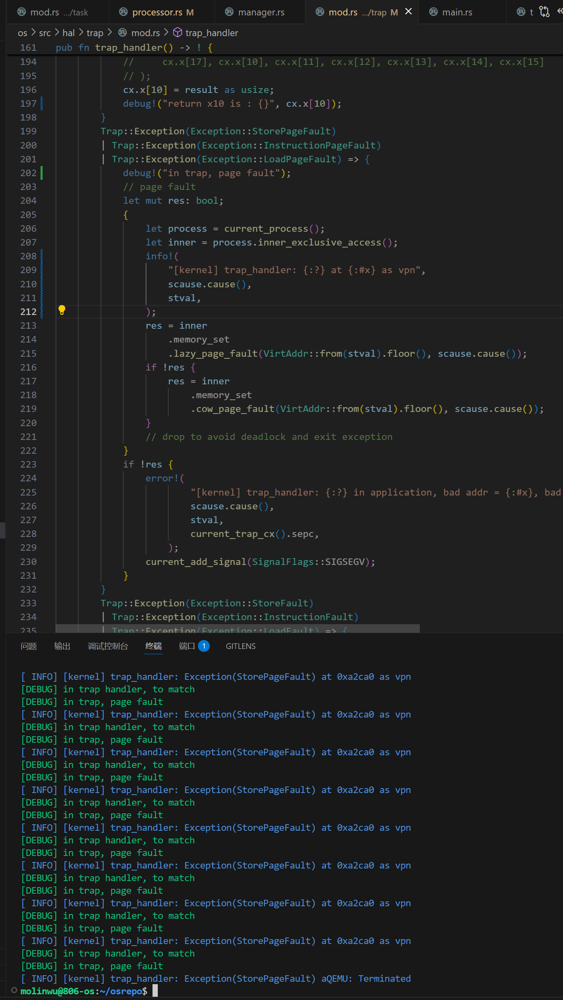
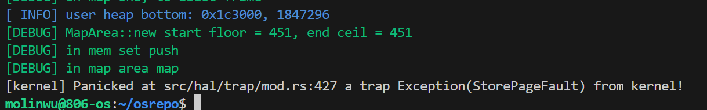

# 决赛开发日志 by molinwu

## 7.1

休息一天


## 7.2

计划一下重构的事，现在的代码看着太乱了，移植了一些东西没有很好的融合。导致debug的难度高，主要打算重构一下进程管理和内存管理部分


## 7.3-7.4

开始重构。

重新了解了一下地址空间的相关知识，主要区分用户地址空间和内核地址空间。


## 7.5

在用户发生 trap 时，`stvec` 存储着 trap 处理的入口地址，也就是到 `stvec` 的地址执行 trap 处理函数，一般存储着一段汇编代码的入口地址，然后通过汇编操作，进行一些重要信息的保存

而应用的执行流程是，在上一个程序 suspend 之后会切换到内核的 idle，通过调用 `schedule`

```rust
/// Return to idle control flow for new scheduling
pub fn schedule(switched_task_cx_ptr: *mut TaskContext) {
    let mut processor = PROCESSOR.exclusive_access();
    let idle_task_cx_ptr = processor.get_idle_task_cx_ptr();
    drop(processor);
    unsafe {
        __switch(switched_task_cx_ptr, idle_task_cx_ptr);
    }
}
```

然后在内核中的 `processor`（对cpu的抽象）会调度待执行的任务队列

```rust
pub fn run_tasks() {
    loop {
        let mut processor = PROCESSOR.exclusive_access();
        if let Some(task) = fetch_task() {
            let idle_task_cx_ptr = processor.get_idle_task_cx_ptr();
            // access coming task TCB exclusively
            task.process
                .upgrade()
                .unwrap()
                .inner_exclusive_access()
                .tms
                .set_begin();
            let mut task_inner = task.inner_exclusive_access();
            let next_task_cx_ptr = &task_inner.task_cx as *const TaskContext;
            task_inner.task_status = TaskStatus::Running;
            // release coming task_inner manually
            drop(task_inner);
            // release coming task TCB manually
            processor.current = Some(task);
            // release processor manually
            drop(processor);
            unsafe {
                __switch(idle_task_cx_ptr, next_task_cx_ptr);
            }
        } else {
            check_timer();
        }
    }
}·
```

CPU 在 fetch 到一个 `task` 之后会切换任务上下文，也就是会返回到 `TaskContext` 的 `ra`（return address）去执行，这个存储的是 `trap_return` 的地址，最终在 `trap_return` 中设置 stvec

```rust
 unsafe {
        stvec::write(TRAMPOLINE as usize, TrapMode::Direct);
    }
```

也就是跳板页的首地址，这个符号在连接脚本中被定义，就是汇编代码的入口地址。


## 7.6

不知道为什么 glibc 总是运行不起来，今天 debug 发现是在 fork(clone) 子进程的时候对地址空间的处理有问题，参考的代码中，fork 的子进程没有完全复制父进程的地址空间，而是将 stack 和 trap 空间单独处理，他是给子进程重新分配了 trap 和 stack 页面，但是却 copy 了父进程的数据，而不是直接的 copy 父进程的地址空间。。。。

发现问题，进程和线程的设计有问题，目前的困境是，在子进程 fork 时线程的 `new` 方法需要 trap 信息，但是如上面所说，trap 在开始时不设置而是单独处理的，但是这个单独处理需要子进程的 fork，，造成了死循坏，所以跑不起来。

### 子进程的地址空间

在 Linux 中，当父进程调用 `fork()` 创建子进程时，子进程的地址空间是通过一种高效的机制设置的。这个过程涉及以下几个关键步骤和机制：

1. **写时复制（Copy-On-Write，COW）**

`fork()` 的核心机制是 **写时复制**，它是一种延迟拷贝技术，用于高效地创建子进程。具体来说：

- 在调用 `fork()` 时，子进程的地址空间（包括代码段、数据段、堆、栈等）并不会立即被完整复制一份。
- 相反，父进程和子进程的地址空间在创建时是共享的，但每个地址空间的页面（内存块）被标记为“只读”。
- 当父进程或子进程试图修改某个共享页面时，操作系统会触发一个“写时复制”事件：
  - 操作系统会为修改的进程创建该页面的独立副本。
  - 修改的进程会继续在新的副本上操作，而另一个进程仍然使用原来的共享页面。
- 这种机制大大减少了 `fork()` 的开销，因为只有在实际需要修改内存时，才会进行复制。

2. **地址空间的初始化**

在 `fork()` 调用时，子进程的地址空间会按照以下方式初始化：

- **代码段（Text Segment）**：代码段通常包含程序的可执行代码，通常是只读的。在 `fork()` 时，代码段会被标记为共享且只读，因此父进程和子进程可以共享相同的代码段，无需复制。
- **数据段（Data Segment）**：数据段包含全局变量和静态变量。在 `fork()` 时，数据段的页面会被标记为“只读”，并采用写时复制机制。如果父进程或子进程试图修改数据段中的内容，操作系统会为修改的进程创建独立的页面副本。
- **堆（Heap）**：堆用于动态内存分配（如通过 `malloc()` 分配的内存）。在 `fork()` 时，堆的页面同样被标记为“只读”，并采用写时复制机制。当父进程或子进程试图修改堆中的内容时，操作系统会为修改的进程创建独立的页面副本。
- **栈（Stack）**：栈用于函数调用和局部变量存储。在 `fork()` 时，栈的页面也会被标记为“只读”，并采用写时复制机制。当父进程或子进程试图修改栈中的内容时，操作系统会为修改的进程创建独立的页面副本。

3. **文件描述符和资源**

除了地址空间，子进程还会继承父进程的其他资源：

- **文件描述符**：子进程会继承父进程打开的所有文件描述符。
- **信号处理设置**：子进程会继承父进程的信号处理函数和信号屏蔽集。
- **环境变量和工作目录**：子进程会继承父进程的环境变量和当前工作目录。

4. **效率优势**

写时复制机制使得 `fork()` 在大多数情况下非常高效。例如：

- 如果子进程创建后立即调用 `exec()`（如在常见的“fork + exec”模式中），则子进程的地址空间不会被复制，因为 `exec()` 会替换掉子进程的地址空间。
- 如果父进程和子进程在 `fork()` 后没有修改共享页面，则它们可以共享相同的物理内存，节省资源。

## 7.7




静态库之前的问题：一直在空转，现在找到了为什么，是因为 PageFault，但是 PageFault 不知道为什么一直没解决，应该也是地址空间的问题。需要等队友的 hal 移植成功估计。不过明天应该可以先搞清楚**懒分配**和**COW**的逻辑。

现在是

- glibc 的问题是地址空间问题
- musl 虽然可以运行，但是 test fail 的问题暂时还没找到
- 静态库的空转是因为 PageFault，感觉也是地址空间，存疑，需要进一步看**懒分配**和**COW**的逻辑。


## 7.8

#### load_page_fault 和 store_page_fault

在 Rust 中，特别是在 RISC-V 架构的上下文中，`LoadPageFault` 和 `StorePageFault` 是两种不同类型的内存访问异常，它们分别对应于加载（读取）操作和存储（写入）操作时触发的页错误。

`LoadPageFault`

- **定义**：当程序尝试从一个未映射的虚拟地址加载（读取）数据时，会触发 `LoadPageFault`。
- **触发场景**：
  - 访问的虚拟地址没有对应的页表项。
  - 访问的地址权限不足（例如，没有读权限）。
- **处理方式**：操作系统通常会捕获该异常，并根据情况决定是分配新的物理页面、修复页表，还是终止程序。

`StorePageFault`

- **定义**：当程序尝试向一个未映射的虚拟地址存储（写入）数据时，会触发 `StorePageFault`。
- **触发场景**：
  - 访问的虚拟地址没有对应的页表项。
  - 访问的地址权限不足（例如，没有写权限）。
- **处理方式**：与 `LoadPageFault` 类似，操作系统会捕获该异常，并根据情况决定是分配新的物理页面、修复页表，还是终止程序。

**区别**

- **操作类型**：
  - `LoadPageFault` 是在读取操作时触发的。
  - `StorePageFault` 是在写入操作时触发的。
- **用途**：
  - `LoadPageFault` 主要用于处理读取未映射或权限不足的内存。
  - `StorePageFault` 主要用于处理写入未映射或权限不足的内存。

空转是因为page fault，本质是对**COW**机制的实现有些问题，设置和检查的时机不匹配。

我想我知道为什么了，因为我们参考的代码是实现了懒分配和COW机制的，他们在mmap的时候使用了懒分配机制，也就是说，程序在使用这部分空间的时候会触发页面错误，从而进行懒分配，在懒分配的时候他们会对拥有`PTEFlags::W`标志位的pte设置COW位，之后如果该进程fork子进程，子进程也想使用这个空间时，就会进行COW位的判断和处理。但是我们的mmap是实时分配，也就是说，进程在使用mmap空间的时候不会触发懒分配的错误处理，也就没有设置COW位，之后子进程复制了父进程的地址空间，在子进程想使用这个空间的时候，触发COW错误，但是由于没有设置COW位，所以判断失败，也就没有正确处理这个错误，以至于page fault没有解决，程序空转。


## 7.9-7.13

回家


## 7.14

今天写了futex相关的系统调用，了解了一下他的工作流程


#### futex

**futex（fast userspace mutex）是 Linux 内核提供的一种“绝大多数时间工作在用户态、只有在真正需要阻塞或唤醒时才陷入内核”的同步原语，用来高效实现锁、条件变量等线程同步机制。**

1. **动机：为什么要有 futex？**

传统 System V IPC（`semget`, `semop` …）或早期 POSIX 信号量/互斥体每次操作都要系统调用，代价高。
futex 把「**无竞争时完全在用户态完成**」和「**有竞争时由内核帮忙挂起/唤醒**」结合起来，兼顾**正确性**和**性能**。

2. **工作原理（两步走）**
3. **用户态 fast-path**
   线程在共享内存中放一个 32 位整数（futex word）表示锁状态；
   用原子指令（`LDREX/STREX`, `cmpxchg`…）尝试获取锁——成功就直接返回，**0 syscall**。
4. **内核 slow-path（只在需要时）**
   如果尝试失败（发现已被占用）：
   - 调用 `futex(..., FUTEX_WAIT, expected, ...)`：内核检查值是否仍为 `expected`，是则把当前任务挂起；
   - 持有者释放锁后调用 `futex(..., FUTEX_WAKE, n, ...)`：内核唤醒最多 `n` 个等待者。
5. **关键系统调用**

```c
#include <linux/futex.h>
#include <sys/syscall.h>
#include <unistd.h>

long futex(int *uaddr, int op, int val,
           const struct timespec *timeout,
           int *uaddr2, int val3);
```

- **op** 决定行为：`FUTEX_WAIT`, `FUTEX_WAKE`, `FUTEX_REQUEUE`, `FUTEX_WAKE_OP`, `FUTEX_WAIT_BITSET` …
- **返回值**：成功返回 0 或唤醒数；失败返回 -1 置 errno。

4. **内核里发生了什么？**

- **挂起等待**：`futex_wait()` → `futex_wait_setup()` → `schedule()` 把 task 置为 `TASK_INTERRUPTIBLE`，挂入 futex 等待队列。
- **唤醒**：`futex_wake()` → `wake_up_q()` → `try_to_wake_up()` 把等待者状态改为 `TASK_RUNNING`，放回调度队列。
- **队列管理**：每个 futex 地址在内部哈希表 `futex_hash` 中对应一个 `futex_q` 链表，锁粒度很细，避免全局大锁。

5. **用 futex 构建高层同步器**

glibc 的 `pthread_mutex_t`、`pthread_cond_t`、`sem_t`、C++11 的 `std::mutex`/`std::condition_variable`，以及 Rust 的 `std::sync::Mutex` 等，**底层全部用 futex** 实现。
示例：`pthread_mutex_lock()` 在 `__lll_lock_wait()` 里最终会走到：

```c
lll_futex_wait(&mutex->__data.__lock, 2, private);
```

6. **小结**

| 维度       | 说明                                               |
| :--------- | :------------------------------------------------- |
| **作用**   | 用户态/内核态混合的同步原语                        |
| **性能**   | 无竞争时 ≈ 原子指令；有竞争时 syscall              |
| **接口**   | `futex()` 系统调用                                 |
| **使用方** | glibc、libstdc++、musl、Rust std 等高层库          |
| **优点**   | 低开销、可扩展、支持优先级继承/robust 锁等高级特性 |

因此，**futex 是现代 Linux 线程同步的基石**。

-----

`musl/lua`：就是之前发现的cow时机不对的问题，临时改了一下就可以了

`libctest`中的`pthread_cancel_points`卡住了，因为我们的线程暂时是空实现。


## 7.15

修复busybox，mkdir比较神奇，它本身有了一个文件，然后它还想创建，（我也不知道为什么本身会有那个文件），本来返回-1，给改成返回0就success了，不过，之后要查一下为什么那个文件本身就存在了。mv命令也有改名的效果，不过在fstatat中的返回值不对，导致输出了operation not permitted，应该返回no such file or dictionary，然后添加了rename的系统调用，后面的几个就都ok了。剩下的busybox都和文件系统的布局有点关系

## 7.16


busybox中mkdir的问题是因为之前运行过测例，已经修改过了文件系统镜像，重新加载一个新的文件系统镜像之后，mkdir相关的测例就过了。

- 用debug信息发现了iozonetest的问题，似乎是指令错误，暂时不知道为什么。不过是和page fault相关，有一行cow page fault输出，怀疑是地址空间问题。
- 发现了一些之前因为文件系统问题的原因，在我们原来参考的代码中有，只不过因为兼容的问题，移植初期给取消了，今天做了兼容，目前没什么问题。
- 写了一些socket的支持，但是还没有细看

## 7.17

计网是一个庞大的部分，似乎分了好多层，是不是每一层都要实现，那感觉代码量不亚于一个地址空间或者进程管理的代码。

study

## 7.18


- 全新的错误，前面两个问题一个是没有映射kernel space，一个是因为在clone user res的时候有一个config常量拼错了。
- 这个真没见过。要么是文件系统问题，要么还是地址空间问题

- 这个`fs::init()`是可以执行成功的，但是很奇怪`open /musl/busybox`就不行。。。

#### **NotReady可能原因分析**

1. **文件系统未正确挂载**
   - 挂载操作未完成或挂载点未激活
   - 超级块（Superblock）初始化失败
   - 根 inode 未正确加载
2. **文件系统驱动未完全实现**
   - 缺少关键操作函数（如 `open`、`read`）
   - 文件系统类型（如 ext2/FAT）的驱动未注册到内核
   - Inode 或 Dentry 缓存未正确建立
3. **硬件/存储层问题**
   - 块设备驱动未就绪（如磁盘读取失败）
   - 文件系统镜像未正确加载到内存

## 7.19

#### 参考代码使用`insert with hint`

之前我仔细看参考代码的时候，发现他们`alloc user res`的时候，使用的是`insert with hint`当时我还好奇为什么这么麻烦，还得先递归寻找可用页面，再分配，根据tid直接计算分配不是更好，还节省性能。今天知道为什么了，因为在创建子进程的时候，子进程首先使用父进程的地址空间，如果子进程exec其他应用的时候再重新分配stack和trap资源，但是问题是如果直接copy父进程的stack和trap信息的话，创建子进程的时候返回会返回到父进程的trap信息处，这里似乎要返回子进程的trap信息，我们参考的代码是给子进程一个存储trap的空间，然后copy父进程的数据，之后如果exec其他应用的话，再重新给子进程分配一个trap页，所以使用的是`insert with hint` ，而不能直接根据tid分配，因为tid唯一，做不到给一个进程分配两个trap页。

举例来说，在 `fork` 子进程并创建子进程的主线程的时候，就不必再分配一次用户栈和 Trap 上下文，因为子进程拷贝了父进程的地址空间，这些内容已经被映射过了。因此这个时候 `alloc_user_res` 为假。其他情况下则需要进行映射。——rCore


## 7.20

在fs中的`create_init_files`就可以open成功，但是在syscall中的`sys_exec`中就open失败，怀疑是权限问题。

```rust
lazy_static! {
    pub static ref KEEP_BUSYBOX_ELF: Option<Arc<FileClass>> = {
        let fd = open("/musl/busybox", OpenFlags::O_RDONLY, NONE_MODE).unwrap();
        Some(Arc::new(fd))
    };
}

pub fn get_musl_busybox() -> Arc<FileClass> {
    unsafe { KEEP_BUSYBOX_ELF.as_ref().unwrap().clone() }
}
```

如果只是保存FileClass的话，在`sys_exec`中就可以open过去，但是`read_all`会失败。

发现在create file中可以open成功，但是sys_exec中open失败，想了一个取巧的办法是在create file的时候就把busybox的elf数据保存下来

```rust
lazy_static! {
    pub static ref KEEP_BUSYBOX_ELF: Option<Vec<u8>> = {
        let app_inode = open("/musl/busybox", OpenFlags::O_RDONLY, NONE_MODE)
            .unwrap()
            .file()
            .unwrap();
        Some(app_inode.inode.read_all().unwrap())
    };
}

pub fn get_musl_busybox() -> Vec<u8> {
    unsafe { KEEP_BUSYBOX_ELF.as_ref().unwrap().clone() }
}
```

- 然后做一个可以get到busybox的elf数据的接口，虽然这个方法可以跳过上一个问题，但是新的问题又出现了，我请问呢，为什么这么多错误，这就是内核吗？这就是底层吗？我真的要bk了。。。。
- 根据目前的现象， 在create中没有问题，但是在sys_exec中有问题，说明底层没问题，文件系统可能有问题，可能是在不知什么地方把对底层的引用释放了，或者是在fork中有问题，总之就是在切换进程的时候把底层的引用给搞丢了，所以底层找不到了，在子进程中访问的时候就访问不到，（底层应该也没有每次访问都初始化的机制，或者说，在子进程的访问机制就不是让底层初始化的），按理说文件系统应该也没什么问题，因为参考的他们都可以，怀疑是引用的polyhal层中某个地方使用roll思想给底层设备给释放了，可以看看polyhal的example代码。
- 队友说改了processor的run_task代码，看来一眼，发现把参考代码的多核逻辑给搞过来了，且拥有抢占式调度似乎，可能有点关系。


## 7.21


polyhal中的pagetable的change里，`satp::write`失败。

这明明是一个寄存器的操作，这个不成功是什么鬼。。。难道我还要去写底层代码？驱动？为什么会这样。。。


## 7.22


这个问题应该是在loop里多次获取`trap_cx`的问题

果然，改完之后这个就过了，但是开始空转了，应该是`page_fault`


## 7.23

没办法了，只能和example一样，不能自己设置trap信息了。很有可能是这个原因，它不让我自己写trap地址。根本map不来。

似乎是，因为没有使用正确的memory_set？？

- 把ustack的映射放到了from_elf中，但是还是有问题


还是会page fault，但是分配成功了


## 7.24

- 把ustack放进from_elf中，分配成功了，但是还是页面错误，我怀疑是因为在exec中的memory_set没有activate的原因，但是不知道为什么这个activate不能执行，很奇怪
- 所以polyhal不需要用token的原因就是它手动的切换了页表，使用activate。而我们原来的代码和参考的代码都是使用token找到对应的页表，再根据找到的页表去翻译vpn。
- 没招了，我真没招了。


## 7.25

`notready`和寄存器写不进去真没招了，和队友商量了一下，只能退回到之前没有引用polyhal的时候进行重构了。

- 删了user res，不过问题出现了，在fork之后，父进程和子进程都要返回，父进程要自己的trap，子进程也要使用父进程的trap信息，按照目前的逻辑，子进程的trap直接指向父进程的trap，这样有两个可能的问题，一是把父进程的返回值错误的返回0，导致父进程没办法继续执行，二是子进程找不到（不过这种可能比较小）。
- 子进程要使用父进程的trap信息，父进程先返回，返回之后processor会fetch 到子进程，然后子进程返回

```rust
    pub fn trap_cx_ppn(&self, tid: usize) -> PhysPageNum {
        debug!(
            "in get trap cx ppn , self tid is : {}, tid is : {}",
            self.tid(),
            tid
        );
        let process = self.process.upgrade().unwrap();
        let process_inner = process.inner_exclusive_access();
        let trap_cx_bottom_va: VirtAddr = trap_cx_bottom_from_tid(tid).into();
        process_inner
            .memory_set
            .translate(trap_cx_bottom_va.into())
            .unwrap()
            .ppn()
    }
```


- 为什么这个tid为1的时候就会`unwrap`失败，但是为0的时候就能`unwrap`成功？
- 这个地方虽然使用的是子进程的页表，但是这是fork，子进程复制了父进程的地址空间，所以0可以`translate`成功，因为0在父进程的地址空间中有映射，而1没有，所以1就`translate`失败。
- 突然感觉我这样改没什么实际意义，就是把tid变唯一了，这有什么用？有这时间不如去做一些更有意义的工作。


- `mmap`的`copy`有问题，应该是因为`mmap`中某些页是懒分配，没有分配实际的物理空间，所以在`copy`的时候`loadpagefault`了。


- 两次都是`/glibc/busybox`执行，所以有相同的`elf`，`max_end_vpn`和`heap_bottom`，不过奇怪的是，为什么musl没有这个问题
- 对奥，process id都不一样，理论上是有不同的地址空间才对，虽然有相同的va，但是pa应该不同。



- 在内核态trap了？
- 将内核栈改大，但是没有解决。不是内核栈过小的问题。
- 队友在改这个，先去改别的。


## 7.26

study

#### TCP/UDP

UDP 和 TCP 是互联网传输层的两大核心协议，它们都基于 IP 协议，但设计哲学和工作原理截然不同。

------

**1. TCP（传输控制协议）：像“打电话”**

- **特点**：可靠、有序、面向连接。
- **核心原理**：
  - **三次握手建立连接**：  
    客户端和服务器先互相确认“你能听到我吗？”（类似打电话时的“喂？能听到吗？”）。  
    例：客户端发送 `SYN` → 服务器回复 `SYN-ACK` → 客户端再回 `ACK`，连接建立。
  - **数据分段与排序**：  
    数据被拆分成多个小包（如发送一张图片），每个包标记顺序号。若某个包丢失（如第3包），接收方会要求重传，最终按顺序组装还原。
  - **流量控制**：  
    根据接收方的处理能力调整发送速度（比如对方手机信号差时，说“慢点说”）。
  - **四次挥手断开连接**：  
    双方确认“我说完了，可以挂了”（如 `FIN` → `ACK` → `FIN` → `ACK`）。
- **适用场景**：网页（HTTP/HTTPS）、邮件（SMTP）、文件传输（FTP）等需要数据完整的应用。

------

**2. UDP（用户数据报协议）：像“发短信”**

- **特点**：无连接、不可靠、高效。
- **核心原理**：
  - **无需握手**：直接发数据，不管对方是否在监听。  
    例：你直接发短信给朋友，不确认他是否开机。
  - **无状态传输**：  
    每个数据包（称为“数据报”）独立发送，不标记顺序，不追踪是否到达。若丢失（如短信没收到），发送方完全不知道。
  - **无流量控制**：  
    以恒定速度发送，不管网络是否拥堵（类似不停群发消息）。
  - **轻量头部**：  
    仅8字节头部（TCP为20字节以上），传输开销小。
- **适用场景**：视频直播、在线游戏、DNS查询等需要实时性、可容忍少量丢包的应用。

------

**对比表格：TCP vs UDP**

| **特性**     | **TCP**                    | **UDP**                |
| ------------ | -------------------------- | ---------------------- |
| **连接方式** | 面向连接（三次握手）       | 无连接（直接发）       |
| **可靠性**   | 保证数据完整、有序         | 不保证，可能丢包或乱序 |
| **传输效率** | 较低（需确认、重传、排序） | 极高（无额外机制）     |
| **流量控制** | 有（滑动窗口机制）         | 无                     |
| **头部大小** | 20+字节                    | 8字节                  |
| **典型应用** | 网页、邮件、文件传输       | 视频、语音、游戏、DNS  |

------

**生活化例子**

- **TCP**：网购快递（必须签收、按顺序到货，丢失会补发）。  
- **UDP**：电台广播（信号可能断断续续，但实时性强，错过就错过了）。

------

**总结一句话**  

**TCP是“可靠但慢”的协议，UDP是“快速但不可靠”的协议**——选择哪个取决于应用更看重数据完整性还是实时性。

#### **内核视角**

下面用**“一张图 + 两条时间线”**的方式，从 **内核实现视角** 把 **UDP** 与 **TCP** 讲清楚。所有细节均来自上面引用的 Linux/UNIX 第一手资料。

------

🌐 **一张总览图（内核视角）**

```
用户进程              内核空间                            网卡
───────────         ──────────────────                  ──────
socket()  ──►  struct socket ─┐                           │
bind()    ──►  inet_sock      │                           │
send()    ──►  sk_buff  ──────┼──► IP层 ──► MAC层 ──►  发送队列
recv()    ◄──  sk_buff  ◄─────┼──◀ IP层 ◀── MAC层 ◀──  接收队列
close()   ──►  tcp_v4/udp_v4─┘                           ▲
                                                           │
内核管理结构：sock → sk_buff → skb_queue → DMA ring
```

------

⏱️ **UDP 时间线（无连接）**

| 阶段                            | 内核做了什么                                                 | 关键结构                                 |
| ------------------------------- | ------------------------------------------------------------ | ---------------------------------------- |
| **socket(AF_INET, SOCK_DGRAM)** | 创建 `struct udp_sock`，分配一个 **UDP 输入队列**（固定大小，默认 208 KB，可调 `SO_RCVBUF`） |                                          |
| **bind(port)**                  | 把 `udp_sock` 挂到 **全局哈希表**：`port -> udp_sock`        | 哈希冲突时启用 `SO_REUSEPORT` 做负载均衡 |
| **sendto(buf,len,addr)**        | 把用户数据拷到单个 `sk_buff`，直接填 UDP 首部 → 交给 IP 层   | 无流量控制，**不保证到达**               |
| **recvfrom()**                  | 从输入队列弹出一个 **完整数据报**，拷贝到用户空间；队列空 → `EAGAIN` | 队列溢出直接丢包                         |
| **close()**                     | 释放 `udp_sock` 和输入队列                                   | 无状态，立即回收                         |

> UDP 的“输入队列”只负责**存完整报文**，无顺序、无确认、无重传。

------

⏱️ **TCP 时间线（面向连接）**

| 阶段                             | 内核做了什么                                                 | 关键结构                             |
| -------------------------------- | ------------------------------------------------------------ | ------------------------------------ |
| **socket(AF_INET, SOCK_STREAM)** | 创建 `struct tcp_sock`，准备 **两**个队列：发送缓冲区、接收缓冲区 |                                      |
| **bind(port) + listen()**        | 把 `tcp_sock` 标为 **LISTEN**，放入 **半连接 hash** (`SYN queue`) | 等待三次握手                         |
| **accept()**                     | 阻塞直到 `SYN queue` 有完成握手的子 socket；返回新的 `tcp_sock` | 子 socket 继承父 socket 的缓冲区大小 |
| **send(buf,len)**                | 把用户数据切成 **MSS 片**，放入发送缓冲区 → 滑动窗口 → ACK 驱动 | 窗口满时阻塞或返回 `EAGAIN`          |
| **recv()**                       | 从接收缓冲区顺序读字节流；无数据时阻塞                       | 乱序包先进入 **乱序队列**，再合并    |
| **close()**                      | 发起 **四次挥手**；维护 `TIME_WAIT` 定时器                   | 资源在 `TIME_WAIT` 结束后回收        |

> TCP 的 **接收缓冲区** 会重排乱序段、做流量控制；**发送缓冲区** 负责超时重传。

------

🎯 **内核差异速记表**

| 维度             | UDP                          | TCP                        |
| ---------------- | ---------------------------- | -------------------------- |
| **连接状态**     | 无状态                       | 11 种 TCP 状态机           |
| **队列数量**     | 1 个输入队列                 | 发送 + 接收 + 乱序队列     |
| **队列管理**     | 完整报文、无顺序             | 字节流、重排、窗口控制     |
| **系统调用差异** | `sendto/recvfrom` 每次带地址 | `send/recv` 已连接         |
| **资源消耗**     | 极低                         | 每个连接 ≈ 3–4 kB 内核内存 |
| **网络可见**     | 报文边界保留                 | 字节流无边界               |

------

🧩 **一句话总结**

- **UDP 内核实现 = 端口哈希表 + 固定大小输入队列 + 无重传。**  
- **TCP 内核实现 = 状态机 + 双缓冲区 + 滑动窗口 + 重传定时器 + 四次挥手。**

#### Trap

今天突然怀疑为什么已经有跳板页了，还要我们手动设置trap信息，这两个是不一样的，跳板页是在用户trap到内核的时候执行的汇编代码，而真正的trap信息还保存在我们自己设置的trap位置。


## 7.27


最近一直遇到pagefault相关问题，但是我们对引入的懒分配和COW机制不是很熟悉，感觉是这两个机制在作妖。

决定删除这两个机制。

在exec中似乎有一个地方没有正确设置user_sp,修改之后这个就解决了.


- 呜呜呜,这句话终于输出了
- 改了heap的分配方式,按照heap id分配
- 不过为什么1进程会访问已经退出的2进程的heap空间呢

- 嘿嘿!过啦!
- 因为按照linux的标准,COW的机制导致父子进程的对堆空间的映射应该是相同的虚拟地址,即便在exec中也是,因为两次使用相同的elf(也就是/glibc/busybox),所以结束地址相同,heap bottom 相同,但是没人知道为什么我之前使用两个不同的页表映射相同的地址映射不进去....于是我给改成用固定的方式计算,给他们传入相同的计算变量,也就是固定的heap id,神奇的是居然可以映射进去....这就太好了,这样就算是使用巧妙的方法绕过了COW机制,但是满足了其中要求的父子进程的heap空间的虚拟地址相同.
- 这个应该也解释了为什么之前进程1会跑到进程2的heap地址,因为理论上这两个的heap地址应该是一样的.

## 7.28

- 目前还剩线程，信号，la的支持，有些信号操作是支持的，但是没有仔细的看过原理。
- 这之后就是对test的支持了。
- 近期先做线程和信号吧
- 对，还有网络相关

## 7.29


加上动态链接之后就page fault了。

## 7.30

休一天

## 7.31

`ld-linux-riscv64-lp64d.so.1` 是 **glibc 的动态链接器**；musl 使用的是 `ld-musl-riscv64.so.1` 等命名方式，两者**不兼容**，不能混用。但是我发现我们的文件系统镜像中根本就没有musl下的那个动态链接库，无语住了，翻了翻群，发现这个需要我们自己搞，我记得去年是有这个的，从去年的文件系统镜像中copy一个过来。


## 8.1

- trap需要保存的信息本质上只有两个，一个是虚拟地址，用于从页表中查取，一个是ppn，用于获取元数据。
- trap和ustack的分配方式改成和参考一样，不过我感觉他那个也有取巧，不然凭什么只需要start vpn就能从another的area中复制数据，没道理。应该是两个页表映射到了相同的虚拟地址，所以才可以。
- tid唯一的问题完成。因为信号和线程需要tid唯一，最终还是把这个机制给做出来了。


- 真尴尬，不是栈问题，这个动态链接，是mmap的地址。父进程在子进程退出后尝试访问子进程的mmap地址。
- 我怀疑是子进程在clone父进程的areas的时候的问题，可能连物理地址也clone了，所以子进程对地址空间的修改影响了父进程。
- 似乎应该加上COW机制


## 8.2

在 RISC-V 中，**`tp`（Thread Pointer）寄存器** 的**官方用途**是：

> **存放当前执行线程的“线程局部存储（TLS）块”基地址**  
> —— 也就是 `__thread` / `thread_local` 变量所在内存区域的**起始指针**。

------

**✅ 官方 ABI 规定**

- **ABI 名称**：`tp` 是 **x4** 寄存器的别名。  

- **调用约定**：跨函数调用时 **保持不变**（callee-saved）。  

- **访问 TLS** 时，编译器生成的代码会把 `tp` 加上一个常量偏移，直接定位变量：

  ```asm
  ld   t0, 0x18(tp)   # 读取 thread_local 变量
  ```

------

**✅ 典型用法**

| 场景                                  | 代码示例                               | 编译器行为                     |
| ------------------------------------- | -------------------------------------- | ------------------------------ |
| **C/C++ `__thread` / `thread_local`** | `__thread int foo;`                    | `foo` 的地址 = `tp + 固定偏移` |
| **Rust `#[thread_local]`**            | `#[thread_local] static BAR: u32 = 0;` | 同上                           |
| **运行时初始化**                      | libc / std 启动代码                    | 把 TLS 块的物理地址写进 `tp`   |

------

**⚠️ 注意事项**

- **不是特权寄存器**：`tp` 只是一个 **通用寄存器**；内核/用户态都能读写。  
- **内核不强制语义**：如果程序完全不用 TLS，可以把 `tp` 当作普通 callee-saved 寄存器用（**不推荐**）。  
- **初始化责任**：  
  - **用户态**：libc/链接器负责在 ELF 启动时设定好 `tp`。  
  - **内核**：切换线程时，**不**需要保存/恢复 `tp`（ABI 要求用户态自己维护）。

------

**✅ 一句话总结**

> **在 RISC-V 上，`tp`（x4）就是“线程局部存储基址寄存器”，专供编译器和运行时用来快速定位 `thread_local` / `__thread` 变量。**

- 在`from_existed_user`的时候没有对mmap进行特判，所以在clone area的时候应该是把所有的vpn和对应的ppn都copy过来了，也就是说，子进程和父进程享有相同的ppn，所以子进程在修改ppn的时候把父进程的ppn给改了，导致错误。应该是这个问题。在copy数据的时候，应该给子进程重新分配页。~~这个和COW的底层原理差不多了~~
- 不对，这个clone和mmap没什么关系，主要是from existed user里面的copy。但是这个里面的copy确实重新分配了物理页，这就很奇怪了。
- 解决了，我的天很神奇，今天和队友讨论了一下，用gdb搞了一下，发现父进程访问的非法地址在tp寄存器里面存着，然后我的队友就说，它做了这个tp的保存和恢复，在我的代码里加上之后就运行成功了。。。。就加了四行代码。。。。难绷，看来还是应该多讨论。


## 8.3

POSIX线程（pthread）明确规定：

- **信号处理动作是进程共享的**（通过 `sigaction` 设置）。
- **信号递送是线程定向的**（如 `pthread_kill` 可定向到特定线程），但处理逻辑仍遵循进程级规则。
- 例如：`SIGSEGV` 触发时，即使某线程注册了处理器，整个进程仍可能终止（除非使用 `sigaction` 的 `SA_ONSTACK` 等标志）。

#### Futexcmd == 9

命令码 `9` 对应的正式名称是

```
FUTEX_WAKE_OP
```

它不是简单地把某个线程唤醒，而是

1. 先在 **uaddr2** 指向的 futex 字上做一次**原子运算**（加、或、与、异或等），
2. 再把运算结果跟 **val3** 的低 24 位（即 `FUTEX_OP_ARG3`）做一次比较，
3. 如果比较结果为真，就唤醒 **uaddr** 上最多 **val** 个等待者，  
   如果比较结果为假，就唤醒 **uaddr2** 上最多 **val** 个等待者。

典型用途：把**条件变量**的“等待-触发”逻辑全部塞进一次 futex 调用里完成，避免竞争。

------

**运算编码**

`val3` 的 32 位拆成三部分：

```
31           28 27        24 23                     0
+--------------+-----------+-------------------------+
|   op_arg1    |   op      |        op_arg2          |
+--------------+-----------+-------------------------+
```

- `op_arg1`：对 **uaddr2** 做的运算  
  0 = FUTEX_OP_SET, 1 = FUTEX_OP_ADD, 2 = FUTEX_OP_OR, 3 = FUTEX_OP_ANDN, 4 = FUTEX_OP_XOR
- `op`：比较运算  
  0 = FUTEX_OP_CMP_EQ, 1 = FUTEX_OP_CMP_NE, 2 = FUTEX_OP_CMP_LT, 3 = FUTEX_OP_CMP_LE, 4 = FUTEX_OP_CMP_GT, 5 = FUTEX_OP_CMP_GE
- `op_arg2`：比较用的立即数（24 位有符号）

------

**伪代码（内核视角）**

```rust
let op_arg1 = ((val3 >> 28) & 0xF) as u8;
let op = ((val3 >> 24) & 0xF) as u8;
let op_arg2 = (val3 & 0x00FF_FFFF) as i32;
let old = *translated_ref(token, uaddr2);
match op_arg1 {
    0 => *translated_refmut(token, uaddr2) = op_arg2,
    1 => *translated_refmut(token, uaddr2) += op_arg2,
    2 => *translated_refmut(token, uaddr2) |= op_arg2,
    3 => *translated_refmut(token, uaddr2) &= !op_arg2,
    4 => *translated_refmut(token, uaddr2) ^= op_arg2,
    _ => return Err(SysErrNo::EINVAL),
}
let cmp_ok = match op {
    0 => old == op_arg2,
    1 => old != op_arg2,
    2 => old < op_arg2,
    3 => old <= op_arg2,
    4 => old > op_arg2,
    5 => old >= op_arg2,
    _ => return Err(SysErrNo::EINVAL),
};
let wake_addr = if cmp { uaddr } else { uaddr2 };
futex_wake(wake_addr, val);
```

------

**总结**

当你的 `sys_futex` 收到 `cmd == 9` 时，应：

- 解析 `val3` 为 `FUTEX_WAKE_OP` 的运算-比较指令；
- 原子地修改 `uaddr2` 指向的 futex 字；
- 根据比较结果决定唤醒 `uaddr` 还是 `uaddr2` 上的等待者。


## 8.4-8.7

学习网络相关，不过发现确实庞大，准备移植一个网络模块。


## 8.8

今天把信号的内容添加完了，不过这导致了前面的测例出现问题了。还要做兼容的问题。


## 8.9

#### 自顶向下

下面用最少、最可落地的 Rust 代码，把“能跑通系统调用”的 TCP/UDP 网络模块自顶向下写出来。  
只保留必须的数据结构与函数名，其余全部留白，方便你后面一点点填。

────────────────  

1. 用户视角：只暴露 8 个系统调用  
   sys_socket()  
   sys_bind()  
   sys_listen()  
   sys_accept()  
   sys_connect()  
   sys_sendto() / sys_sendmsg()  
   sys_recvfrom() / sys_recvmsg()  
   sys_close()

────────────────  

2. 自顶向下：代码骨架

2.1 task::fd_table（你已有时可直接复用）

```rust
pub struct FdTable {
    entries: Vec<Option<Arc<dyn File>>>,
}
```

2.2 net::Socket（对上层它就是 `dyn File`）

```rust
pub trait File: Send + Sync {
    fn read(&self, buf: &mut [u8]) -> Result<usize, Error>;
    fn write(&self, buf: &[u8]) -> Result<usize, Error>;
    fn poll(&self) -> PollEvents;          // 非阻塞用
    fn as_socket(&self) -> Option<&Socket>; // downcast
}

pub struct Socket {
    domain:   u32,      // AF_INET
    typ:      u32,      // SOCK_STREAM / DGRAM
    protocol: u32,      // IPPROTO_TCP / UDP
    inner:    SocketInner,
}

enum SocketInner {
    Tcp(TcpSocket),
    Udp(UdpSocket),
}
```

2.3 传输层最小结构体

```rust
pub struct UdpSocket {
    local:  Option<SocketAddrV4>,   // 已 bind 的地址
    peer:   Option<SocketAddrV4>,   // connect() 后填
    rx:     VecDeque<Vec<u8>>,      // 收到的包
}

pub struct TcpSocket {
    state:  TcpState,               // LISTEN / ESTABLISHED ...
    local:  SocketAddrV4,
    peer:   Option<SocketAddrV4>,
    rx:     VecDeque<u8>,           // 顺序字节流
    tx:     VecDeque<u8>,
}
#[derive(Copy, Clone)]
enum TcpState { Closed, Listen, SynSent, Established }
```

2.4 网络层最小结构体（只占位）

```rust
#[derive(Copy, Clone)]
pub struct SocketAddrV4 {
    ip:   Ipv4Addr,
    port: u16,
}
```

#### 地址族

一句话：地址族（Address Family）就是“地址的格式说明书”。

内核里凡是出现 `AF_XXX` 的常量，都是在告诉你“接下来的 IP/端口/路径该怎么解析、占多少字节”。常见值：

AF_INET   → IPv4 地址，4 字节 IP + 2 字节端口  
AF_INET6  → IPv6 地址，16 字节 IP + 2 字节端口  
AF_UNIX   → 本地文件系统路径，可变长字符串  
AF_PACKET → 原始链路层帧，以太网头格式  

因此：

• 创建 socket 时你必须先选 AF，告诉内核“后面我要给的是哪种地址”。  
• 后续所有系统调用（bind、connect、sendto、accept）都把 sockaddr 强转成对应的格式。  

没有地址族，内核就无法知道 `struct sockaddr` 里那 14 个字节到底是 IPv4、IPv6，还是别的。

这些值只是“协议族”常量，在内核/系统库里用整数区分，没有内在算术意义——就像枚举标签。

| 宏名       | 典型值（十进制） | 含义（地址格式 / 用途）         |
| ---------- | ---------------- | ------------------------------- |
| `AF_INET`  | 2                | IPv4：4 byte IP + 2 byte port   |
| `AF_INET6` | 10               | IPv6：16 byte IP + 2 byte port  |
| `AF_UNIX`  | 1                | Unix 域套接字：本地文件系统路径 |

在 Linux 的 `include/linux/socket.h` 里能看到：

```c
#define AF_UNSPEC   0
#define AF_UNIX     1   /* Unix domain sockets */
#define AF_INET     2   /* Internet IP Protocol */
#define AF_INET6    10  /* IP version 6 */
```

因此：

• 写程序时只认“名字”，不要写死数字。  
• 内核收到 `domain = 2` 就知道后续 `sockaddr_in` 是 IPv4 格式；收到 `domain = 10` 就按 `sockaddr_in6` 解析。

#### TCP

下面用「一条 TCP 连接从创建到关闭」的时间线串起 `TcpInner` 的所有字段，说明它们**什么时候被写、什么时候被读、如何驱动整个状态机**。

------

阶段 0：socket 诞生  
• `TcpInner::new()` 初始化  
  ‑ `state = Closed`  
  ‑ `snd_una = snd_nxt = rcv_nxt = 0`（真正握手时再填 ISN）  
  ‑ `rx/tx/backlog/rtx_queue/ooo_map/…` 全部为空  
  ‑ `local_addr = peer_addr = None`

------

阶段 1：bind → listen  
• 用户调用 `bind("0.0.0.0:8080")` → `bound_port = 8080`  
• 用户调用 `listen(128)` →  
  ‑ `state = Listen`  
  ‑ `backlog = 128`  
  ‑ `pending_conns`（半连接队列）清空  
  ‑ `completed_conns`（全连接队列）清空  

------

阶段 2：三次握手（SYN 到达）  
2.1 收到第一个 SYN  
  ‑ 新建 `PendingConnection` 塞进 `pending_conns`  
  ‑ 给这条子连接随机产生 ISN → 写入子连接的 `snd_nxt`  
  ‑ 发送 SYN-ACK，启动 **RTO 定时器** (`rto_timer.start()`)

2.2 收到 ACK（三次握手最后一个包）  
  ‑ 把该连接从 `pending_conns` 移到 `completed_conns`  
  ‑ 子连接状态变为 `Established`  
  ‑ 上层 `accept()` 从 `completed_conns.pop_front()` 取走即可

------

阶段 3：数据传输（ESTABLISHED）  
3.1 接收方向  
  • 网卡收到数据包 →  
    ‑ 若 seq == `rcv_nxt`：直接追加到 `rx`（应用可读）  
    ‑ 若 seq > `rcv_nxt`：把 `RecvSegment` 插入 `ooo_map`，等待空洞填补  
    ‑ 触发 `pending_ack = true`，启动 **延迟 ACK 定时器** (`delack_timer.start()`)

  • 定时器到期 → 发送 ACK，清空 `pending_ack`，`rcv_nxt` += 已交付字节

3.2 发送方向  
  • 用户 `write(buf)` → 把字节推到 `tx`  
  • 发送逻辑循环：  
    允许发送窗口 = `min(peer_wnd, cwnd)`  
    从 `tx` 弹出 ≤ MSS 的数据 → 构建 `SentSegment` →  
    ‑ 填入 `seq = snd_nxt`，`len = data.len()` →  
    ‑ `snd_nxt += len` →  
    ‑ 启动 **RTO 定时器** →  
    ‑ 包放入 `rtx_queue` → 真正发送

3.3 收到 ACK  
  • 解析 ack_seq → 把所有 `SentSegment.seq + len ≤ ack_seq` 从 `rtx_queue` 删除  
  • 更新 `snd_una = ack_seq`  
  • 根据 RTT 样本更新 `rto_timer.rtt_estimator()`  
  • 拥塞控制：  
    ‑ 若处于慢启动：`cwnd += MSS`  
    ‑ 若到达 `ssthresh`：进入拥塞避免 `cwnd += MSS*MSS/cwnd`

3.4 超时重传  
  • `rto_timer` 触发 → 把 `rtx_queue.front()` 重新发送  
  • `rtx_count += 1`；若超过阈值，可 `close()` 并发送 RST  
  • 拥塞反应：`ssthresh = max(cwnd/2, 2*MSS)`，`cwnd = MSS`（TCP Tahoe）

------

阶段 4：四次挥手（主动/被动关闭）  
• 用户 `close()` → `state = FinWait1`，放入 FIN 段到 `tx` 并发送  
• 收到对端 FIN → 根据当前状态机迁移  
  ‑ `FinWait1 → FinWait2 → TimeWait` 或  
  ‑ `CloseWait → LastAck`  
• `TimeWait` 定时器到期后真正释放资源

------

阶段 5：资源回收  
• 所有定时器停止  
• `rx/tx/rtx_queue/ooo_map` 清空  
• `state = Closed`

------

一句话总结  
`TcpInner` 像一个“迷你 TCP 端点”：  

- `rx/tx` 对接用户；  
- `snd_* / rcv_*` 与序号空间打交道；  
- 定时器 + 队列（rtx_queue / ooo_map / delack_timer）保证可靠、按序、流量/拥塞控制；  
- 状态机字段（`state`, `pending_conns`, `completed_conns`）驱动连接生命周期。


## 8.10

开始移植blueos的net模块


## 8.11

所以其实本质上socket不需要一个真正的inode，只需要有一个虚拟的概念，就我似乎给你分配的一个inode，但具体分没分配不关心，主要是为了使用fd来管理这个socket


## 8.12

队友说决赛的测例有点问题，我来debug一下。


- 第一个失败了，看了一下源码，应该是要由一部分被跳过，跳过的部分应该是0才对。
- 但是这个工作似乎应该是用户态来做才对
- 不过很奇怪，按理说我在每次mmap或者brk的时候都让alloc出来的页面全零配置了，之后如果只是在用户空间跳了一些部分，前面没有被操作过，应该还是全零才对。


## 8.13

#### vDso

**vDSO = “virtual Dynamic Shared Object”** —— 内核在 **用户态地址空间** 里 **映射的一小段只读代码/数据**，用来让 libc 调用 **“快”且不进入内核** 的系统调用（如 `gettimeofday`、`clock_gettime`、`sigreturn` 等），同时避免 **系统调用号/ABI 差异** 带来的兼容性问题。

------

为什么需要 vDSO？

1. **加速**  
   像 `gettimeofday` 这类纯读系统信息，不修改内核状态，内核提前把实现 **编译成一段机器码** 拷到 vDSO 里；  
   用户态直接 `call vDSO` → **不走 `syscall/ecall`**，省一次上下文切换。
2. **兼容**  
   不同架构/内核版本的系统调用号、寄存器约定不一样，libc 只需 **链接到 vDSO 提供的符号**（`__vdso_gettimeofday`…），内核升级后 vDSO 内容跟着变，**用户程序无需重编**。
3. **信号返回**  
   glibc 把 `rt_sigreturn` 的 stub 放在 vDSO 里；若内核没映射 vDSO，stub 地址就是悬空 → InstructionPageFault（你遇到的情况）。

------

在系统里的样子

- 用户用 `ldd /bin/ls` 常见到一行：  

  ```
  linux-vdso.so.1 =>  (0x00007ffe6b7fc000)
  ```

  这就是 vDSO 被自动映射的页。

- 内核启动时调用 `arch_setup_additional_pages`，把 **一页 R-X** 映射到 **随机化后的用户地址**（ASLR）。

------

一句话总结  
vDSO 就是 **内核送给用户态的“自带库”**，让 **快系统调用** 和 **ABI 兼容** 同时成立。

- musl的相关代码是正确执行了的。
- ai结论：
- musl 把 stub 放在 **用户 libc** → 地址有效，能用。
- 你用的 glibc 依赖 **vDSO** 提供 stub，而你的内核 **没给用户映射 vDSO**，于是返回地址指向“空气”，于是 InstructionPageFault。

## 8.14

队友改la架构改了一个半月但是失败了，我康康能不能提供点新思路。

#### DA&PG

在 LoongArch 架构中，`CRMD` 寄存器是 **当前模式信息寄存器**（Current Mode Information Register），其中的 `DA` 和 `PG` 位共同决定了处理器当前的虚实地址翻译模式，具体含义如下：

| 位   | 名称 | 含义                                                         |
| ---- | ---- | ------------------------------------------------------------ |
| 3    | DA   | 直接地址翻译模式使能位（Direct Address translation mode enable） |
| 4    | PG   | 映射地址翻译模式使能位（Paged address translation mode enable） |

在 LoongArch 架构中，`CRMD` 寄存器是 **当前模式信息寄存器**（Current Mode Information Register），其中的 `DA` 和 `PG` 位共同决定了处理器当前的虚实地址翻译模式，具体含义如下：

| 位   | 名称 | 含义                                                         |
| ---- | ---- | ------------------------------------------------------------ |
| 3    | DA   | 直接地址翻译模式使能位（Direct Address translation mode enable） |
| 4    | PG   | 映射地址翻译模式使能位（Paged address translation mode enable） |

**1. DA（Direct Address）**

- **DA=1** 表示启用 **直接地址翻译模式**（Direct Address Translation Mode）。
- 在此模式下，**虚拟地址直接等于物理地址**（或低位部分直接映射），**不经过页表或TLB转换**。
- 处理器复位后默认进入该模式（DA=1, PG=0），此时 PC=0x1C000000 对应的物理地址也是 0x1C000000。

**2. PG（Paged）**

- **PG=1** 表示启用 **映射地址翻译模式**（Paged Address Translation Mode）。
- 在此模式下，地址翻译通过 **直接映射窗口** 或 **页表映射（TLB）** 完成。
- 操作系统正常运行时，通常启用该模式（DA=0, PG=1），以支持虚拟内存管理。

**两种模式的组合关系**

| DA       | PG   | 模式说明                     |
| -------- | ---- | ---------------------------- |
| 1        | 0    | 直接地址翻译模式（复位默认） |
| 0        | 1    | 映射地址翻译模式（启用页表） |
| 其他组合 |      | 非法或未定义                 |


## 8.15

la真的改不出来。。。。~~~呜呜呜呜呜真崩溃了~~~

改git支持吧

在内核里建了一个/etc/gitconfig文件

```rust
#### OS COMP TEST GROUP START git-musl ####
error: opening /home/.gitconfig: Operation not permitted
error: opening /home/.gitconfig: Operation not permitted
error: opening /home/.gitconfig: Operation not permitted
```

- 不知道为什么，明明创建了lock文件，读取了/etc/gitconfig,但是就是不创建/home/.gitconfig就想写，太奇怪了。于是我尝试直接创建/home/.gitconfig文件

```rust
#### OS COMP TEST GROUP START git-musl ####
error: failed to write new configuration file /home/
error: failed to write new configuration file /home/
error: failed to write new configuration file /home/
```

- 这个是因为在git想要确认/home/.gitconfig文件是否是一个符号链接的时候返回了错误的错误码，因为这个文件本身是普通文件，所以在git问，“你是一个符号链接吗？”的时候，应该告诉他，“不，我不是”。

```rust
#### OS COMP TEST GROUP START git-musl ####
error: could not write config file /home/.gitconfig: No such file or directory
error: could not write config file /home/.gitconfig: No such file or directory
error: could not write config file /home/.gitconfig: No such file or directory
```

```rust
[DEBUG] old path is : /home/.gitconfig.lock, new path : /home/.gitconfig
```

- 它居然是先写/.gitconfig.lock文件，再重命名为/.gitconfig文件，但是我已经创建了/.gitconfig文件，所以会重命名失败。
- 但是如果我把内核中的/.gitconfig删除，又会回到第一个问题。
- 估计是权限问题，不过git的权限检查也是离谱，奇奇怪怪。

