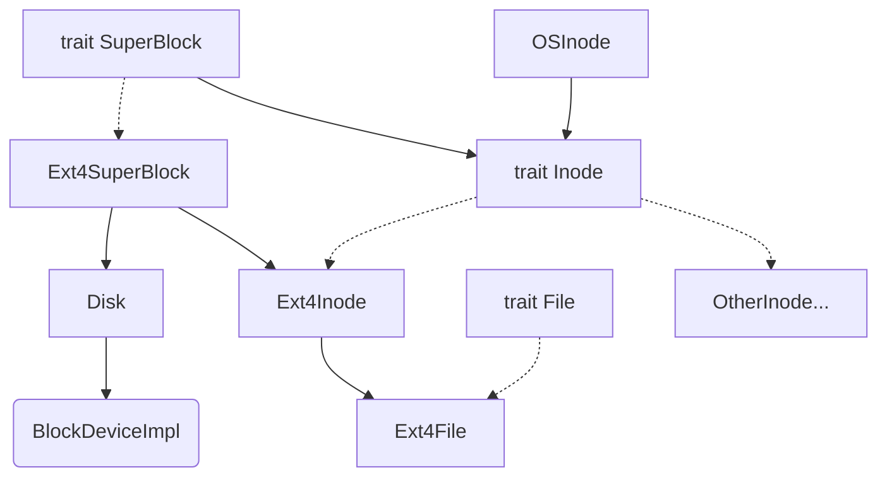

# 决赛第一阶段开发文档

- [决赛第一阶段开发文档](#决赛第一阶段开发文档)
  - [1. 概述](#1-概述)
  - [2. SubsToKernel 设计与实现](#2-substokernel-设计与实现)
    - [2.1 进程管理](#21-进程管理)
      - [2.1.1 进程与线程控制块](#211-进程与线程控制块)
      - [2.1.2 进程调度](#212-进程调度)
      - [2.1.3 异常与中断](#213-异常与中断)
    - [2.2 内存管理](#22-内存管理)
      - [2.2.1 地址空间布局](#221-地址空间布局)
      - [2.2.2 内存映射](#222-内存映射)
      - [2.2.3 堆管理](#223-堆管理)
    - [2.3 文件系统](#23-文件系统)
      - [2.3.1 虚拟文件系统](#231-虚拟文件系统)
      - [2.3.2 EXT4 文件系统支持](#232-ext4-文件系统支持)
      - [2.3.3 文件描述符管理](#233-文件描述符管理)
    - [2.4 信号机制](#24-信号机制)
      - [2.4.1 信号处理框架](#241-信号处理框架)
      - [2.4.2 信号传递机制](#242-信号传递机制)
    - [2.5 HAL 硬件抽象层](#25-hal-硬件抽象层)
      - [2.5.1 架构适配设计](#251-架构适配设计)
      - [2.5.2 内存管理适配](#252-内存管理适配)
      - [2.5.3 中断处理适配](#253-中断处理适配)
    - [2.6 网络机制](#26-网络机制)
      - [2.6.1 Socket 系统调用](#261-socket-系统调用)
      - [2.6.2 网络协议栈](#262-网络协议栈)
      - [2.6.3 设备驱动](#263-设备驱动)
  - [3. 总结与展望](#3-总结与展望)

## 1. 概述

`SubsToKernel` 是使用 `Rust` 语言基于 [2025春夏季开源操作系统训练营 rCore 项目](https://github.com/LearningOS/rust-based-os-comp2025/blob/main/2025-spring-summary.md) 设计的操作系统内核，支持 RISC-V/LoongArch 两个架构，兼容 POSIX 协议。本项目在决赛阶段实现了完整的进程管理、内存管理、文件系统、信号机制、跨架构 HAL 设计以及网络功能。

队员来自北京科技大学，成员及分工如下：

- 吴函霖：内存管理、网络模块、进程结构体重构、部分 syscalls 实现；
- 刘畅：文件系统、信号机制、架构适配重构、部分 syscalls 实现。

## 2. SubsToKernel 设计与实现

### 2.1 进程管理

决赛阶段，我们对进程管理模块进行了重构。采用 PCB 和 TCB 分离的设计，实现了更清晰的进程与线程管理架构。

#### 2.1.1 进程与线程控制块

我们使用 `ProcessControlBlock`(PCB) 和 `TaskControlBlock`(TCB) 分别管理进程和线程，PCB 中包含一个 TCB 数组用来存放一个进程的所有线程:

```rust
/// Process Control Block
pub struct ProcessControlBlock {
    ///ppid
    pub ppid: usize,
    /// immutable
    pub pid: usize,
    /// immutable default user
    pub user: Arc<User>,
    /// mutable
    inner: UPSafeCell<ProcessControlBlockInner>,
}
```

PCB 的内部结构包含了进程的所有资源管理，相比于原先的版本，我们添加了信号、堆管理和计时器等机制，并改写了文件管理和地址空间的实现：

```rust
pub struct ProcessControlBlockInner {
    /// is zombie?
    pub is_zombie: bool,
    /// memory set(address space)
    pub memory_set: Arc<MemorySet>,
    /// parent process
    pub parent: Option<Weak<ProcessControlBlock>>,
    /// children process
    pub children: Vec<Arc<ProcessControlBlock>>,
    /// exit code
    pub exit_code: i32,
    /// file descriptor table
    pub fd_table: Arc<FdTable>,
    /// fs info
    pub fs_info: Arc<FsInfo>,
    /// signal flags
    pub signals: SignalFlags,
    /// tasks(also known as threads)
    pub tasks: Vec<Option<Arc<TaskControlBlock>>>,
    /// task resource allocator
    pub task_res_allocator: RecycleAllocator,
    /// mutex list
    pub mutex_list: Vec<Option<Arc<dyn Mutex>>>,
    /// semaphore list
    pub semaphore_list: Vec<Option<Arc<Semaphore>>>,
    /// condvar list
    pub condvar_list: Vec<Option<Arc<Condvar>>>,
    /// priority
    pub priority: usize,
    /// stride
    pub stride: Stride,
    /// process tms
    pub tms: Tms,
    /// signal table
    pub sig_table: Arc<SigTable>,
    /// clear child tid
    pub clear_child_tid: usize,
    /// heap management
    pub heap_id: usize,
    pub heap_bottom: usize,
    pub heap_top: usize,
    /// robust list
    pub robust_list: RobustList,
    /// timer
    pub timer: Arc<Timer>,
}
```

TCB 中包含一个对自己所属进程的弱引用，避免循环引用的同时能够访问进程资源。相比于原本的 rCore 实现，我们删除了 `TaskUserRes`，使其结构更加清晰，有利于对进程资源的管理:

```rust
pub struct TaskControlBlock {
    /// immutable
    pub process: Weak<ProcessControlBlock>,
    /// Kernel stack corresponding to TID
    pub kstack: KernelStack,
    /// mutable
    inner: UPSafeCell<TaskControlBlockInner>,
}

pub struct TaskControlBlockInner {
    pub tid: usize,
    pub ptid: usize,
    /// Trap cx phys page number
    pub trap_cx_ppn: PhysPageNum,
    /// Trap virtual address
    pub trap_va: VirtAddr,
    /// Save task context, 线程上下文
    pub task_cx: TaskContext,
    /// Maintain the execution status of the current process
    pub task_status: TaskStatus,
    /// It is set when active exit or execution error occurs
    pub exit_code: Option<i32>,
    /// User stack top
    pub ustack_top: VirtAddr,
    /// Signal mask
    pub sig_mask: SignalFlags,
    /// Signal pending
    pub sig_pending: SignalFlags,
}
```

每个成员如注释所述，对子进程持强引用，对父进程持弱引用的方法可以防止循环引用造成的内存泄漏。

#### 2.1.2 进程调度

为了确保异步安全，我们使用 `Arc` 包裹 PCB 和 TCB，并使用内部可变性模式管理可变状态：

```rust
pub struct UPSafeCell<T> {
    /// inner data
    inner: RefCell<T>,
}

unsafe impl<T> Sync for UPSafeCell<T> {}

impl<T> UPSafeCell<T> {
    /// User is responsible to guarantee that inner struct is only used in
    /// uniprocessor.
    pub unsafe fn new(value: T) -> Self {
        Self {
            inner: RefCell::new(value),
        }
    }
    /// Panic if the data has been borrowed.
    pub fn exclusive_access(&self) -> RefMut<'_, T> {
        self.inner.borrow_mut()
    }
    pub fn borrow(&self) -> RefMut<'_, T> {
        self.inner.borrow_mut()
    }
    pub fn get_unchecked_mut(&self) -> &mut T {
        unsafe { &mut *self.inner.as_ptr() }
    }
    pub fn get_unchecked_ref(&self) -> &T {
        unsafe { &*self.inner.as_ptr() }
    }
}
```

`RefCell` 是 Rust 标准库中的一个类型，提供了在运行时进行可变借用检查的能力。它允许在单线程环境中进行内部可变性（interior mutability）。`Sync` 是一个标记 trait，表示类型可以安全地在多个线程间共享引用。`RefCell` 本身不是 `Sync` 的，因为它只在单线程环境中保证安全，因此我们通过 `unsafe impl` 声明，承诺 `UPSafeCell` 可以安全地在多线程环境中共享。在多核环境下，这种方法并不安全，只是一种在多核尚未实现的情况下的临时措施。

线程状态管理包括四种状态：
- `Ready`：就绪状态，等待调度
- `Block`：阻塞状态，等待某些条件满足
- `Running`：运行状态，正在执行
- `Exit`：退出状态，线程已结束

调度算法采用时间片轮转结合 Stride 调度：

```rust
pub fn run_tasks() {
    loop {
        let mut processor = PROCESSOR.exclusive_access();
        if let Some(task) = fetch_task() {
            let idle_task_cx_ptr = processor.get_idle_task_cx_ptr();
            // 上下文切换和任务执行逻辑
            ...
            processor.current = Some(task);
            drop(processor);
            unsafe {
                __switch(idle_task_cx_ptr, next_task_cx_ptr);
            }
        } else {
            check_timer();
        }
    }
}
```

任务之间的切换通过访问 `__switch` 这个符号来实现，其作用是保存一个任务的上下文而恢复另一个任务的上下文，也就是与当前这个任务相关的寄存器内容。

用户态向内核态的切换通过访问 `__alltraps` 这个符号进行，其实现方式是切换内核栈与用户栈的指针，保存当前的上下文，包括通用寄存器、浮点寄存器、当前地址空间 token 和 `sepc`(`prmd`) 寄存器等到内核栈上，然后将 `sp` 指针切换为用户栈后返回，从内核态切换到用户态的 `__restore` 符号做的是类似的操作。

#### 2.1.3 异常与中断

我们的系统支持处理不同架构下的异常与中断，通过条件编译适配 RISC-V 和 LoongArch：

```rust
#[cfg(target_arch = "riscv64")]
pub fn trap_handler() -> ! {
    // RISC-V 特定的 trap 处理
}

#[cfg(target_arch = "loongarch64")]
pub fn trap_handler() -> ! {
    // LoongArch 特定的 trap 处理
}
```

### 2.2 内存管理

我们重新设计了内存管理子系统，支持更灵活的地址空间布局和高效的内存分配策略。

#### 2.2.1 地址空间布局

地址空间被重新规划，用户栈和堆分别管理，避免相互冲突：


内存布局从低地址到高地址依次为：
- 代码段和数据段
- 用户栈区域
- 保护页（Guard Page）
- 用户堆区域

```rust
pub struct MemorySetInner {
    /// page table
    pub page_table: PageTable,
    /// areas
    pub areas: Vec<MapArea>,
}
```

#### 2.2.2 内存映射

使用 `MapArea` 管理不同类型的内存区域：

```rust
pub struct MapArea {
    pub vpn_range: VPNRange,
    pub data_frames: BTreeMap<VirtPageNum, Arc<FrameTracker>>,
    pub map_type: MapType,
    pub map_perm: MapPermission,
    pub area_type: MapAreaType,
    pub mmap_file: MmapFile,
    pub mmap_flags: MmapFlags,
    pub groupid: usize,
}
```

物理页帧使用 RAII 管理，确保内存安全：

```rust
pub struct FrameTracker {
    pub ppn: PhysPageNum,
}

impl Drop for FrameTracker {
    fn drop(&mut self) {
        frame_dealloc(self.ppn);
    }
}
```

#### 2.2.3 堆管理

堆的管理信息维护在 PCB 中，支持动态扩展：

```rust
// 在 ProcessControlBlockInner 中
pub heap_id: usize,
pub heap_bottom: usize,
pub heap_top: usize,
```

### 2.3 文件系统

文件系统设计目标是最大程度将文件系统与内核解耦合，降低内核的复杂度，目前我们已经实现了解耦合的基本目标，支持了 EXT4 文件系统。

#### 2.3.1 虚拟文件系统

基于 Rust 提供的 `trait` 机制，抽象为 `SuperBlock`, `Inode` 和 `File` 特性，任何实现了这些 `trait` 的对象都可以作为任意一个文件系统的模块，由此可以消除不同文件系统的差异，以便支持不同的文件系统。只需要调用 `trait` 中定义的方法即可对文件系统实现统一的操作。部分定义如下：

```rust
pub trait SuperBlock: Send + Sync {
    fn root_inode(&self) -> Arc<dyn Inode>;
    fn sync(&self);
    fn fs_stat(&self) -> Statfs;
    fn ls(&self);
}
```

其中 `SuperBlock` 对应文件系统的管理器，负责提供整个文件系统的信息，对外提供根节点 `root_inode` 进行调用，同时负责文件系统的磁盘刷新操作。

```rust
pub trait Inode: Send + Sync {
    fn size(&self) -> usize;
    fn types(&self) -> InodeType;
    fn is_dir(&self) -> bool;
    fn fstat(&self) -> Kstat;
    /// 创建文件或目录
    fn create(&self, _path: &str, _ty: InodeType) -> Result<Arc<dyn Inode>, SysErrNo>;
    /// 查找文件
    fn find(&self, _path: &str, _flags: OpenFlags, _loop_times: usize) -> Result<Arc<dyn Inode>, SysErrNo>;
    fn read_at(&self, _off: usize, _buf: &mut [u8]) -> SyscallRet;
    fn write_at(&self, _off: usize, _buf: &[u8]) -> SyscallRet;
    /// 读取目录项
    fn read_dentry(&self, _off: usize, _len: usize) -> Result<(Vec<u8>, isize), SysErrNo>;
    ...
}
```

`Inode` 对应的是文件系统中的具体文件，在后续我们有 `impl Inode for Ext4Inode` 以具体实现文件节点，对读写、增删查改等一系列接口进行封装以供上层调用。

```rust
pub trait File: Send + Sync {
    fn readable(&self) -> bool;
    fn writable(&self) -> bool;
    /// 对缓冲区的读操作
    fn read(&self, _buf: UserBuffer) -> SyscallRet;
    /// 对缓冲区的写操作
    fn write(&self, _buf: UserBuffer) -> SyscallRet;
    fn fstat(&self) -> Kstat;
    ...
}
```

`File` 对应在内核中具体使用的文件，这是一个十分泛用的接口，可以 `impl` 在抽象的文件、输出流、管道和设备上。

除此之外，还要实现给内核其他部分的文件处理的接口，方便进行文件的读写增改查操作。

```rust
pub struct OSInode {
    readable: bool, // 该文件是否允许通过 sys_read 进行读
    writable: bool, // 该文件是否允许通过 sys_write 进行写
    pub inode: Arc<dyn Inode>,
    pub(crate) inner: Mutex<OSInodeInner>,
}
#[derive(Debug)]
pub struct OSInodeInner {
    pub(crate) offset: usize, // 偏移量
}
```

`OSInode` 是文件系统给内核的接口，诸如诸如 `open()` 等一般的内核对文件的操作的返回值类型，由此实现对文件的控制。文件系统架构图如下：




#### 2.3.2 EXT4 文件系统支持

我们使用 [elliott10/lwext4_rust](https://github.com/elliott10/lwext4_rust) 库实现 EXT4 支持：

```rust
pub struct Ext4SuperBlock {
    inner: UPSafeCell<Ext4BlockWrapper<Disk>>,
    root: Arc<dyn Inode>,
}
```

`Ext4SuperBlock` 中的 `inner` 封装着块设备驱动 `Disk`，其中 `UPSafeCell` 提供了线程安全的内部可变性； `root` 作为动态分发的根目录为文件系统操作提供起点。

```rust
pub struct Ext4Inode {
    inner: UPSafeCell<Ext4InodeInner>,
}

pub struct Ext4InodeInner {
    f: Ext4File,
    delay: bool,
    if_dir: bool,
}
```

`Ext4Inode` 提供着文件类型标志 `if_dir` 和延迟删除标志 `delay`，还有 `f` 作为 `Ext4File` 即实际的文件操作对象。

```rust
pub struct Ext4File {
    //file_desc_map: BTreeMap<CString, ext4_file>,
    file_desc: ext4_file,
    file_path: CString,

    this_type: InodeTypes,

    has_opened: bool,
    last_flags: u32,
}
```

`ext4_file` 是由 `lwext4_rust` 库封装的文件类型，`file_path` 为文件的绝对路径，`this_type` 作为 `InodeTypes` 是关于文件类型的枚举值，`has_opened` 是关于文件是否打开的标记，`last_flags` 是上次使用的打开标记。这些内容比较完整地描述了一个文件所需要的数据。

#### 2.3.3 文件描述符管理

文件描述符表管理进程的文件访问：

```rust
pub struct FdTable {
    inner: UPSafeCell<FdTableInner>,
}

pub struct FdTableInner {
    soft_limit: usize,
    hard_limit: usize,
    files: Vec<Option<FileDescriptor>>,
}
```

文件描述符表管理进程对打开文件的控制，用 `FdTableInner` 封装，分配新 `fd` 时会检查软阈值 `soft_limit`，而 `hard_limit` 是整个操作系统不可逾越的绝对资源上限值。

```rust
#[derive(Clone)]
pub enum FileClass {
    File(Arc<OSInode>),
    Abs(Arc<dyn File>),
}
#[derive(Clone)]
pub struct FileDescriptor {
    pub flags: OpenFlags,
    pub file: FileClass,
}
```

`FileClass` 对不同的文件提供不同的访问接口，而 `FileDescriptior` 作为文件描述符 `fd` 的实体用于封装文件的操作状态。`FileClass` 最后通过 `File` 这个 `trait` 连接到 `Ext4File` 类型。

### 2.4 信号机制

我们实现了 POSIX 信号机制，支持信号的发送、接收和处理。

#### 2.4.1 信号处理框架

信号处理相关的数据结构包括：

```rust
/// Signal flags
pub struct SignalFlags {
    bits: u64,
}

/// Signal table for storing signal handlers
pub struct SigTable {
    inner: UPSafeCell<SigTableInner>,
}

pub struct SigTableInner {
    table: [SigAction; MAX_SIG],
}

/// Signal action
pub struct SigAction {
    pub handler: usize,
    pub mask: SignalFlags,
    pub flags: SigActionFlags,
}
```

#### 2.4.2 信号传递机制

信号的发送和处理逻辑：

```rust
pub fn send_signal(pid: usize, signal: usize) -> SyscallRet {
    // 查找目标进程并发送信号
    if let Some(target_process) = find_process(pid) {
        let mut inner = target_process.inner_exclusive_access();
        inner.sig_pending.insert(signal);
        // 如果进程正在等待，则唤醒它
        if inner.task_status == TaskStatus::Interruptible {
            inner.task_status = TaskStatus::Ready;
            add_task(target_process.clone());
        }
        0
    } else {
        -1
    }
}
```

### 2.5 HAL 硬件抽象层

为了支持 RISC-V 和 LoongArch 两种架构，我们设计了完整的硬件抽象层。

#### 2.5.1 架构适配设计

通过条件编译和 trait 抽象实现架构适配：

```rust
// src/hal/mod.rs
#[cfg(target_arch = "riscv64")]
pub mod riscv64;
#[cfg(target_arch = "loongarch64")]
pub mod loongarch64;

#[cfg(target_arch = "riscv64")]
pub use riscv64::*;
#[cfg(target_arch = "loongarch64")]
pub use loongarch64::*;
```

#### 2.5.2 内存管理适配

不同架构的内存管理差异通过 HAL 层统一：

```rust
// 页表项标志位适配
#[cfg(target_arch = "riscv64")]
pub type PTEFlags = riscv64::PTEFlags;
#[cfg(target_arch = "loongarch64")]
pub type PTEFlags = loongarch64::PTEFlags;

// 地址转换适配
pub trait AddressTranslation {
    fn translate_va(&self, va: VirtAddr) -> Option<PhysAddr>;
    fn map(&mut self, va: VirtAddr, pa: PhysAddr, flags: PTEFlags);
    fn unmap(&mut self, va: VirtAddr);
}
```

#### 2.5.3 中断处理适配

中断处理的架构差异通过统一接口屏蔽：

```rust
pub trait TrapHandler {
    fn handle_interrupt(&self, interrupt_type: InterruptType);
    fn handle_exception(&self, exception_type: ExceptionType);
}

#[cfg(target_arch = "riscv64")]
impl TrapHandler for RiscvTrapHandler {
    // RISC-V 特定实现
}

#[cfg(target_arch = "loongarch64")]
impl TrapHandler for LoongArchTrapHandler {
    // LoongArch 特定实现
}
```

### 2.6 网络机制

我们实现了网络协议栈和 Socket 系统调用，支持 TCP 和 UDP 通信。

#### 2.6.1 Socket 系统调用

实现了完整的 Socket API：

```rust
// 创建 socket
pub fn sys_socket(domain: usize, socket_type: usize, protocol: usize) -> SyscallRet {
    match domain {
        AF_INET => {
            match socket_type {
                SOCK_STREAM => {
                    // 创建 TCP socket
                    let tcp_socket = TcpSocket::new();
                    let socket = Socket::Tcp(Mutex::new(tcp_socket));
                    create_fd_for_socket(socket)
                }
                SOCK_DGRAM => {
                    // 创建 UDP socket
                    let udp_socket = UdpSocket::new();
                    let socket = Socket::Udp(Mutex::new(udp_socket));
                    create_fd_for_socket(socket)
                }
                _ => Err(SysErrNo::EINVAL.into())
            }
        }
        _ => Err(SysErrNo::EAFNOSUPPORT.into())
    }
}

// 绑定地址
pub fn sys_bind(fd: usize, addr: *const SockaddrImpl, addrlen: u32) -> SyscallRet;

// 监听连接
pub fn sys_listen(fd: usize, backlog: i32) -> SyscallRet;

// 接受连接
pub fn sys_accept(fd: usize, addr: *mut SockaddrImpl, addrlen: *mut u32) -> SyscallRet;

// 连接到服务器
pub fn sys_connect(fd: usize, addr: *const SockaddrImpl, addrlen: u32) -> SyscallRet;

// 发送数据
pub fn sys_sendto(fd: usize, buf: *const u8, len: usize, flags: i32, dest_addr: *const SockaddrImpl, addrlen: u32) -> SyscallRet;

// 接收数据
pub fn sys_recvfrom(fd: usize, buf: *mut u8, len: usize, flags: i32, src_addr: *mut SockaddrImpl, addrlen: *mut u32) -> SyscallRet;
```

#### 2.6.2 网络协议栈

基于 `smoltcp` 库实现网络协议栈：

```rust
pub enum Socket {
    Udp(Mutex<UdpSocket>),
    Tcp(Mutex<TcpSocket>),
}

impl Socket {
    pub fn send(&self, buf: &[u8]) -> AxResult<usize> {
        match self {
            Socket::Udp(udpsocket) => Ok(udpsocket.lock().send(buf)?),
            Socket::Tcp(tcpsocket) => Ok(tcpsocket.lock().send(buf)?),
        }
    }

    pub fn recv(&self, buf: &mut [u8]) -> AxResult<usize> {
        match self {
            Socket::Udp(udpsocket) => Ok(udpsocket.lock().recv(buf)?),
            Socket::Tcp(tcpsocket) => Ok(tcpsocket.lock().recv(buf)?),
        }
    }
}
```

#### 2.6.3 设备驱动

网络设备驱动支持不同架构：

```rust
#[cfg(target_arch = "riscv64")]
pub type BlockDeviceImpl = VirtIoBlkDev<VirtIoHalImpl, MmioTransport>;
#[cfg(target_arch = "loongarch64")]
pub type BlockDeviceImpl = VirtIoBlkDev<VirtIoHalImpl, PciTransport>;

impl BlockDeviceImpl {
    pub fn new_device() -> Self {
        #[cfg(target_arch = "riscv64")]
        unsafe { 
            VirtIoBlkDev::<VirtIoHalImpl, MmioTransport>::new(
                &mut *(VIRTIO0 as *mut VirtIOHeader)
            ) 
        }
        #[cfg(target_arch = "loongarch64")]
        unsafe { 
            VirtIoBlkDev::<VirtIoHalImpl, PciTransport>::new(
                &mut *(VIRTIO0 as *mut u8)
            ) 
        }
    }
}
```

## 3. 总结与展望

`SubsToKernel` 在决赛阶段完成了一个功能相对完整的操作系统内核实现，成功实现了文件系统、信号机制以及网络功能。从初始化仓库到现在，团队成员通过良好的沟通协作和夜以继日的努力，克服了众多技术难题。

我们在实现过程中参考了许多优秀的开源项目，例如 [TrustOS](https://gitlab.eduxiji.net/rusttrusthuster/oskernel2024-trustos)、[rCoreloongArch](https://github.com/Godones/rCoreloongArch)、[chaos](https://github.com/chaos-kernel/chaos/tree/main) 和 [NPUcore-IMPACT](https://github.com/Fediory/NPUcore-IMPACT/tree/NPUcore-FF) 等项目。

主要成就：
- 实现了完整的进程和线程管理机制
- 设计 RISC-V 和 LoongArch 双架构
- 集成了 EXT4 文件系统支持
- 实现了 POSIX 信号机制
- 完成了网络协议栈和 Socket API
- 设计了可扩展的 HAL 硬件抽象层

下一阶段的目标是继续完善系统调用实现，优化性能，并朝着实现更完整完善的操作系统推进：
- 完善系统调用覆盖率
- 优化内存管理和调度性能
- 增强网络功能和安全性
- 支持更多文件系统类型
- 实现多核支持