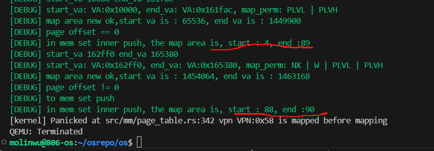
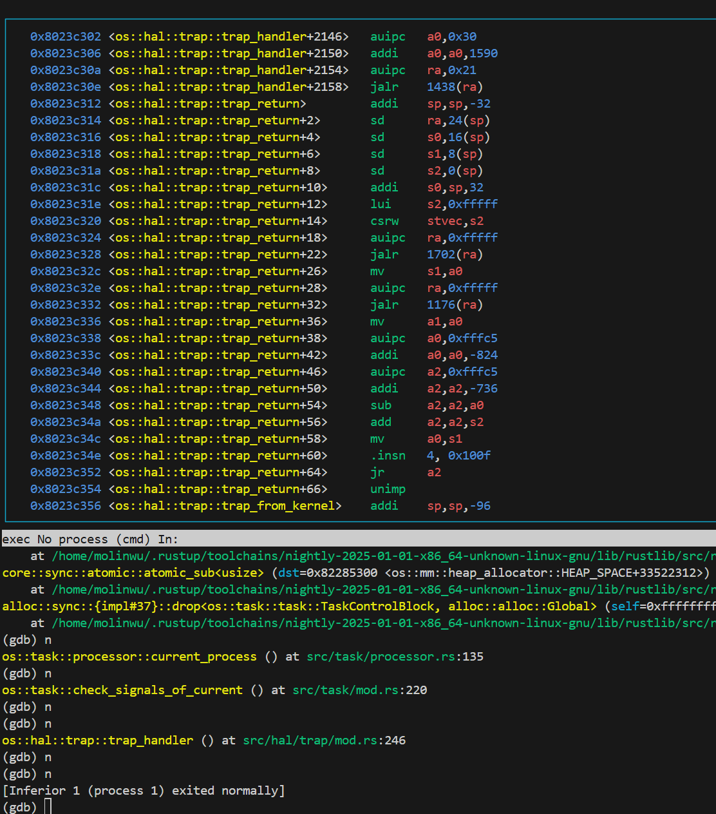

# 开发日志与 bug 记录 by wdlin


## 2025.5.15 ~ 2025.6.6

做的主要是参考 [rCoreloongArch](https://github.com/Godones/rCoreloongArch) 实现了对 LoongArch 架构的支持，[曾经考虑过](https://github.com/wdlin233/osrepo/tree/polyhal)使用 `polyhal` 但是后来觉得自己做迁移的可操作性更大，对自己内核的支持也更好，现在想来不一定自己实现 HAL 是个好事. 

开发过程中留下的记录：

- [x] 就现在的需要做的工作来说，是 page_table, memory_set 和 address 适配 rv 和 la 的兼容.
- [x] LA 的 `task::id` 中 `alloc_user_res()` 不同于 RV，涉及的是 `syscall_brk`，希望我写的没错.
- [x] 为了修改 mm 也要修改 LA 的 trap 和 task 等.
- [x] 适配 LA 的 trap 和 task.
- [x] FileSystem，如果不对磁盘进行初始化就会导致错误，所以磁盘初始化是无法避免的问题.
- [x] LA 的 kernel 出现 ELF 字段错误. 因为先前修改的文件系统是将一个目录内的所有elf文件载入，所以导致文件系统载入了不该载入的 rust 源文件. 从暴力解决的角度来说，显然条件编译，或者对 elf 进行过滤也可行. 但目前暂且保留 easy-fs-fuse-la.

```shell
[23, 21, 5b, 6e, 6f, 5f, 73, 74]
Aborting: line 68, file src/mm/memory_set.rs: called `Result::unwrap()` on an `Err` value: "Did not find ELF magic number"

[DEBUG] elf: [7f, 45, 4c, 46, 2, 1, 1, 0]
```

- [x] `block_cache.rs` 的 `BlockCach::new()` 中的 -> `block_device.read_block(block_id, &mut cache);` 一句无法执行，报错如下. 经过排查应该是对 `FRAME_ALLOCATOR` 的再次引用. 这对吗？不是，怎么可能是这个啊

```shell
[kernel] Panicked at src/sync/up.rs:34 already borrowed: BorrowMutError
```

- [x] 尝试对 `virtio_blk.rs` 进行修改. 实际上就是实现 `virtio-pci`. `virtio-blk` 参考了 `rcore-hal-component/887b4c`，`virtio-pci` 参考了 `Byte-OS/polyhal/examples/src/pci.rs`.
- [x] 使用 `-kernel $(ELF_KERNEL)` 就会遇到 `PageLoadFault` 的问题，rv 和 la 的问题可能是一致的. 在这一点上我很困惑是什么所导致的，是之前修改的文件系统部分吗？可以确定的是，la 的 `PageLoadFault` 和 `task` module 应该是没有任何关系的. 但是话说回来为甚么 `arch` branch 的 MMIO 修改之后就不能用了呢，所以遇到 `LoadPageFault` 应该是 MMIO 的问题. 但是问题不知在哪. 
    - [x] rv
    - [x] la

解答：修改 `const VIRTIO0: usize = 0x10001000 | 0x80200000;` 后 报错 `[kernel] Panicked at src/trap/mod.rs:330 a trap Exception(LoadPageFault) from kernel!`. 很明显 `LoadPageFault` 都是 MMIO 地址不对所导致的问题. 经过修改后可以得出在 rv 下的 `PageLoadFault` 是没有对内核地址空间进行映射所导致的问题.

```rust
KERNEL_SPACE
    .exclusive_access()
    .page_table
    .translate_va(VirtAddr::from(buffer.as_ptr() as *const usize as usize))
    .unwrap()
    .0
```

至于 `dma_alloc()` 的先前方法是循环分配单页，而 `alloc_contiguous` 只是对指针进行移动而没有使用 `frame_alloc()` 进行真正的分配.

`pci` 没有专门一个 `VirtIOHeader` 这让 `pci` 的处理麻烦了很多需要手动处理分配的问题，参考 ByteOS 的 `driver/kvirtio/src/lib.rs` 设计了扫描总线 0 上所有 PCI 块设备的逻辑，然后配置 BARs，这里因为我们没人写过设备驱动所以修改了很久.

- [x] 现在 rv 和 la 都能正常启动了，在 la 里可以读取 `APPS_LIST`，但是会遇到虚地址被映射的问题.

```shell
[DEBUG] Reading all data from inode with id: 25
[DEBUG] start_va: VA:0x10000000, end_va: VA:0x10003534, map_perm: PLVL | PLVH
[DEBUG] map_area: MapArea { vpn_range: SimpleRange { l: VPN:0x4000, r: VPN:0x4001 }, data_frames: {}, map_perm: PLVL | PLVH }
[DEBUG] start_va: VA:0x10004000, end_va: VA:0x10008000, map_perm: NX | PLVL | PLVH
[DEBUG] map_area: MapArea { vpn_range: SimpleRange { l: VPN:0x4001, r: VPN:0x4002 }, data_frames: {}, map_perm: NX | PLVL | PLVH }
[DEBUG] start_va: VA:0x10008000, end_va: VA:0x1000c128, map_perm: NX | W | PLVL | PLVH
[DEBUG] map_area: MapArea { vpn_range: SimpleRange { l: VPN:0x4002, r: VPN:0x4004 }, data_frames: {}, map_perm: NX | W | PLVL | PLVH }
[kernel] Panicked at src/mm/page_table.rs:296 vpn VPN:0x4005 is mapped before mapping
```

因为堆分配的时候地址空间造成了堆叠：

```rust
self.heap_bottom = ustack_top;
self.program_brk = ustack_top;
process_inner.memory_set.insert_framed_area(
    ustack_bottom.into(),
    ustack_top.into(),
    MapPermission::default() | MapPermission::W,
);
process_inner.memory_set.insert_framed_area(
    self.heap_bottom.into(),
    self.program_brk.into(),
    MapPermission::default() | MapPermission::W,
);
```

这两个部分被分到同一页了，增加一个页面对齐就可以保证分配在不同的虚地址了.

- [x] 实现 la 的分时功能.
- [x] 解决地址对齐问题

```shell
[DEBUG] Converting usize to VirtAddr: 10004086
[initproc] Forked child process, executing user_shell
[DEBUG] Converting usize to VirtAddr: 100040a0
[DEBUG] Converting usize to VirtAddr: 100040a1
[DEBUG] Converting usize to VirtAddr: 100040a2
[DEBUG] Converting usize to VirtAddr: 100040a3
[DEBUG] Converting usize to VirtAddr: 100040a4
[DEBUG] Converting usize to VirtAddr: 100040a5
[DEBUG] Converting usize to VirtAddr: 100040a6
[DEBUG] Converting usize to VirtAddr: 100040a7
[DEBUG] Converting usize to VirtAddr: 100040a8
[DEBUG] Converting usize to VirtAddr: 10004098
[DEBUG] Converting usize to VirtAddr: 10014000
[INFO] Converting VirtAddr to VirtPageNum: VA:0x10014000 with offset: 0
[DEBUG] Converting usize to VirtAddr: 10016000
[INFO] Converting VirtAddr to VirtPageNum: VA:0x10016000 with offset: 8192
[kernel] Panicked at src/mm/address.rs:182 assertion `left == right` failed
  left: 8192
 right: 0
```

修改用户栈大小后转变为zombie process. 疑似 `usertests_simple` 中的 `waitpid` 有问题. 并不是. 是因为之前在完成 basic 测例时修改了 `block_current_and_run_next` 的逻辑，将 `add_block_task(task);` 保留就可以正常运行了.

## 2025.6.8

~~队友实现了 ext4 的文件系统~~实际上根本不能用，开始适配对 la 的支持了. 前几天尝试了一下使用更新版本的 `ext4_rs` 对文件系统进行适配，发现难度有一点大，要花费很多时间，于是先这么使用了.

在 la 上遇到的第一个问题，就是会出现地址段的重复映射，经过排查发现是因为 `PAGE_SIZE` 的大小在 rv 和 la 上并不一样，之前也遇到过类似的问题.

```shell
[DEBUG] elf program header count: 5
[DEBUG] start_va: VA:0x0, end_va: VA:0x2da0, map_perm: PLVL | PLVH
[ INFO] MapArea::new: 0x0 - 0x2da0
[ INFO] MapArea::new start floor = 0, end ceil = 1
[DEBUG] map_area: MapArea { vpn_range: SimpleRange { l: VPN:0x0, r: VPN:0x1 }, data_frames: {}, map_perm: PLVL | PLVH }
[ INFO] map vpn VPN:0x0 to ppn PPN:0x81c with flags PLVL | PLVH
[DEBUG] start_va: VA:0x3000, end_va: VA:0x3f30, map_perm: NX | PLVL | PLVH
[ INFO] MapArea::new: 0x3000 - 0x3f30
[ INFO] MapArea::new start floor = 0, end ceil = 1
[DEBUG] map_area: MapArea { vpn_range: SimpleRange { l: VPN:0x0, r: VPN:0x1 }, data_frames: {}, map_perm: NX | PLVL | PLVH }
[ INFO] map vpn VPN:0x0 to ppn PPN:0x81f with flags PLVL | PLVH | NX
[kernel] Panicked at src/mm/page_table.rs:271 vpn VPN:0x0 is mapped before mapping
```

发现是加载成 rv 的镜像了，幽默. 不过更换之后还是遇到了不能打开文件的问题 `[kernel] Panicked at src/task/mod.rs:201 called `Option::unwrap()` on a `None` value`.

用 `ls` 指令查看后发现现在只能打开 `.elf` 尾缀的程序.

考虑更直接的使用 `ext4_rs` 的接口，可以打开文件，但是执行过程中会出现 

```shell
[ERROR] [kernel] trap_handler: Exception(LoadPageFault) in application, bad addr = 0x6000, bad instruction = 0x10a0, kernel killed it.
``` 

的错误 


## 2025.6.13

考虑分别对文件系统进行实现，在此我决定自己处理文件系统部分，使用了 `lwext4_rust` 库，并参考了[去年队伍](https://gitlab.eduxiji.net/rusttrusthuster/oskernel2024-trustos)的实现。这里借用了他们写的真的很好，从中学到了很多。整体架构上和他们差不多，然后就要考虑如何适配我们自己的操作系统。第一步是更改 `VIRTIO0` 的值，然后就可以顺利读取磁盘了. 解决了

```shell
[kernel] Panicked at src/hal/trap/mod.rs:344 a trap Exception(StorePageFault) from kernel!
```

的问题. 调好之后就可以读取文件并执行程序了，但是又遇到了

```shell
[ERROR] [kernel] trap_handler: Exception(LoadPageFault) in application, bad addr = 0x6000, bad instruction = 0x10be, kernel killed it.
```

这应该是内核的问题，在先前的 `ext4_rs` 中也遇到了. 在 `run_tasks()` 执行了一段时间都没什么问题，会是 `__switch(idle_task_cx_ptr, next_task_cx_ptr);` 的问题吗？

猜测是用户栈的问题

```shell
[ INFO] user stack base: 0x3000
[DEBUG] in drop for gid
[DEBUG] kernel: add main thread to scheduler, pid = 0
[ INFO] get_idle_task_cx_ptr: idle task cx ptr: 0x8026f080
[DEBUG] run_tasks: pid: 0, tid: 0
[ INFO] get_idle_task_cx_ptr: idle task cx ptr: 0x8026f080
[DEBUG] in schedule, to switch
[ INFO] get_idle_task_cx_ptr: idle task cx ptr: 0x8026f080
[DEBUG] run_tasks: pid: 0, tid: 0
[ERROR] [kernel] trap_handler: Exception(LoadPageFault) in application, bad addr = 0x6000, bad instruction = 0x10be, kernel killed it.
[kernel] Idle process exit with exit_code -11 ...
```

会在 `user_stack_base` 往上的 `3 * PAGE_SIZE` 的地址段进行访问. 经过在 `ProcessControlBlock::new()` 中各地址段的调试，应该是 `sp` 值的设置有误，在 `set_sp` 中进行更改 `self.x[2] = sp - 8`，因为栈指针要设置在栈顶下方.

然后就开始迁移 `sys_open`，涉及到的 `fd_table` 的结构很不一样.

## 2025.6.20

前一周没怎么写代码，因为复习期末了。考完期末周，使用 `lwext4_rust` 库继续实现文件系统。回来实现了 `sys_open()`，然后开始做 EXT4 对 la 的适配，解决 `VIRTIO0` 后遇到的 

```shell
[kernel] Panicked at src/drivers/virtio/blk.rs:16 VirtIOBlk create failed: InvalidParam
```

问题，做 pci 与 mmio 的兼容. 虽然之前说不使用 `polyhal`，但是还是从中学习到了很多，正好 `polyhal` 的维护者也写在 ByteOS 上写了一个 PCI 驱动，从中学习了。其实驱动的问题很多时候是地址的问题，这里要注意是物理地址，因此自然就涉及到了虚实地址转换的问题。

## 2025.6.21

做好总线驱动，遇到

```rust
impl File for Stdout {
    fn write(&self, user_buf: UserBuffer) -> SyscallRet {
        info!("kernel: write to stdout");
        info!("kernel: write to stdout buffer len: {:?}", user_buf.buffers.len());
        for buffer in user_buf.buffers.iter() {
            info!("kernel: write to stdout buffer: {:?}", *buffer);
            print!("{}", core::str::from_utf8(*buffer).unwrap());
        }
        info!("kernel: write to stdout done");
        Ok(user_buf.len())
    }
}
```

中不能访问 `*buffer` 的问题，具体表现在会出现 `LoadPageFault` 报错和 `[ INFO] kernel: write to stdout buffer: [` 日志.

反汇编

```asm
90000000002641ec:	00150007 	move        	$a3, $zero
90000000002641f0:	00150009 	move        	$a5, $zero
90000000002641f4:	50002000 	b           	32(0x20)	# 9000000000264214 <_ZN40_$LT$str$u20$as$u20$core..fmt..Debug$GT$3fmt17h91ad8e2e5f5954c0E+0x374>
90000000002641f8:	00150009 	move        	$a5, $zero
90000000002641fc:	47ffdcff 	bnez        	$a3, -36(0x7fffdc)	# 90000000002641d8 <_ZN40_$LT$str$u20$as$u20$core..fmt..Debug$GT$3fmt17h91ad8e2e5f5954c0E+0x338>
9000000000264200:	00150007 	move        	$a3, $zero
9000000000264204:	50001000 	b           	16(0x10)	# 9000000000264214 <_ZN40_$LT$str$u20$as$u20$core..fmt..Debug$GT$3fmt17h91ad8e2e5f5954c0E+0x374>
9000000000264208:	5bffcd25 	beq         	$a5, $a1, -52(0x3ffcc)	# 90000000002641d4 <_ZN40_$LT$str$u20$as$u20$core..fmt..Debug$GT$3fmt17h91ad8e2e5f5954c0E+0x334>
900000000026420c:	50007800 	b           	120(0x78)	# 9000000000264284 <_ZN40_$LT$str$u20$as$u20$core..fmt..Debug$GT$3fmt17h91ad8e2e5f5954c0E+0x3e4>
9000000000264210:	5c0074e5 	bne         	$a3, $a1, 116(0x74)	# 9000000000264284 <_ZN40_$LT$str$u20$as$u20$core..fmt..Debug$GT$3fmt17h91ad8e2e5f5954c0E+0x3e4>
9000000000264214:	28c06328 	ld.d        	$a4, $s2, 24(0x18)
9000000000264218:	0011a4e6 	sub.d       	$a2, $a3, $a5
```

在 `9000000000264218:	0011a4e6 	sub.d       	$a2, $a3, $a5` 出错. 

涉及的是关于物理内存到内核虚拟地址的映射问题，于是重新设计了一个 `safe_translated_byte_buffer` 让其传给 `File::write` 的是被处理过后的内核虚地址.

## 2025.6.23

在实现 `sys_mmap` 时遇到了地址不能被访问的问题

```shell
[DEBUG] in memory set, mmap
[ERROR] find_insert_addr: hint = 0x2ffdcd7000, size = 4096
[ERROR] find_insert_addr: start_vpn = 0x2ffdcd6, end_vpn = 0x2ffdcd7, start_va = 0x2ffdcd6000
[DEBUG] [sys_mmap] start_va:0x2ffdcd6000,end_va:0x2ffdcd7000
[DEBUG] [sys_mmap] alloc addr=0x2ffdcd6000
[DEBUG] in sys write
[DEBUG] current pid is :1
[DEBUG] in write,to translated byte buffer
[DEBUG] Getting bytes array for PhysAddr: 0x822ff000
[ INFO] safe_translated_byte_buffer: start_va: VA:0x1f78, end_va: VA:0x1f86, ppn: PPN:0x822ff
[DEBUG] safe trsnslated byte buffer ok
[DEBUG] UserBuffer::new: buffers: [[109, 109, 97, 112, 32, 99, 111, 110, 116, 101, 110, 116, 58, 32]]
[ INFO] kernel: write to stdout
mmap content: [ INFO] kernel: write to stdout done
[DEBUG] in write, to return , ret is :14
[DEBUG] in sys write
[DEBUG] current pid is :1
[DEBUG] in write,to translated byte buffer
[DEBUG] safe trsnslated byte buffer ok
[DEBUG] UserBuffer::new: buffers: []
[ INFO] kernel: write to stdout
[ INFO] kernel: write to stdout done
[DEBUG] in write, to return , ret is :0
[ERROR] [kernel] trap_handler: Exception(LoadPageFault) in application, bad addr = 0x2ffdcd6000, bad instruction = 0x1970, kernel killed it.
```

具体而言是 `MMAP_TOP` 附近的地址不能被正确访问.

如果在 `find_insert_addr` 这个函数中修改映射的地址位置，

```shell
[ERROR] find_insert_addr: hint = 0x2ffdcd7000, size = 4096
[ERROR] find_insert_addr: start_vpn = 0x2ffdcd6, end_vpn = 0x2ffdcd7, start_va = 0x2ffdcd5000
[DEBUG] [sys_mmap] start_va:0x2ffdcd6000,end_va:0x2ffdcd7000
[DEBUG] [sys_mmap] alloc addr=0x2ffdcd6000
[DEBUG] in sys write
[DEBUG] current pid is :1
[DEBUG] in write,to translated byte buffer
[DEBUG] Getting bytes array for PhysAddr: 0x822ff000
[ INFO] safe_translated_byte_buffer: start_va: VA:0x1f78, end_va: VA:0x1f86, ppn: PPN:0x822ff
[DEBUG] safe trsnslated byte buffer ok
[DEBUG] UserBuffer::new: buffers: [[109, 109, 97, 112, 32, 99, 111, 110, 116, 101, 110, 116, 58, 32]]
[ INFO] kernel: write to stdout
mmap content: [ INFO] kernel: write to stdout done
[DEBUG] in write, to return , ret is :14
[DEBUG] in sys write
[DEBUG] current pid is :1
[DEBUG] in write,to translated byte buffer
[DEBUG] safe trsnslated byte buffer ok
[DEBUG] UserBuffer::new: buffers: []
[ INFO] kernel: write to stdout
[ INFO] kernel: write to stdout done
[DEBUG] in write, to return , ret is :0
[ERROR] [kernel] trap_handler: Exception(LoadPageFault) in application, bad addr = 0x2ffdcd6000, bad instruction = 0x1970, kernel killed it.
```

应该是在创建 `MapArea` 时的问题而不是在用户地址空间里插入映射信息的问题. 导致整个映射出现错误了. 我怀疑这整个段都不能访问，`mmap` 和 `munmap` 的区别就在于 `mmap` 对映射的地址进行了访问.

```shell
[DEBUG] [sys_mmap] start_va:0x2ffdcd6000,end_va:0x2ffdcd7000
[DEBUG] [sys_mmap] alloc addr=0x2ffdcd7000
[DEBUG] [sys_mmap] alloc addr=0x2ffdcd7000 as isize
[ERROR] [kernel] trap_handler: Exception(LoadPageFault) in application, bad addr = 0x2ffdcd7000, bad instruction = 0x1970, kernel killed it.
```

当我使用原本的方法

```rust
self.insert_framed_area(VirtAddr::from(addr), VirtAddr::from(addr + len), map_perm, area_type);
```

就不会出现 `LoadPageFault` 的报错，也可能是说，错误是因为没有建立对映的映射而导致的，并不是这个地址的问题，因为缓冲区又一次出现空的情况，所以也有可能是 `sys_write` 的问题，换句话说，对应的地址没有被映射是一回事，对应地址的数据又是一回事. 可能是因为这个地址没有对应的数据. 

是因为没有映射到文件的内容吗？这是有可能的.

```c
array = mmap(NULL, kst.st_size, PROT_WRITE | PROT_READ, MAP_FILE | MAP_SHARED, fd, 0);
if (array == MAP_FAILED) {
	printf("mmap error.\n");
} else {
	printf("mmap content: %s\n", array);
}
```

在 `trap_handler` 中对 `LoadPageFault` 做了处理，实现了 `cow`. 然后一个错误是在 `OSInode::write` 中的 `for slice in buf.buffers.iter()` 不能访问 `slice`. 或者说 `munmap` 中 `buf` 的地址有问题.

确实是 `buf` 在内核态访问了用户态的内容，使用 `safe_translated_byte_buffer` 需要解决引用问题，和引用问题斗争了很久. 其实完全可以使用 `translated_byte_buffer` 这个更基础的函数来解决，惭愧.

## 2025.6.24

这部分内容是之后补的，所以可能有点疏漏。总的来说这段时间在解决 busybox 的启动问题。

在解决 `sys_mmap` 时我们参考了[前辈](https://gitlab.eduxiji.net/rusttrusthuster/oskernel2024-trustos)的代码，觉得他们写的非常好，于是也进入了一个写时复制机制，这样就能提高很多性能了。

于是我们采取了惰性分配的策略，也就是在新建一个 `MapArea` 时本应传入一个 `None`，我们就先不传。也就是说，复制内存时, 不真的去拷贝内存, 只是将新的虚拟地址映射到同样的一块物理地址, 直到程序要进行写操作时, 才进行实际的拷贝操作。

好处是如果相应的数据在复制到消亡的过程中，并没有进行过写操作的话, 则可以节省拷贝这部分数据的时间。

COW页面发生写操作时会触发 `PageFault` 进入 `trap_handler` 进行处理。

> 在COW机制中，当一个页面被标记为只读（因为COW）时，任何写操作都会触发一个页面错误。因此，存储操作（写操作）会触发StorePageFault。而读操作和取指操作不会触发写操作，因此不会因为COW而触发错误（除非该页面本身也不允许读或执行）。所以在COW处理中，我们应该只处理StorePageFault，而将LoadPageFault和FetchPageFault视为真正的错误。

但不是很确定 LA 下的 `LoadPageFault` 和 `FetchPageFault` 是否也需要 COW 的处理，也没什么资料能佐证这一点，虽然测例通过了...会是 LA 的 TLB 重填中遇到的一些页面权限的问题吗？不是很确定架构上是否存在着这个差异，感觉代码也写的没什么问题.

## 2025.6.25 ~ 2025.6.30

这段是后面补的，写的可能比较乱，具体看 commits 可能会更好。这段时间我们在启动了 sh，但是集中出现了特别多的问题。这几天一直到初赛结束队友基本都是凌晨四点才回去睡觉，然后我在早上合并他昨晚写的代码，看看有没有什么问题，队友最后解决了，真是太厉害了！！！于是 `busybox` 和 `libctest` 我们后面修了一些 syscalls 和 内存布局的问题也就过了很多。

但很惭愧的是这部分我都没帮上什么忙，问题就在于内存，但是内存都是队友处理的，感觉我对这部分一点也不了解，水准之低令人汗颜。



当时出现的一个 `mmap` 问题，后来发现是我们堆空间的布局有问题，队友就修改了 `change_program_brk` 解决了。



我们当时持续的出现这个莫名进入 `trap_handler` 然后报错 `StorePageFault` 的问题，然后就会传参给 `sys_mmap` 让其 `start` 和 `len` 都为0，显然这是极其不合理的。持续卡了我们好几天，临近初赛结束遇到这种问题，其实已经做好初赛爆零的准备了，**有点绝望了**，当时是不是不应该花这么多时间来准备内核赛，而且开始写的时间也有点晚了，如果当时没有选择 ch8 还好，队友的思路是这个 `trap_cx` 是有问题的，但是 ch8 的 `trap_cx` 非常复杂，是由一个 `TaskUserRes` 来管理的，存在用户栈上。

队友的思路是在用户栈上会遇到 `tid` 不唯一的问题，因为 `trap_cx` 是依靠 `tid` 来索引，如果不唯一就会导致 `trap_cx` 的混乱。按他26晚左右时间的思路应该是这个问题，不知道是不是，他后来和我解释了一下其实也没太懂，总之还是用户空间布局的问题。具体看 commits 可能比较好。我看似乎是会在 `fork` 时传入两个值，这样他们的寄存器状态就混乱了。

总之这段时间真是保队友大腿了，没帮上什么忙。这段时间的代码有点乱七八糟的，分支也创建了一大堆，自己都有点分不清楚。准备在初赛后好好重构一下，感觉一直被压力着实现 syscalls，后面有些时候都没细想了。加了很多 syscalls 来支持 busybox 的启动。

还遇到一个 LA 下启动 sh 遇到进入 `run_tasks` 调度后卡死的问题，发现是 LA 下的权限设错了，就是那个最高位的 `RPLV` 害我，一般都不需要这个参数的.

准备还是初赛之后好好重构一下，真受不了现在这个代码了.

# Optimization

- [x] 修改 `extern "C" {fn stext(); ...}`，现在 RV 的部分在 `memory_set.rs` 而 LA 的部分在 `info.rs`.
- [x] 将差异部分单独用一个模块进行处理，而往上层提供统一的抽象.

注意在 LoongArch 中有 `pwcl::set_ptwidth(0xb); //16KiB的页大小` 对寄存器设置页大小等操作，配置页大小并不是 `config` 修改一个常量这么简单，为了保险起见这里就不对两个架构的基本参数进行改动了.

la 和 rv 的主要区别除了一些参数外，就在于 la 因为有窗口映射就没有设置内核地址空间，以及需要手动处理 TLB 的一些操作.

- [ ] 用 COW 优化 `fork()`.