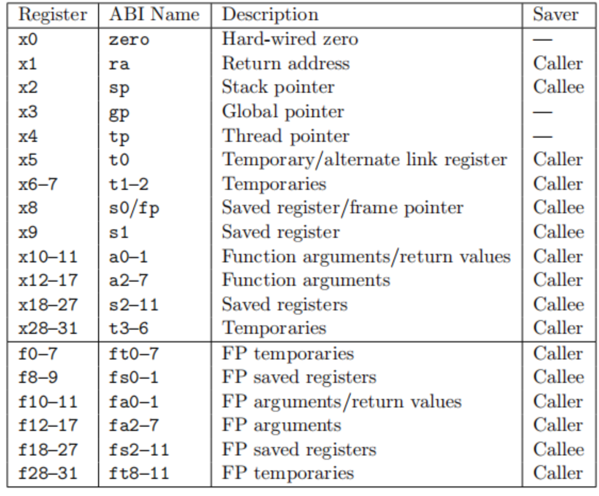

# 开发日志与 bug 记录 by molinwu

## 5月20号

开始写系统能力大赛的`basic syscall`，前几天一直在配环境，最初打算使用`VMware`虚拟机+`ubuntu`，不过两个队友使用的是`wsl`，于是研究了两天的`wsl`以及`docker`，最后有幸有一台服务器，就在服务器上配好环境搞了。

队友在原来`rcore`的基础上删除了之前的user目录下的一些test，把大赛的`basic syscall test`放进去，这样可以沿用`rcore`的user进行测试。测试方法很简单，在`os`目录下`make run`然后在user_shell中输入`usertest`就行了。

`rcore`本来有一些`syscall`是和`basic syscall`中重合的，不过需要统一一下接口和返回值格式。。。队友是直接将编译好的二进制文件放到环境中，于是我还需要一边看`github`上的源码一边调试接口和返回值（~~没有吐槽的意思嘻嘻~~）

打算把`wait`过了，然后发现`wait`，`fork`，`exit`，`waitpid`，`yield`这些`syscall`联系很紧密，开始不明白为什么`rcore`上明明有这些系统调用，但是却没能pass，后来通过打印调试信息发现，那些test并没有使用`rcore`中`user`目录下的`user_lib`，而是直接调用了我们的内核，然而`rcore`的`wait`机制有一部分是在`user_lib`中实现的，所以导致这几个`syscall`都有问题，最后的解决办法是将`use_lib`中那部分机制直接放到内核中。

最后是通过了`fork`，`yield`，`wait`，`exit`和`clone`，奇怪的是`wait`过了，但是`waitpid`没过，不过已经不想管了，已经第二天凌晨两点了，溜了溜了。


## 5月21号

好好看了一下源码，发现`waitpid`比`wait`里多了一个条件判断，`WEXITSTATUS(wstatus)==3`，下面补充一些关于`WEXITSTATUS`的知识

```c
#define WEXITSTATUS(status) __WEXITSTATUS(status)
#define __WEXITSTATUS(status) (((status) & 0xff00) >> 8)
```

这是`WEXITSTATUS`的宏定义，它的作用是从子进程的终止状态中提取退出状态码。

而对于`status`的构成，在 C 语言中，`wait` 或 `waitpid` 函数返回的 `status` 参数是一个整数，它包含了子进程的退出状态信息。这个状态信息是一个位字段，其中不同的位表示不同的子进程终止原因和状态。

### `status` 的结构

`status` 的具体结构如下：

- **低 8 位（0x00ff）**：表示子进程的退出信号（如果子进程是被信号终止的）。
- **中间 8 位（0xff00）**：表示子进程的退出状态码（如果子进程是正常退出的）。
- **高 8 位（0xff0000）**：在某些系统中可能用于其他用途，但通常不使用。

### 具体位字段

- **低 8 位（0x00ff）**：
  - 如果子进程是被信号终止的，这个字段包含终止子进程的信号编号。
  - 如果子进程是正常退出的，这个字段通常为 0。
- **中间 8 位（0xff00）**：
  - 如果子进程是正常退出的，这个字段包含子进程的退出状态码。
  - 如果子进程是被信号终止的，这个字段通常为 0。

### 相关宏定义

- **WEXITSTATUS**：

  ```c
  #define WEXITSTATUS(status) (((status) & 0xff00) >> 8)
  ```

  从 `status` 中提取中间 8 位，即子进程的退出状态码。

- **WIFEXITED**：

  ```c
  #define WIFEXITED(status) (((status) & 0xff) == 0)
  ```

  检查低 8 位是否为 0，即子进程是否正常退出。

- **WTERMSIG**：

  ```c
  #define WTERMSIG(status) ((status) & 0x7f)
  ```

  提取低 8 位，即终止子进程的信号编号。

改了传入的`wstauts`的格式`waitpid`就pass了。

`getppid` pass，类似`getpid`，加一个调用接口即可。进程相关`basic syscall`完成。

本来想完成除了文件系统相关其他所有`syscall`的，但是在完成`sleep`的时候，出现了类似单进程睡眠问题，使用之前的通过`yield`的方式来`waitpid`会出问题，所以引入阻塞等待机制（默认情况下都是阻塞等待）。在父进程`wait`子进程时阻塞，然后子进程结束后唤醒父进程。

遇到一个问题是父进程占有资源子进程不可再使用（不是互斥资源），后来发现，在原来的实现机制中，会在`waitpid`中`return`重新调用`yield`，而在`waitpid`中`return`之后，一些父进程占有的资源就自动释放了，修改后的机制是从`waitpid`中直接`block`，所以需要手动释放父进程占有的一些资源。

再添加这个功能之后测试之前pass的test，发现有问题，就是在父进程还没有block，子进程就已经执行完并尝试唤醒父进程，在子进程退出之后父进程才`block`，导致父进程无法被唤醒。（之后有时间打算参考`linux`机制，在子进程退出之后给父进程传递信号，通过这个信号判断是否`block` or `wakeup` 父进程。）


## 5月22号

今天开始写地址空间部分的内容。

在写brk系统调用时get了一些之前没太在意的知识：一个进程fork子进程的时候子进程会先拥有父进程stack的副本，但是会被重新设置，也就是说父进程和子进程时拥有不同的stack，拥有不同的heap。然而对于同一个进程的多个线程来说，不同的线程也是拥有不同的stack，但是所有的线程共享该进程的heap。~~这就使得一个想把heap放在线程数据结构中的人轻轻的碎了~~

如果只是为了过比赛的测试案例倒是挺好过的，因为对于brk系统调用的源码，它最多只申请了128B的内存，且该进程同时只有一个线程，在rcore原本的设计中，同一个进程的不同线程之间有一页作为保护页，且没有给进程设置堆空间。我大可以将heap bottom放在这个线程的stack top处，但是这样会有潜在的风险，于是我决定，将heap放在进程数据结构中维护而不是放在线程数据结构中维护。~~又要掉头发了~~

救命（语气词），好好好，原来rcore的exec就只支持单线程，之后再说吧，先把test过了。


## 5月23号

过了times的test，在进程数据结构中新添加了Tms数据结构，用来维护进程的四个time，utime—在用户态运行的时间，stime——在内核态运行的时间，cutime——子进程在用户态运行的时间总和，cstime——子进程在内核态运行的时间总和。

实现思路：记录进程被调度的初始时间，然后在syscall之前，也就是从用户态刚刚trap进内核态时记录时间，这个时间减去初始时间就是用户态时间的一部分，在这里设置一次用户态时间，然后在trap结束后记录时间，这个时间就是进程在内核态运行的时间的一部分，然后将初始时间更新为trap结束后记录的这个时间，下次就可以还按照这个逻辑进行设置了。~~想用图来表示，但是本人比较笨，还没学会用绘图工具~~


## 5月27号

完成uname的系统调用

将busybox的测试案例编译好后添加到文件中，以便后续使用


## 5.28

等待队友写文件系统，与文件系统无关的系统调用基本都写完了，所以在给busybox提供支持。

在新建用户的时候要自动创建一个默认用户组，这个用户组的id与用户的id应该相同，但是又可以单独的创建用户组，这样会导致用户组的id增长可能比用户的id增长速度快而导致再次又用户新建时，其默认的用户组id与其用户id不同（我们的用户组id的alloc和用户的id的alloc方式相同，都是线性的分配）。在linux中，用户组和用户的相关信息是通过文件方式静态管理的，而在使用中动态的读取相关信息。在此，我暂时将用户和用户组的信息拿出来直接放在内核中，没有改变用户id和用户组id的alloc方式，而是重新定义，在用户中维护一个用户组id的数组，这个数组的第一个元素就是该用户的默认用户组id。

一个单独创建的用户组在初始化的时候不用将任何的用户放入其中，因为在linux中，用户组相关信息是通过文件方式保存的，所以只要root对该文件具有读写权限，那root就可以通过更改这个文件进行更改相关的用户组信息。比如向某个用户组添加用户。


## 6.2

基于原本rcore的easyfs启动busybox，但这只是暂时的，之后要改成ext4文件系统。目前只是为了进行对busybox进行测试，看看它需要什么syscall，好提前写一些。


## 6.7

其中一个队友重写了hal层，原本清华大学似乎有个库，但是他觉得不好用，转而自己做实现，今天merge过来，解决一下冲突，使其支持原来的syscall的调用。


## 6.9

写文件系统的队友终于搞来了ext4，这下可以写之前没有写的与文件系统有关的syscall 了，不过救命，它搞得什么鬼东西，根本用不了，好多功能都不支持，明天再debug一下，看看都缺了什么功能。


## 6.22

中间去考试了

bk了，那个队友什么都不管，我们决定把他踢了，重新自己移植一个文件系统，这个应该是ext4的。写了很多syscall，basic基本过了，接下来是busybox。不过mmap和pipe有点奇怪，改天再调


## 6.23

出大问题！！sh文件没有办法启动，虽然测例单独都过了，但是大赛要求使用sh的方式运行测例，sh没办法启动就玩完了。。。。。。


## 6.24

fork没问题，难道是exec的时候压栈不对吗，，，，auxv是必须要传的序列？参考一下前辈的代码，发现压栈的本质

```rust
//传参时的压栈布局      
	
		/*
		-----------------------ustack top == sp(init)
                .
                .
                .
            ------------
            env string 2
            ------------
            env string 1
        ------------------------env_st
            地址对齐
        --------------------------

                .
                .
                .
            -------------
            args string 2
            -------------
            args string 1
        ---------------------------args_st
            地址对齐
        ----------------------------
            aux空间
            以两个0为结束标志
        ----------------------------
                0(envp 结束)
            ---------------------
                .
                .
                .
            ---------------------
            envp2 -> env string 2
            ---------------------
            envp1 -> env string 1
        -----------------------------env_base
                0(argv 结束)
            --------------------------
                .
                .
                .
            --------------------------
                argv2 -> args string 2
            --------------------------
                argv1 -> args string 1
        --------------------------------argv_base
            argc
        ---------------------------------sp(final)
        */
```


## 6.25

sh还是无法启动，，，，救命


## 6.26

我滴妈，这几天每天敲十个小时代码，也是提前过上打工人生活了。。感觉应该是地址空间的问题，发现好几个地方的地址空间都是重叠的，也不知道之前的代码时怎么跑起来的


## 6.27

！！！成功了，终于把之前的问题解决了，但是sh的启动需要新的`syscall`，接下来又是写`syscall`的时候了。

之前的问题，，怎么说呢，很多。起初是我们通过了`basic`的全部测例，但是今年的比赛要求是，在我们自己的内核启动之后，扫描所有文件，执行所有`xxxx-testcode.sh`，显然我们小瞧了启动sh的难度，或者说高估了自己（认错），总之没有想到启动sh会卡我们将近4天，又是临近ddl，着急的都快哭了，当然哭并没什么卵用，最重要的还是看代码，debug，找到问题是什么。很幸运，我们算是解决了这个“小问题”。（鬼知道后面会不会还有什么问题，管他呢，立足当下，继续写`syscall`就是了）

通过debug！信息，我们发现`busybox`在启动之后调用了两次的`brk`，并且传入的参数都是零，然后调用了`mmap`，神奇的是，它给`mmap`传入的len参数也是零，但是根据mmap的系统调用规定，len是不能等于零的，于是我们开始找为什么mmap的len传入了零（当然，我们怀疑过是brk的问题，因为连续调用了两次的brk0，但是问了ai之后，ai给出的回答是，这是有可能的，有些程序会通过连续调用brk0来确定堆的末尾地址，虽然不知道是不是真的有程序这样，但是这波ai减大分），通过检查trap信息发现，给mmap传参的是x[10]-x[15]，这六个寄存器。

> 在这附一下寄存器的对应图，相关内容在：
>
> https://www.cnblogs.com/sureZ-learning/p/18306366



也就是a[0]-a[5]，由于完全不知道为什么会这样，于是，GDB！但是等我们启动gdb并调试之后发现，busybox在用户态运行，我们的gdb启动在内核代码中，用户空间不可见（具体是为什么我到现在也还不知道），我们甚至反汇编了busybox的代码，发现有两次的`li  a[7] 214`，a[7]使用来传系统调用号的，214对应brk系统调用，不过其中的跳转指令太多，即使出现了a[0]-a[5]这些的寄存器，也都是基于原来的状态进行的操作，没什么太大的参考意义，于是我们只能猜哪里有问题，mmap传入参数出错，那只能是mmap之前有问题，debug信息中，mmap之前只执行了fork，exec，brk这三个系统调用，我们有点怀疑人生，因为这些系统调用在basic测例中都过了！不过**机器永远是对的**，我们去检查这些代码，brk很简单，只是修改heap的末尾地址，这能有什么错？难道是exec错了？难道是fork错了？通过参考前辈的代码，我们的fork和exec确实有问题。传参数量有问题，改！但是我们改了一些形式化的东西之后，问题并没有被解决。最后我们将问题定位在用户空间的内存布局上，于是重新布局了用户空间，问题就解决了！！

```rust
//重构的用户地址空间布局
/*
------------------------------
    ...
    ...
    ...
    -----------------
    user1's heap size
-------------------------------heap_bottom
    guard page
--------------------------------user_trap_context_top
    guard page
    --------------------
    user1's trap context
    --------------------
    guard page
    --------------------
    user2's trap context
    ...
    ...
    ...
-----------------------------user_stack_top
    guard page
    ---------------
    user1's stack
    ---------------
    guard page
    ---------------
    user2's stack
    ...
    ...
    ...
------------------------------

*/
```


## 6月28日

### `RISCV—syscall-260-wait4(pid,wstatus,options,rusage)`

#### 1. `pid`：目标子进程标识

| 取值    | 含义                                                 |
| :------ | :--------------------------------------------------- |
| **<-1** | 等待**进程组 ID** 等于 `|pid|`（绝对值）的所有子进程 |
| **-1**  | 等待**任意子进程**（类似 `wait`）                    |
| **0**   | 等待与调用进程**同进程组**的任何子进程               |
| **>0**  | 等待**特定 PID** 等于 `pid` 的子进程                 |

#### 2. `wstatus`：子进程状态信息（输出参数）

- **类型**：`int*`（可为 `NULL`）

- **作用**：存储子进程退出状态，需用标准宏解析：

  | 宏                      | 含义                                                         |
  | :---------------------- | :----------------------------------------------------------- |
  | `WIFEXITED(wstatus)`    | 子进程正常退出时为真                                         |
  | `WEXITSTATUS(wstatus)`  | 若正常退出，获取子进程的**退出码**（`exit()` 参数或 `main` 返回值） |
  | `WIFSIGNALED(wstatus)`  | 子进程因**信号终止**时为真                                   |
  | `WTERMSIG(wstatus)`     | 若信号终止，获取**信号编号**                                 |
  | `WIFSTOPPED(wstatus)`   | 子进程被**信号暂停**时为真                                   |
  | `WSTOPSIG(wstatus)`     | 若被暂停，获取**暂停信号编号**                               |
  | `WIFCONTINUED(wstatus)` | 子进程因 `SIGCONT` **恢复执行**时为真                        |

- 解析：

  ```c
  // 正常退出判断 (exit/_exit)
  #define WIFEXITED(w)    (((w) & 0x7F) == 0)  // 检查低7位是否为0
  
  // 获取退出码
  #define WEXITSTATUS(w)  (((w) >> 8) & 0xFF)   // 取8-15位
  
  // 信号终止判断
  #define WIFSIGNALED(w)  (((w) & 0x7F) != 0 && ((w) & 0x7F) < 0x7F)
  
  // 获取终止信号
  #define WTERMSIG(w)     ((w) & 0x7F)          // 取低7位
  
  // 暂停状态判断 (SIGSTOP/SIGTSTP等)
  #define WIFSTOPPED(w)   (((w) & 0xFF) == 0x7F) // 低8位=0x7F
  
  // 获取暂停信号
  #define WSTOPSIG(w)     (((w) >> 8) & 0xFF)    // 取8-15位
  
  // 恢复运行判断 (SIGCONT)
  #define WIFCONTINUED(w) ((w) == 0xFFFF)        // 特殊值0xFFFF
  ```

#### 3. `options`：行为控制标志（位掩码）

| 选项           | 值   | 含义                                             |
| :------------- | ---- | :----------------------------------------------- |
| **WNOHANG**    | 0x1  | 非阻塞模式：无子进程退出时**立即返回 0**，不等待 |
| **WUNTRACED**  | 0x2  | 报告**被暂停**的子进程状态（默认只报告终止状态） |
| **WCONTINUED** | 0x8  | 报告因 `SIGCONT` **恢复执行**的子进程状态        |

#### 4. `rusage`：资源使用统计（输出参数）

- **类型**：`struct rusage*`（可为 `NULL`）

- **作用**：返回子进程的**资源消耗信息**（定义在 `<sys/resource.h>`）：

  ```
  struct rusage {
      struct timeval ru_utime;  // 用户态 CPU 时间
      struct timeval ru_stime;  // 内核态 CPU 时间
      long   ru_maxrss;         // 最大常驻集大小 (KB)
      // 其他字段（如内存/IO/上下文切换等）
  };
  ```

------

### 返回值处理规则

| 返回值 | 含义                                           |
| :----- | :--------------------------------------------- |
| **>0** | 成功：返回**状态改变的子进程 PID**             |
| **0**  | 仅当指定 `WNOHANG` 且**无子进程退出**时返回    |
| **-1** | 错误：设置 `errno` 并返回（需检查 `errno` 值） |

------

### 错误处理（`errno`）

| 错误码     | 原因                                             |
| :--------- | :----------------------------------------------- |
| **ECHILD** | 调用进程**没有目标子进程**（或子进程已被等待过） |
| **EINTR**  | 调用**被信号中断**（可重新调用）                 |
| **EINVAL** | `options` 参数包含**无效标志**                   |

------

### 关键行为说明

1. **资源统计**：

   - 若 `rusage != NULL`，内核填充子进程的**资源使用结构体**（包括 CPU 时间、内存等）。
   - 统计范围**仅限目标子进程**（不包括其子孙进程）。

2. **状态等待**：

   - 默认阻塞等待，除非指定 `WNOHANG`。
   - 同时存在多个终止子进程时，按**未指定顺序**返回其中一个。

3. **与标准函数的等价性**：

   ```
   wait4(pid, wstatus, options, rusage) ≡ waitpid(pid, wstatus, options)
   ```

   - 唯一区别是 `wait4` 额外支持资源统计。

------

### 使用示例

```
#include <sys/wait.h>
#include <sys/resource.h>

int main() {
    pid_t pid = fork();
    if (pid == 0) {
        // 子进程执行任务
        sleep(2);
        _exit(42);  // 退出码 42
    } else {
        int wstatus;
        struct rusage ru;
        pid_t ret = wait4(pid, &wstatus, 0, &ru);  // 阻塞等待

        if (ret > 0) {
            if (WIFEXITED(wstatus)) {
                printf("Child exited: %d\n", WEXITSTATUS(wstatus));  // 输出 42
            }
            printf("CPU user time: %ld sec\n", ru.ru_utime.tv_sec);
        }
    }
    return 0;
}
```

------

### 注意事项

1. **可移植性**：
   - `wait4` 是 **BSD 扩展**，非 POSIX 标准。新代码建议用 `waitpid` + `getrusage` 替代。
   - 需定义 `_DEFAULT_SOURCE`（glibc ≥2.19）启用此函数。
2. **资源统计限制**：
   - 部分资源字段（如 `ru_maxrss`）在 Linux 可能**未完全实现**（需验证内核版本）。
3. **信号中断处理**：
   - 若被信号中断（`EINTR`），通常应**重启调用**以保证可靠性。
4. **僵尸进程回收**：
   - 成功调用后，内核会**释放子进程资源**，避免僵尸进程残留。

> 参考链接：[Linux man-pages: wait4(2)](https://man7.org/linux/man-pages/man2/wait4.2.html)


## 6.30

初赛最后一天了，要写文档了，and今年新加的ppt和视频，希望能过初赛，确实学到很多东西


