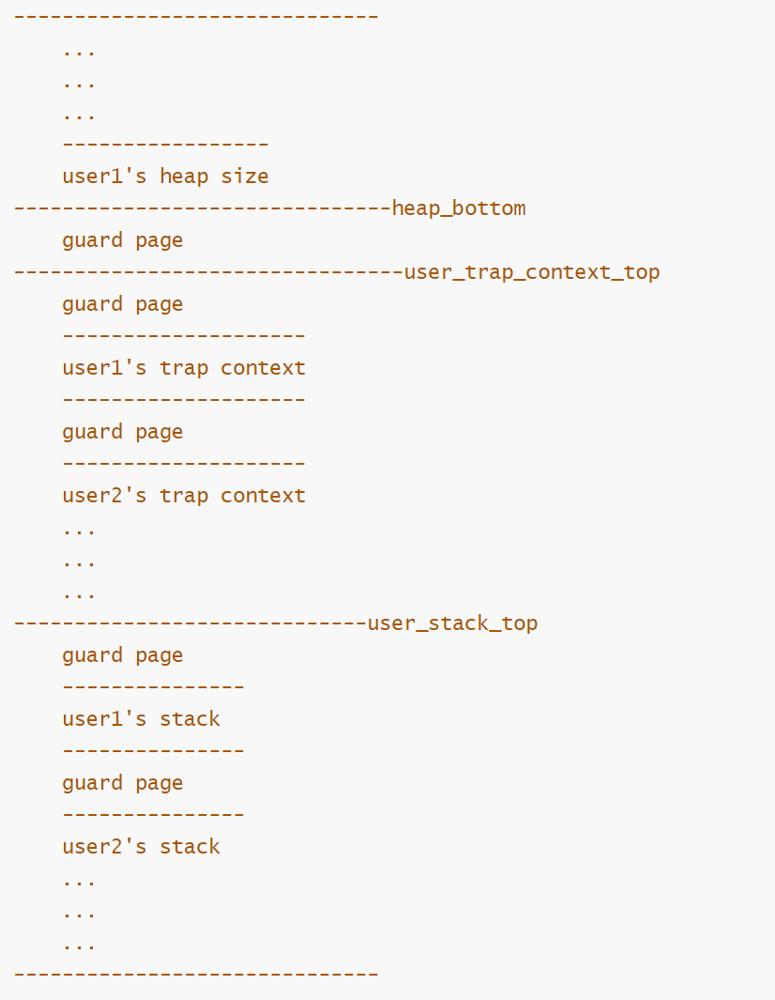
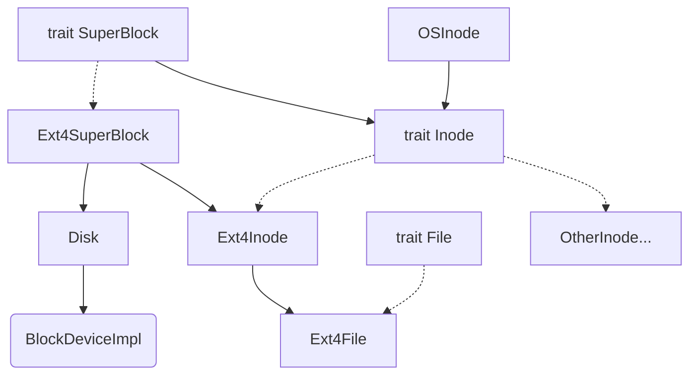

# 初赛开发文档

- [初赛文档](#初赛开发文档)
  - [1. 概述](#1概述)
  - [2. SubsToKernel 设计与实现](#2-substokernel-设计与实现)
    - [2.1 进程管理](#21-进程管理)
    - [2.2 内存管理](#22-内存管理)
    - [2.3 文件系统](#23-文件系统)
      - [2.3.1 虚拟文件系统](#231-虚拟文件系统)
      - [2.3.2 文件接口](#232-文件接口)
      - [2.3.3 文件描述符表](#233-文件描述符表)
      - [2.3.4 块设备驱动](#234-块设备驱动)
    - [2.4 HAL](#24-HAL)
  - [3. 总结与展望](#3-总结与展望)

## 1. 概述

`Substium` 是使用 `Rust` 语言基于 [2025春夏季开源操作系统训练营 rCore 项目](https://github.com/LearningOS/rust-based-os-comp2025/blob/main/2025-spring-summary.md) 的操作系统内核，支持 RISC-V/LoongArch 两个架构，兼容POSIX协议。

初赛 PPT 与演示视频可见于[OS内核赛](https://pan.baidu.com/s/1xo9Nbn3VcW3T2VlsWTMwAw?pwd=696s)，提取码 696s.

队员来自北京科技大学，成员及分工如下：

- 吴函霖：内存管理设计，部分 syscalls 实现；
- 刘畅：文件系统与 LoongArch 支持，部分 syscalls 实现。

## 2. SubsToKernel 设计与实现

### 2.1 进程管理

我们使用 `ProcessControlBlock`(PCB) 和 `TaskControlBlock`(TCB) 分别管理进程和线程， PCB 中包含一个 TCB 数组用来存放一个进程的所有线程:

````rust
pub struct ProcessControlBlockInner {
    /// tasks(also known as threads)
    pub tasks: Vec<Option<Arc<TaskControlBlock>>>,
}
````

TCB 中包含一个对自己所属进程的弱引用，如果需要进程资源时，通过该引用去访问:

```rust
pub struct TaskControlBlock {
    /// immutable
    pub process: Weak<ProcessControlBlock>, //所属进程
    /// mutable
    inner: UPSafeCell<TaskControlBlockInner>,
}
```

这里面都将可变资源放进各自的 `inner` 数据结构中，为了确保异步安全，使用 `Arc` 包裹，因为 `Arc` 是默认不可变的，所以封装 Rust 提供的内部可变性来管理 `inner`：

```rust
pub struct UPSafeCell<T> {
    /// inner data
    inner: RefCell<T>,
}
```

PCB 和 TCB 完成的数据结构如下：

```rust
// PCB——进程控制块
pub struct ProcessControlBlock {
    ///ppid
    pub ppid: usize,
    /// immutable
    pub pid: usize,
    /// immutable default user
    pub user: Arc<User>,
    /// mutable
    inner: UPSafeCell<ProcessControlBlockInner>,
}

/// Inner of Process Control Block
pub struct ProcessControlBlockInner {
    /// is zombie?
    pub is_zombie: bool,
    /// memory set(address space)
    pub memory_set: Arc<MemorySet>,
    /// parent process
    pub parent: Option<Weak<ProcessControlBlock>>,
    /// children process
    pub children: Vec<Arc<ProcessControlBlock>>,
    /// exit code
    pub exit_code: i32,
    /// file descriptor table
    pub fd_table: Arc<FdTable>,
    ///
    pub fs_info: Arc<FsInfo>,
    /// signal flags
    pub signals: SignalFlags,
    /// tasks(also known as threads)
    pub tasks: Vec<Option<Arc<TaskControlBlock>>>,
    /// task resource allocator
    pub task_res_allocator: RecycleAllocator,
    /// mutex list
    pub mutex_list: Vec<Option<Arc<dyn Mutex>>>,
    /// semaphore list
    pub semaphore_list: Vec<Option<Arc<Semaphore>>>,
    /// condvar list
    pub condvar_list: Vec<Option<Arc<Condvar>>>,
    /// priority
    pub priority: usize,
    /// stride
    pub stride: Stride,
    /// process tms
    pub tms: Tms,
    /// signal table
    pub sig_table: Arc<SigTable>,
    /// signal mask
    pub sig_mask: SignalFlags,
    /// signal pending
    pub sig_pending: SignalFlags,
    /// clear child tid
    pub clear_child_tid: usize,
    //heap id
    pub heap_id: usize,
    //heap bottom
    pub heap_bottom: usize,
    //heap top
    pub heap_top: usize,
    //
    pub robust_list: RobustList,
}
```

相比 rCore 原有的版本我们添加了对信号的处理机制，还有将堆的设置也放到 `ProcessControlBlock` 中。

```rust
//TCB——线程控制块
pub struct TaskControlBlock {
    /// immutable
    pub process: Weak<ProcessControlBlock>, //所属进程
    /// Kernel stack corresponding to PID
    #[cfg(target_arch = "riscv64")]
    pub kstack: KernelStack,
    /// mutable
    inner: UPSafeCell<TaskControlBlockInner>,
}
pub struct TaskControlBlockInner {
    pub res: Option<TaskUserRes>,

    /// The physical page number of the frame where the trap context is placed
    #[cfg(target_arch = "riscv64")]
    pub trap_cx_ppn: PhysPageNum,
    //每个线程都存在内核栈，其trap上下文位于内核栈上
    #[cfg(target_arch = "loongarch64")]
    pub kstack: KernelStack,

    /// Save task context, 线程上下文
    pub task_cx: TaskContext,
    /// Maintain the execution status of the current process
    pub task_status: TaskStatus,
    /// It is set when active exit or execution error occurs
    pub exit_code: Option<i32>,

}
```

为了同时支持 RISCV 和 LoongArch 两种架构，使用了条件编译的方式。

将 CPU 抽象成 `processor` 数据结构，通过 `processor` 来执行各个 TCB（因为在linux中，进程也可以看成线程）,通过一个 `run_task`函数，使用loop，代表cpu一直工作。

```rust
pub fn run_tasks() {
    loop {
        let mut processor = PROCESSOR.exclusive_access();
        if let Some(task) = fetch_task() {
            let idle_task_cx_ptr = processor.get_idle_task_cx_ptr();
            ...
            drop(task_inner);
            // release coming task TCB manually
            processor.current = Some(task);
            // release processor manually
            drop(processor);
            unsafe {
                __switch(idle_task_cx_ptr, next_task_cx_ptr);
            }
        } else {
            //warn!("no tasks available in run_tasks");
            check_timer();
        }
    }
}
```

各个线程一共有四种状态：

- `Ready`：就绪
- `Block`：阻塞
- `Running`：运行
- `Exit`：退出；

阻塞进程目前只应用在父进程阻塞等待子进程，在子进程退出时会唤醒父进程，重新将父进程加入调度队列。

调度方法使用时间片轮转 + `stride` 调度算法，`stride` 调度是每个进程有一个初始的 `stride`（代表进程已经运行的长度），每次执行后会加一个 `pass`，每次需要调度时，从 `read` 中选出 `stride` 最小的进程，分配一个时间片给它执行。

进程部分和 rCore 的原有代码似乎相差不大。

### 2.2 内存管理

我们沿用了 rCore 中的地址空间机制的设计，但是重新设计了用户空间的地址空间的布局，为了适应大空间的用户栈的分配和堆的设计。



这里需要强调的是，不同的线程有自己的栈，但是共享同一个进程的堆，所以将堆的相关信息维护在 PCB 中而非 TCB 中。

对于物理页的分配，使用物理页帧分配器`FrameTracker`来管理，使用RAII的思想，在其生命周期结束后会被回收到`FRAME_ALLOCATOR`中

```rust
pub struct FrameTracker {
    pub ppn: PhysPageNum,
}

impl FrameTracker {
    pub fn new(ppn: PhysPageNum) -> Self {
        // page cleaning
        let bytes_array = ppn.get_bytes_array();
        for i in bytes_array {
            *i = 0;
        }
        Self { ppn }
    }
}
impl Drop for FrameTracker {
    fn drop(&mut self) {
        frame_dealloc(self.ppn);
    }
}
```

相关数据结构：

```rust
// 地址空间的抽象
pub struct MemorySetInner {
    /// page table
    pub page_table: PageTable,
    /// areas
    pub areas: Vec<MapArea>,
}

// 页表的抽象
pub struct PageTable {
    root_ppn: PhysPageNum,
    frames: Vec<FrameTracker>,
}

// 页面信息管理
pub struct MapArea {
    pub vpn_range: VPNRange,
    pub data_frames: BTreeMap<VirtPageNum, Arc<FrameTracker>>,
    #[cfg(target_arch = "riscv64")]
    pub map_type: MapType,
    pub map_perm: MapPermission,
    pub area_type: MapAreaType,
    pub mmap_file: MmapFile,
    pub mmap_flags: MmapFlags,
    pub groupid: usize,
}

// 对物理地址，物理页号，虚拟地址，虚拟页号的抽象
pub struct PhysAddr(pub usize);
pub struct VirtAddr(pub usize);
pub struct PhysPageNum(pub usize);
pub struct VirtPageNum(pub usize);
```

为了解决内部可变性的问题我们用 `MemorySetInner` 封装了原本在 `MemorySet` 里的成员。在 `MapArea` 上相比原有的 rCore 设计加了关于映射区域的相关内容。

## 2.3 文件系统

文件系统使用 [elliott10/lwext4_rust](https://github.com/elliott10/lwext4_rust) 库，设计目标是最大程度将文件系统与内核解耦合，降低内核的复杂度，目前我们已经实现了解耦合的基本目标，支持了 EXT4 文件系统。

### 2.3.1 虚拟文件系统

基于 Rust 提供的 `trait` 机制，抽象为 `SuperBlock`, `Inode` 和 `File` 特性，任何实现了这些 `trait` 的对象都可以作为任意一个文件系统的模块，由此可以消除不同文件系统的差异，以便支持不同的文件系统。只需要调用 `trait` 中定义的方法即可对文件系统实现统一的操作。部分定义如下：

```rust
pub trait SuperBlock: Send + Sync {
    fn root_inode(&self) -> Arc<dyn Inode>;
    fn sync(&self);
    fn fs_stat(&self) -> Statfs;
    fn ls(&self);
}
```

其中 `SuperBlock` 对应文件系统的管理器，负责提供整个文件系统的信息，对外提供根节点 `root_inode` 进行调用，同时负责文件系统的磁盘刷新操作。

```rust
pub trait Inode: Send + Sync {
    fn size(&self) -> usize;
    fn types(&self) -> InodeType;
    fn is_dir(&self) -> bool;
    fn fstat(&self) -> Kstat;
    /// 创建文件或目录
    fn create(&self, _path: &str, _ty: InodeType) -> Result<Arc<dyn Inode>, SysErrNo>;
    /// 查找文件
    fn find(&self, _path: &str, _flags: OpenFlags, _loop_times: usize) -> Result<Arc<dyn Inode>, SysErrNo>;
    fn read_at(&self, _off: usize, _buf: &mut [u8]) -> SyscallRet;
    fn write_at(&self, _off: usize, _buf: &[u8]) -> SyscallRet;
    /// 读取目录项
    fn read_dentry(&self, _off: usize, _len: usize) -> Result<(Vec<u8>, isize), SysErrNo>;
    ...
}
```

`Inode` 对应的是文件系统中的具体文件，在后续我们有 `impl Inode for Ext4Inode` 以具体实现文件节点，对读写、增删查改等一系列接口进行封装以供上层调用。

```rust
pub trait File: Send + Sync {
    fn readable(&self) -> bool;
    fn writable(&self) -> bool;
    /// 对缓冲区的读操作
    fn read(&self, _buf: UserBuffer) -> SyscallRet;
    /// 对缓冲区的写操作
    fn write(&self, _buf: UserBuffer) -> SyscallRet;
    fn fstat(&self) -> Kstat;
    ...
}
```

`File` 对应在内核中具体使用的文件，这是一个十分泛用的接口，可以 `impl` 在抽象的文件、输出流、管道和设备上。

### 2.3.2 文件接口

除此之外，还要实现给内核其他部分的文件处理的接口，方便进行文件的读写增改查操作。

```rust
pub struct OSInode {
    readable: bool, // 该文件是否允许通过 sys_read 进行读
    writable: bool, // 该文件是否允许通过 sys_write 进行写
    pub inode: Arc<dyn Inode>,
    pub(crate) inner: Mutex<OSInodeInner>,
}
#[derive(Debug)]
pub struct OSInodeInner {
    pub(crate) offset: usize, // 偏移量
}
```

`OSInode` 是文件系统给内核的接口，诸如诸如 `open()` 等一般的内核对文件的操作的返回值类型，由此实现对文件的控制。文件系统架构图如下：



接下来描述文件系统中各部件的具体实现：

```rust
pub struct Ext4SuperBlock {
    inner: UPSafeCell<Ext4BlockWrapper<Disk>>,
    root: Arc<dyn Inode>,
}
```

`Ext4SuperBlock` 中的 `inner` 封装着块设备驱动 `Disk`，其中 `UPSafeCell` 提供了线程安全的内部可变性； `root` 作为动态分发的根目录为文件系统操作提供起点。

```rust
pub struct Ext4Inode {
    inner: UPSafeCell<Ext4InodeInner>,
}

pub struct Ext4InodeInner {
    f: Ext4File,
    delay: bool,
    if_dir: bool,
}
```

`Ext4Inode` 提供着文件类型标志 `if_dir` 和延迟删除标志 `delay`，还有 `f` 作为 `Ext4File` 即实际的文件操作对象。

```rust
pub struct Ext4File {
    //file_desc_map: BTreeMap<CString, ext4_file>,
    file_desc: ext4_file,
    file_path: CString,

    this_type: InodeTypes,

    has_opened: bool,
    last_flags: u32,
}
```

`ext4_file` 是由 `lwext4_rust` 库封装的文件类型，`file_path` 为文件的绝对路径，`this_type` 作为 `InodeTypes` 是关于文件类型的枚举值，`has_opened` 是关于文件是否打开的标记，`last_flags` 是上次使用的打开标记。这些内容比较完整地描述了一个文件所需要的数据。

### 2.3.3 文件描述符表

```rust
pub struct FdTable {
    inner: UPSafeCell<FdTableInner>,
}
pub struct FdTableInner {
    soft_limit: usize,
    hard_limit: usize,
    files: Vec<Option<FileDescriptor>>,
}
```

文件描述符表管理进程对打开文件的控制，用 `FdTableInner` 封装，分配新 `fd` 时会检查软阈值 `soft_limit`，而 `hard_limit` 是整个操作系统不可逾越的绝对资源上限值。

```rust
#[derive(Clone)]
pub enum FileClass {
    File(Arc<OSInode>),
    Abs(Arc<dyn File>),
}
#[derive(Clone)]
pub struct FileDescriptor {
    pub flags: OpenFlags,
    pub file: FileClass,
}
```

`FileClass` 对不同的文件提供不同的访问接口，而 `FileDescriptior` 作为文件描述符 `fd` 的实体用于封装文件的操作状态。`FileClass` 最后通过 `File` 这个 `trait` 连接到 `Ext4File` 类型。

### 2.3.4 块设备驱动

我们使用了 `virtio_drivers` 库 `0.6.0` 版本，对于 RISC-V 的 MMIO 总线和 LoongArch 的 PCI 总线分别做了配置。

```rust
#[cfg(target_arch = "riscv64")]
pub type BlockDeviceImpl = VirtIoBlkDev<VirtIoHalImpl, MmioTransport>;
#[cfg(target_arch = "loongarch64")]
pub type BlockDeviceImpl = VirtIoBlkDev<VirtIoHalImpl, PciTransport>;

impl BlockDeviceImpl {
    pub fn new_device() -> Self {
        #[cfg(target_arch = "riscv64")]
        unsafe { 
            VirtIoBlkDev::<VirtIoHalImpl, MmioTransport>::new(
                &mut *(VIRTIO0 as *mut VirtIOHeader)
            ) 
        }
        #[cfg(target_arch = "loongarch64")]
        unsafe { 
            VirtIoBlkDev::<VirtIoHalImpl, PciTransport>::new(
                &mut *(VIRTIO0 as *mut u8)
            ) 
        }
    }
}
```

在 `VirtIOHalImpl` 的实现是将 `virtio_drivers` 的 `Hal` 这个 `trait` 作用其上，例如：

```rust
unsafe impl Hal for VirtIoHalImpl {
    fn dma_alloc(pages: usize, _direction: BufferDirection) -> (usize, NonNull<u8>) {
        let mut ppn_base = PhysPageNum(0);
        for i in 0..pages {
            let frame = frame_alloc().unwrap();
            // debug!("alloc paddr: {:?}", frame);
            if i == 0 {
                ppn_base = frame.ppn;
            }
            assert_eq!(frame.ppn.0, ppn_base.0 + i);
            QUEUE_FRAMES.lock().push(frame.into()); // expected `Arc<FrameTracker>`, found `FrameTracker
        }
        let pa: PhysAddr = ppn_base.into();
        #[cfg(target_arch = "riscv64")]
        unsafe {
            (pa.0, NonNull::new_unchecked((pa.0 | 0x80200000) as *mut u8))
        }
        #[cfg(target_arch = "loongarch64")]
        unsafe {
            (pa.0, NonNull::new_unchecked((pa.0 | 0x9000000000000000) as *mut u8))
        }
    }
	...
}
```

## 2.4 HAL

我们参考了 [rCoreloongArch](https://github.com/Godones/rCoreloongArch) 对原有的 RISC-V 的 rCore 做了适配，通过条件编译与 LoongArch 做了适配，与底层相关的操作封装在 `src/hal/` 里。将诸如内存分配、进程调度等不同的设计合并在同一份代码中，这样程序就可以使用同一接口体和接口对内核进行设计。

## 3. 总结与展望

`Substium` 是一个完成了部分初赛赛题的内核，虽然我们随着时间的推移已经感到 debug 变得更加吃力，而且其整体设计具有一定问题。从初始化仓库到初赛结束的今日，离不开团队成员之间的良好的沟通协作，更离不开所有人的坚持和夜以继日的努力。

我们在实现过程中参考了许多优秀的开源项目，例如 [TrustOS](https://gitlab.eduxiji.net/rusttrusthuster/oskernel2024-trustos)、[rCoreloongArch](https://github.com/Godones/rCoreloongArch)、[chaos](https://github.com/chaos-kernel/chaos/tree/main) 和 [NPUcore-IMPACT](https://github.com/Fediory/NPUcore-IMPACT/tree/NPUcore-FF) 等项目。

下一阶段的目标是实现 syscalls 的同时做一下重构，由于我们使用的是 ch8 分支而不是更普遍使用的 ch6, ch7 分支，在线程尤其是其 `trap_cx` 的处理上感到比较吃力，目的是朝着实现更完整完善的一个操作系统推进。